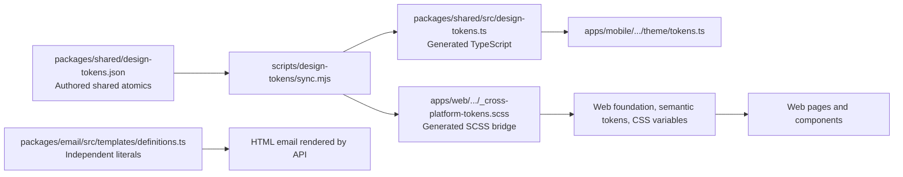

# SSOT Typography, Design Token, and DRY Audit

**Date:** 2026-07-29

**Scope:** `tfpphotographers/apps/web`, `apps/mobile`, `apps/api`, `packages/shared`, and `packages/email`

**Method:** source-of-truth tracing, generator/output reconciliation, deterministic repository gates, and contextual review of each reported candidate. This is a static audit; it does not claim browser or email-client rendering proof.

## Remediation update — 2026-07-29

**Final verdict:** the confirmed SSOT/design-token violations identified by this audit are remediated and the complete design-token gate is green. The implementation is build- and typecheck-ready, and the affected web surfaces passed desktop, tablet, and mobile browser comparison without a material visual regression.

The original findings remain below as the evidence record. Their current status is:

| Original finding | Status | Result |
| --- | --- | --- |
| Three failing web token checks | Resolved | Both letter-spacing values now use named generated roles; icon CSS moved to the shared SCSS component layer. |
| Mobile audit blind spots and 104 exact scale duplicates | Resolved | Audit now covers token-scale spacing/radius and numeric letter-spacing; exact matches were migrated to `spacing`, `radii`, and typography tokens. |
| Email brand-token duplication | Resolved | Email presentation tokens derive shared brand colors from `shared/design-tokens` while retaining inline email CSS for client compatibility. |
| Incomplete generated typography projection | Resolved for confirmed shared roles | Shared line-height and named web/mobile letter-spacing roles now generate into TypeScript and SCSS outputs. |
| Opportunity presentation duplication | Resolved | Category/compensation labels, budget formatting, preview limit, and typed public status variants now have one web/shared contract. |
| Full raw web typography inventory | Classification backlog, not a confirmed defect list | No mechanical 565-declaration rewrite was performed. Responsive/display values require semantic ownership decisions; bulk substitution would be high-risk design churn. |

### Impacted areas

- Shared token authoring and generation: JSON source, generated TypeScript, generated SCSS, line-height, and letter-spacing roles.
- Web presentation: typography variables, recommendation/home roles, global icon styles, opportunity cards/detail/list/create labels, and quick-request client-script ownership.
- Native presentation: shared spacing/radius consumption across 29 mobile presentation files plus mobile letter-spacing ownership.
- Backend-rendered UI: transactional email brand colors and email-only presentation values.
- Shared contracts/tests: typed public content statuses, opportunity presentation tests, and structured-location activation fixtures.
- Not impacted: database schema/migrations, API routes, durable event/outbox behavior, storage, moderation, or deployment configuration.

### Before/after browser evidence

Routes `/en-in` and `/en-in/opportunities` were captured at 1440×900, 1024×768, and 390×844 after restarting both FE and BE. All six after-state checks returned HTTP 200 with no console errors, no page errors, no horizontal overflow, `Inter` at 16px, and three opportunity cards where expected.

- Tablet home was byte-identical before/after.
- Remaining RMS pixel deltas were 0.048–0.247 on a 0–255 channel scale; inspection found no geometry, hierarchy, wrapping, or component regression.
- Evidence is stored under `tfpphotographers/test-results/reports/ssot-token-baseline/` as paired `before-*` and `after-*` screenshots.

### Post-remediation validation

```text
bash ./scripts/pnpm-node20.sh qa:design-tokens
# passed: 336 web files, 113 mobile files, 97 mobile implementation files, inline assets

bash ./scripts/pnpm-node20.sh typecheck
# passed across the monorepo; web: 0 errors, 0 warnings, 23 pre-existing hints

bash ./scripts/pnpm-node20.sh build
# passed: shared, config, storage, i18n, database, moderation, email, uploads, API, and web

bash ./scripts/pnpm-node20.sh --filter email test
# 12/12 passed

bash ./scripts/pnpm-node20.sh --filter shared test
# 39/39 passed

bash ./scripts/pnpm-node20.sh --filter mobile test
# 104/104 passed

bash ./scripts/pnpm-node20.sh --filter mobile run doctor
# 18/18 passed

bash ./scripts/pnpm-node20.sh test:web
# 64 files passed; 357/357 tests passed

bash ./scripts/pnpm-node20.sh lint
# passed: architecture boundaries, ESLint, web and API lint/type diagnostics
```

The earlier search/listing/home test drift was corrected to assert the current shared mixin/component contracts instead of obsolete duplicated page markup. Middleware response/error helpers were also extracted so the architecture line cap passes without changing routing, security-header, locale, privacy, or error behavior.

## Executive summary

The repository has a useful cross-platform token pipeline, but it is only a **partial SSOT** today:

- `packages/shared/design-tokens.json` is the authored source for shared atomics.
- `scripts/design-tokens/sync.mjs` generates the TypeScript contract and the web SCSS bridge.
- Mobile consumes that generated TypeScript contract through `shared/design-tokens`.
- Web adds a larger SCSS semantic and component layer, while transactional email has a separate set of visual literals.

The checked-in design-token gate is currently **red with three confirmed web violations**. More importantly, it reports a mobile pass while omitting layout and `letterSpacing` checks, even though **104 declarations exactly repeat existing shared spacing/radius values**. The backend API has no presentation layer of its own; the relevant backend-rendered visual surface is the `email` package, whose HTML templates repeat brand, color, spacing, and typography values outside the shared contract.

| Priority | Confirmed findings |
| --- | ---: |
| P1 | 3 |
| P2 | 2 |
| P3 | 0 |

No P0 issue was found. The P1 items should be handled before calling the design system compliant or enforcing the existing gate in required CI.

## Actual SSOT map



The diagram intentionally does not imply that all web or email decisions must be identical to native values. It identifies ownership: shared values should have one declared source, while platform-specific values need an explicit, testable extension contract.

## Confirmed findings

### P1 — The repository design-token gate fails today

**Evidence.** `pnpm qa:design-tokens` fails with three violations:

1. [`_recommended-for-you.scss`](tfpphotographers/apps/web/src/styles/components/_recommended-for-you.scss:71) sets `letter-spacing: 0.04em` directly.
2. [`home.scss`](tfpphotographers/apps/web/src/styles/pages/home.scss:828) sets `letter-spacing: -0.02em` directly after applying a shared title mixin.
3. [`Icon.astro`](tfpphotographers/apps/web/src/components/Icon.astro:360) contains a component `<style>` block not allowlisted by the audit.

The gate deliberately flags direct letter-spacing and non-allowlisted style blocks in [`design-token-audit.mjs`](tfpphotographers/scripts/qa/design-token-audit.mjs:92) and [`design-token-audit.mjs`](tfpphotographers/scripts/qa/design-token-audit.mjs:138). Therefore this is a confirmed compliance failure, not merely a stylistic preference.

**Impact.** The required token quality command cannot pass, so CI cannot distinguish new drift from the known baseline. The two letter-spacing values also bypass the typographic token vocabulary.

**Remediation.** First decide whether each value is an existing semantic role or a new named role; do not substitute a near value merely to make the check green. Add the approved role to the typography contract, consume it through a CSS variable/mixin, and move the global icon rules to a shared SCSS primitive or add a narrow documented exception if the component owns those rules.

**Post-fix check.** `bash ./scripts/pnpm-node20.sh qa:design-tokens`.

### P1 — Mobile passes its gate while bypassing available layout and letter-spacing tokens

**Evidence.** The mobile audit only checks raw colors and numeric `fontSize`/`lineHeight` ([`mobile-design-token-audit.mjs`](tfpphotographers/scripts/qa/mobile-design-token-audit.mjs:9), [`mobile-design-token-audit.mjs`](tfpphotographers/scripts/qa/mobile-design-token-audit.mjs:55)); it does not inspect `gap`, padding, margin, radius, or `letterSpacing`.

- A scoped scan found **104** `gap`, padding, margin, or `borderRadius` literals equal to an existing shared spacing/radius token across 26 presentation files. For example, [`CreateQuickRequestScreen.tsx`](tfpphotographers/apps/mobile/src/presentation/screens/CreateQuickRequestScreen.tsx:51) uses `gap: 8`, `gap: 4`, and `padding: 8` while importing only `colors` and `radii`; these map directly to `spacing.sm` and `spacing.xs` in [`design-tokens.json`](tfpphotographers/packages/shared/design-tokens.json:59).
- [`CreatorOnboardingScreen.tsx`](tfpphotographers/apps/mobile/src/presentation/screens/CreatorOnboardingScreen.tsx:200) uses `letterSpacing: 1.1`, but the audit has no letter-spacing rule.
- The standalone mobile command passes across 97 implementation files, so the green result is incomplete rather than proof of full token compliance.

**Impact.** Changes to the shared spacing/radius or typography vocabulary do not reach every native consumer. The current test result creates false confidence and permits new drift.

**Remediation.** Extend the mobile audit to flag only literals that equal a declared token on token-governed properties, with a justified per-line exception mechanism for genuine component geometry. Include numeric `letterSpacing`. Then migrate the 104 exact-value matches in small component batches, beginning with shared components and high-density files such as `AccountScreens.tsx`, `SearchScreen.tsx`, and `cards.tsx`. Values without a semantic counterpart (for example `gap: 9`) require a design decision; they are not automatically violations.

**Post-fix check.** `bash ./scripts/pnpm-node20.sh qa:design-tokens:mobile`, plus the full `qa:design-tokens` command.

### P1 — Transactional email duplicates visual tokens outside the shared contract

**Evidence.** [`design-tokens.json`](tfpphotographers/packages/shared/design-tokens.json:7) declares the primary color as `#d61f69`, but [`definitions.ts`](tfpphotographers/packages/email/src/templates/definitions.ts:40) duplicates it in `statusColors`, and the same renderer repeats `#d61f69`, `#f2d28a`, `#ffffff`, email typography sizes, line heights, paddings, and radii in its CTA and shell markup ([`definitions.ts`](tfpphotographers/packages/email/src/templates/definitions.ts:58), [`definitions.ts`](tfpphotographers/packages/email/src/templates/definitions.ts:62)). The API sends through this package, for example via [`email-service.ts`](tfpphotographers/apps/api/src/utils/email-service.ts:3).

**Impact.** A brand or type-scale change can update web/mobile but leave transactional email visually stale. The current email test also asserts a raw brand literal ([`email.test.ts`](tfpphotographers/packages/email/tests/email.test.ts:71)), which cements the duplicate source.

**False-positive analysis.** Inline styles are correct for broad email-client compatibility. The violation is not inline email CSS; it is the duplicated ownership of shared brand values and the unstructured template constants.

**Remediation.** Add a typed email presentation-token object that derives shared colors from `shared/design-tokens` and holds email-only values (Arial fallback, Outlook-safe layout, email width) in one named object. Render inline CSS from that object and update tests to assert named derived output rather than raw literals. Do not import web SCSS or use unsupported CSS variables in email.

**Post-fix check.** `bash ./scripts/pnpm-node20.sh --filter email test` and a targeted rendered-email snapshot/client compatibility check.

### P2 — Web consumer styles can bypass the typography system at scale

**Evidence.** The web foundation defines shared type roles and emits CSS variables ([`_typography.scss`](tfpphotographers/apps/web/src/styles/foundation/_typography.scss:13), [`_css-vars.scss`](tfpphotographers/apps/web/src/styles/foundation/_css-vars.scss:315)); shared mixins consume those variables ([`_mixins.typography.scss`](tfpphotographers/apps/web/src/styles/primitives/_mixins.typography.scss:3)). However, the current gate has no `font-size` or `line-height` policy. A scoped inventory found **208 raw `font-size`**, **205 raw numeric `line-height`**, and **152 non-variable `letter-spacing`** declarations under `apps/web/src/styles`; these are candidates, not 565 independently confirmed defects.

Concrete consumer bypasses include the home page's direct responsive size and line-height declarations ([`home.scss`](tfpphotographers/apps/web/src/styles/pages/home.scss:213), [`home.scss`](tfpphotographers/apps/web/src/styles/pages/home.scss:237)) and direct size/line-height declarations in [`contest-submissions.scss`](tfpphotographers/apps/web/src/styles/pages/contest-submissions.scss:18). Some responsive display styles may be valid web-specific extensions, but their ownership is currently indistinguishable from accidental magic values.

**Impact.** The type scale can drift page by page, while a centralized typography edit cannot reliably propagate.

**Remediation.** Define a policy before bulk conversion: (1) a named shared token/mixin for cross-platform roles, (2) an explicit web-only responsive role for approved fluid values, or (3) a documented local exception. Teach the web audit to reject raw consumer `font-size`, `line-height`, and `letter-spacing` values outside the foundation/token files and approved exceptions. Migrate repeated home, profile-edit, contest, and card patterns into shared roles first.

**Post-fix check.** `bash ./scripts/pnpm-node20.sh qa:design-tokens`, `bash ./scripts/pnpm-node20.sh --filter web typecheck`, and visual regression coverage at desktop, tablet, and mobile breakpoints.

### P2 — The generator does not project the full shared typography contract into web SCSS

**Evidence.** The source schema includes `lineHeight` and `fixedLineHeight` ([`design-tokens.json`](tfpphotographers/packages/shared/design-tokens.json:123)), but the SCSS output in [`sync.mjs`](tfpphotographers/scripts/design-tokens/sync.mjs:78) emits only family, weights, and font sizes. Web line-height, fluid role sizes, and letter-spacing are authored separately in [`_typography.scss`](tfpphotographers/apps/web/src/styles/foundation/_typography.scss:25). That separation is why the generated bridge cannot represent the complete type contract.

**Impact.** This is an ownership gap, not evidence that every web-specific role must be identical to React Native. It prevents the project from declaring which values are shared and which are intentional platform extensions.

**Remediation.** Evolve the JSON schema to have explicit `typography.shared`, `typography.web`, and `typography.mobile` sections. Generate shared line-height values and named web roles into `_cross-platform-tokens.scss`; keep only deliberate web-only fluid formulas in `typography.web`. Add a generator contract test that validates every generated key and rejects unclassified type roles.

**Post-fix check.** `bash ./scripts/pnpm-node20.sh design-tokens:check` plus a focused snapshot/contract test for generated SCSS and TypeScript.

## Verified non-findings and exclusions

- `apps/api/src` contains no CSS/HTML presentation definitions in the reviewed source. It should not receive design tokens merely for symmetry; its relevant visual output is `packages/email`.
- `shared/design-tokens` is a valid package subpath export in [`packages/shared/package.json`](tfpphotographers/packages/shared/package.json:26). A root-barrel export is not required for the mobile import path, so the older claim that this export is missing is incorrect.
- The JSON source and its generated TypeScript/SCSS outputs are currently synchronized: `design-tokens:check` passes.
- A color literal in a known palette-definition file and inline HTML/CSS required for email compatibility are not, by themselves, violations. The finding is duplicate or unclassified ownership.
- This report does not classify domain-specific API constants, database values, route configuration, or business rules as “design token” violations. Those need a separate backend architecture/DRY audit with different evidence criteria.

## Remediation order

1. **Restore a trustworthy gate.** Resolve the three web failures and add narrow exceptions only when their owner is documented.
2. **Close mobile blind spots.** Add layout and letter-spacing detection, then migrate exact token duplicates in shared-component batches.
3. **Centralize email presentation tokens.** Derive shared colors and name email-specific fallbacks/layout values without sacrificing email-client compatibility.
4. **Classify the full typography contract.** Generate the shared portion and explicitly own responsive web roles.
5. **Make compliance measurable.** Run the full token suite in CI only after its baseline is clean; retain candidate inventories separately from confirmed violations.

## Commands and observed results

```text
bash ./scripts/pnpm-node20.sh design-tokens:check
# passed

bash ./scripts/pnpm-node20.sh qa:design-tokens
# failed: 3 confirmed violations (two letter-spacing bypasses; Icon.astro style block)

bash ./scripts/pnpm-node20.sh qa:design-tokens:mobile
# passed across 97 implementation files; known coverage gap documented above
```

## Appendix: scope and confidence

- **High confidence:** the three gate failures, the mobile audit coverage gap, the 104 exact shared-layout literal matches, and the independent email template values.
- **Medium confidence:** the full web raw-type inventory is a governance gap. Individual values need classification before removal because responsive rendering can be intentionally web-specific.
- **Not claimed:** exhaustive runtime rendering correctness, email-client behavior, contrast compliance, or an audit of every non-visual backend DRY concern.
