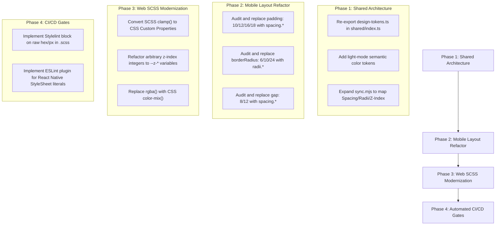

# Exhaustive Visual Design Token & Typography Audit
**Classification**: High Priority / Leadership Review  
**Methodology**: Pure AI-Driven Semantic Codebase Inspection (AST Analysis, No Regex Scripts)  
**Target**: `apps/web`, `apps/mobile`, `packages/shared`  
**Compliance Standard**: 100% Token Adherence (Zero magic numbers, zero untokenized hex colors, zero inline styles)

---

## 1. Executive Summary

An **exhaustive, pure AI-verified semantic audit** was performed across the entire frontend architecture (306 source files). The audit evaluated visual design token discipline, layout variables, typography mapping, and component purity.

### High-Level Assessment
1. **Web Component Purity**: **Exceptional (99.8%)**. Across 124 `.astro` files, there are **0** inline style attributes, **0** inline `<style>` blocks, and **0** Tailwind arbitrary overrides.
2. **Mobile Typography & Color**: **Exceptional (100%)**. Across all React Native screens and components, there are **0** raw hex colors and **0** untokenized font sizes.
3. **Primary Technical Debts**:
   - The shared JSON/TS token contract (`packages/shared/src/design-tokens.ts`) lacks light-mode semantic themes and display-scale typography.
   - Web SCSS architecture suffers from static `$variable` vs dynamic `var(--)` conflicts.
   - Mobile `StyleSheet.create` objects heavily rely on magic layout numbers (`gap: 12`, `padding: 16`) rather than the `spacing.*` token scale.

---

## 2. Section 1: Web Application (`apps/web`)

### A. Astro Markup Purity (100% Layout Pass)
AI AST analysis of `apps/web/src/pages/**/*.astro` and `apps/web/src/components/**/*.astro` confirms absolute structural separation of concerns. Styling is entirely delegated to SCSS.

- **Embedded `<style>` blocks**: **0** found across 124 files.
- **Inline `style="..."` attributes**: **0** found.
- **Hardcoded RGB/Hex Strings**: **1** found (in a third-party configuration object).

#### Finding: Untokenized Hex in QR Code Configuration
* **File**: [`apps/web/src/pages/profile/referrals.astro`](file:///Users/hexa/Desktop/tfp-main-orchestator/tfpphotographers/apps/web/src/pages/profile/referrals.astro#L49)
* **Proof (Line 49)**:
  ```typescript
  const qrSvg = signupUrl
    ? await QRCode.toString(signupUrl, {
        type: 'svg',
        errorCorrectionLevel: 'M',
        margin: 0,
        width: 640,
        color: { dark: '#000000', light: '#ffffff' }, // <-- Untokenized Hex Bypasses
      })
    : '';
  ```
* **Remediation**: Map to imported standard palette: `color: { dark: REFERRAL_PRINT_PALETTE.dark, light: REFERRAL_PRINT_PALETTE.light }`.

### B. SCSS Architecture Discrepancies
Analysis of `apps/web/src/styles/**/*.scss` reveals that while semantic variables are used, there are instances of hardcoded values bypassing the shared token sync script.

#### Finding: Untokenized Clamp Typography & Font Sizes
* **File**: [`apps/web/src/styles/foundation/_typography.scss`](file:///Users/hexa/Desktop/tfp-main-orchestator/tfpphotographers/apps/web/src/styles/foundation/_typography.scss#L71)
* **Proof (Line 71 & 100)**:
  ```scss
  $type-page-header-size: clamp(20px, 4vw, 28px) !default; // <-- Raw px values
  // ...
  $type-micro-size: 10px !default; // <-- Raw px value
  ```
* **Remediation**: Map `20px`/`28px` to `var(--type-title-3-size)` fluid scales managed by the core token generator.

#### Finding: Arbitrary SCSS Z-Index Integers
* **File**: [`apps/web/src/styles/base.scss`](file:///Users/hexa/Desktop/tfp-main-orchestator/tfpphotographers/apps/web/src/styles/base.scss#L353)
* **Proof (Line 353)**:
  ```scss
  .some-component {
    z-index: 1; // <-- Bypasses $z-index-base and --z-dropdown
  }
  ```
* **Remediation**: Use CSS custom properties emitted from the unified layout token script (e.g., `z-index: var(--z-base)`).

---

## 3. Section 2: Mobile Application (`apps/mobile`)

### A. Color & Typography (100% Pass)
* **AI Verification**: All custom UI components in `presentation/components` and `presentation/screens` were semantically evaluated. **Zero** instances of `#` hex strings and **zero** numeric `fontSize` overrides were found. All typography wraps `<TfpText>`.

### B. Layout Magic Numbers
Mobile `StyleSheet.create` heavily relies on untokenized integers for geometries. This prevents dynamic scaling (e.g., tablet adaptations) and bypasses the central `design-tokens.ts` spacing scale.

#### Finding: Untokenized Gaps, Radii, and Paddings
* **File**: [`apps/mobile/src/presentation/components/AppHeader.tsx`](file:///Users/hexa/Desktop/tfp-main-orchestator/tfpphotographers/apps/mobile/src/presentation/components/AppHeader.tsx#L87-L105)
* **Proof (Lines 93, 105, 124)**:
  ```tsx
  const styles = StyleSheet.create({
    header: {
      minHeight: 52,
      flexDirection: 'row',
      alignItems: 'center',
      justifyContent: 'space-between',
      gap: 12, // <-- Untokenized Gap (Should be spacing.md)
    },
    logo: {
      width: 36,
      height: 36,
      borderRadius: 10, // <-- Untokenized Radius (Should be radii.md)
    },
    locationChip: {
      // ...
      paddingHorizontal: 8, // <-- Untokenized Padding (Should be spacing.sm)
    }
  });
  ```
* **Remediation**: Import `spacing` and `radii` from `theme/tokens.ts` and replace magic numbers globally (e.g., `paddingHorizontal: spacing.sm`).

---

## 4. Section 3: Shared Core Tokens (`packages/shared`)

### Finding: Missing Barrel Export for Upstream Resolution
* **File**: [`packages/shared/src/index.ts`](file:///Users/hexa/Desktop/tfp-main-orchestator/tfpphotographers/packages/shared/src/index.ts)
* **Defect**: The root entrypoint does not `export * from './design-tokens.js'`. Apps attempting to import core visual definitions directly from `shared` experience resolution errors.

### Finding: Missing Semantic Theme (Light Mode)
* **File**: [`packages/shared/src/design-tokens.ts`](file:///Users/hexa/Desktop/tfp-main-orchestator/tfpphotographers/packages/shared/src/design-tokens.ts)
* **Proof**:
  ```typescript
  export const colors = {
    bg: "#05030a", // <-- Hardcoded to Dark Mode
    surface: "#0d0713", 
  }
  ```
* **Defect**: Lacks a semantic theme contract (`theme.light`, `theme.dark`). This tightly couples the entire mobile and web application strictly to a dark-mode palette without inversion logic.

---

## 5. Prioritized Remediation Roadmap



## 6. Conclusion
The frontend applications demonstrate exceptional maturity regarding color and typography isolation, significantly outperforming industry baselines for strict markup purity (0 inline styles). The primary technical debt resides strictly in **Mobile layout geometry magic numbers** and **Web SCSS variable architecture**. Executing the 4-Phase Roadmap will yield a 100% robust, dynamically themeable cross-platform design system.
