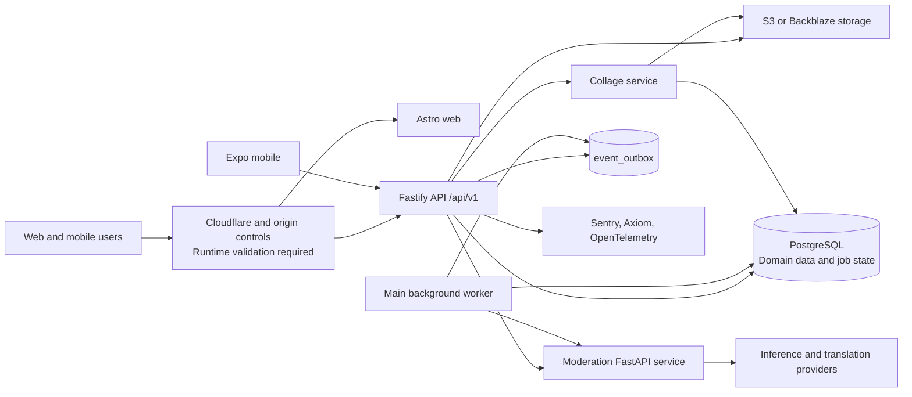
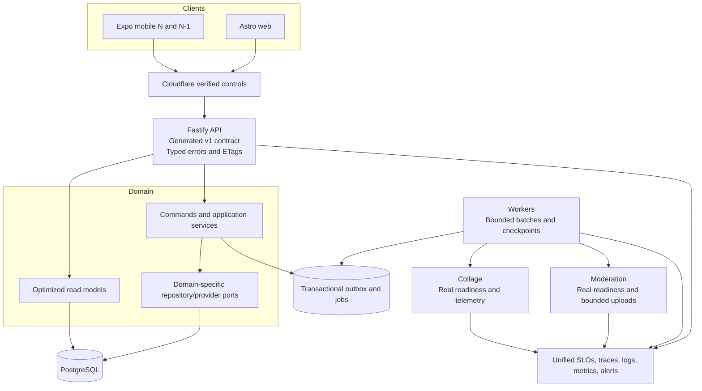

# 🏛️ Enterprise AAA Gold-Standard Application Architecture and Codebase Audit

**Workspace:** `/Users/hexa/Desktop/tfp-main-orchestator`  
**Audit date:** 2026-07-27  
**Audit mode:** Repository-wide, static, read-only review of the current working tree  
**Overall rating:** **B — strong production foundations with five High-priority release risks**  
**Confidence:** High for repository evidence; explicitly limited for live infrastructure, secrets, dashboards, and target-environment behavior

---

## 1. Executive Summary

The platform has materially stronger foundations than a typical pre-launch marketplace: centralized Fastify authentication with default-deny routing, a PostgreSQL transactional outbox with locking/retry/stale recovery, explicit moderation state machines, deterministic PostgreSQL search and geo-ranking, typed production configuration, security-focused CI, an Expo mobile client that uses the real `/api/v1` contract, and unusually detailed operational documentation.

It is not yet at the requested AAA enterprise bar. The highest risks are narrow rather than systemic:

1. three state transitions still enqueue domain events after their database commit, leaving a crash window in which durable state changes but downstream notifications do not;
2. the moderation and collage readiness endpoints can report ready without proving required dependencies are usable;
3. the main API/worker runtime assertion does not reject a production `DATABASE_URL` that points to localhost, although the deployment doctor does;
4. root and collage deployment scripts still default to SSH as `root`;
5. the moderation service locks Starlette `0.48.0`, which is affected by a reviewed High-severity `FileResponse`/`StaticFiles` Range-header denial of service and those features are used by the service.

No Critical finding was established from static evidence. That is not a claim that the deployed system has no Critical exposure: Cloudflare, TLS, origin restrictions, secret values, backups, restore evidence, external alert routing, provider permissions, database state, and deployed package versions were intentionally not accessed.

### Decision

**Conditionally ready for continued UAT; not ready for an unconditional production release.** Close the five High items, add the missing concurrency/contract gates, and complete the target-environment evidence pack before go-live.

---

## 2. Scope, Method, and Evidence Rules

### Repositories inspected

| Repository | Revision observed | Purpose |
|---|---:|---|
| Root orchestrator | `6538b15` | Cross-service deployment, operations, and gitlinks |
| `tfpphotographers` | `def4bdfa` | Web, API, worker, mobile, shared packages, database, tests, and docs |
| `tfp-collage-service` | `2d7ee7e` | Collage HTTP service and database-backed worker |
| `tfp-moderation-service` | `a2eaa97` | FastAPI moderation service, inference, operator UI, deployment, and tests |

The main application had pre-existing user-authored web changes. They were included as current-tree evidence and were not modified, staged, or reverted. No pull, build, test, seed, migration, package installation, browser mutation, deployment, or network probe against project infrastructure was performed.

### Coverage

- **7,648 distinct tracked files inventoried** across the four Git boundaries.
- **1,880 non-JPEG source, config, test, migration, script, and documentation files content-inspected** through full listings, targeted reads, dependency/config searches, boundary scans, call-site traces, and hotspot review.
- **5,768 tracked seed JPEGs metadata/inventory-inspected**, not visually classified; their executable and architectural risk is negligible, but their lifecycle and repository footprint were considered.
- **603,591 lines** of non-artifact executable/config/test/documentation content were included in the main application inventory; the root, collage, and moderation repositories were separately counted and traced.
- **348 source test files** identified: 327 main application, 2 collage, and 19 moderation.
- **189 HTTP route declarations** identified: 164 main Fastify API, 21 moderation FastAPI, and 4 collage Fastify.

### Runtime surfaces inspected — 8

1. Astro web application
2. Fastify API
3. Main TypeScript background worker
4. Expo/React Native mobile application
5. UI review worker service
6. Moderation FastAPI service and inference worker runtime
7. Moderation private folder-operations UI
8. Collage API and database-backed worker runtime

Eight shared packages were also inspected: config, database, email, i18n, moderation, shared, storage, and uploads.

### Evidence classification

- **Confirmed:** directly demonstrated by current repository code, schema, lockfile, or workflow.
- **Potential:** the code establishes a credible failure path, but impact depends on usage/load or a condition not proven statically.
- **Runtime validation required:** repository controls or documentation exist, but live activation and behavior cannot be established from Git.

### Audit guardrails

- The PostgreSQL queue/outbox model is treated as intentional and valid. `FOR UPDATE SKIP LOCKED`, retry scheduling, terminal failure state, and stale-processing recovery are strengths, not defects.
- File size alone is not a defect. Hotspots are reported only where multiple responsibilities and change risk are evident.
- Existing audit documents were leads, not evidence. Findings that current code has fixed were not repeated.
- No secrets were printed or assessed for value/strength. Only validation logic and handling paths were inspected.

---

## 3. System Architecture Map

### Dominant request path

`Astro/mobile client → Fastify route → handler → command/query/service → repository or Prisma → PostgreSQL → transactional outbox → background event handlers → email/system-message/provider side effects`.

The intended domain boundary is documented and partially enforced. Routes are prevented from importing database values, and new command/service database imports fail the boundary gate, while 23 historical direct-database paths remain as shrink-only debt.

---

## 4. What Is Already Strong

- **Authentication and authorization:** central API middleware is default-deny, public/admin routes are classified centrally, admin checks are explicit, cookie/token secrets have production validation, and credentialed wildcard CORS is rejected.
- **Durability:** domain events persist in PostgreSQL, workers claim with row locking, failures retry with backoff/jitter, stale work is recovered, terminal failures are inspectable, and shutdown drains are documented and implemented.
- **Moderation:** image state changes use compare-and-swap updates in important paths; raw provider evidence is preserved separately from compact review artifacts; NCII preservation/private-storage handling is explicit.
- **Data integrity:** a partial expression index prevents duplicate active content reports even when nullable image keys are involved; migrations include search/trigram and job invariants.
- **Search:** discovery is deterministic and provider-portable, using intent parsing, taxonomy, PostgreSQL FTS/trigram, and geo ranking rather than unnecessary vector/LLM infrastructure.
- **Configuration:** production secrets, duplicate secrets, observability credentials, storage configuration, rate-limit Redis, real email providers, moderation providers, and public app URLs are validated.
- **Testing:** the main repository has broad unit/integration coverage, security validation, CodeQL, gitleaks, dependency review, audit gates, accessibility/smoke jobs, and targeted outbox integration tests.
- **Operations:** deployment/runbook documentation explicitly separates Contabo UAT from OCI, treats environment proof honestly, and documents rollback, tunnels, security, and durable-event readiness.

---

## 5. Findings Summary

### By severity

| Severity | Count |
|---|---:|
| Critical | 0 |
| High | 5 |
| Medium | 14 |
| Low | 3 |
| **Total** | **22** |

### By category

| Category | Count | IDs |
|---|---:|---|
| Architecture / code quality | 2 | ARCH-001, CODE-001 |
| Reliability / distributed systems | 2 | DIST-001, REL-001 |
| Configuration | 1 | CONFIG-001 |
| Infrastructure / deployment | 1 | INFRA-001 |
| Concurrency / race conditions | 2 | CONC-001, CONC-002 |
| Security | 3 | SEC-001, SEC-002, SEC-003 |
| API design | 1 | API-001 |
| Error handling | 1 | ERR-001 |
| Data model / migrations | 1 | DATA-001 |
| Performance / scalability | 2 | PERF-001, PERF-002 |
| Testing / CI | 2 | TEST-001, TEST-002 |
| Observability | 1 | OBS-001 |
| Mobile | 1 | MOBILE-001 |
| Dead code / cleanup | 1 | DEAD-001 |
| Documentation / governance | 1 | DOC-001 |

### Priority matrix

| Priority | Count | Meaning |
|---|---:|---|
| P0 | 5 | Release gate |
| P1 | 8 | Next hardening iteration |
| P2 | 7 | Planned architecture/scale work |
| P3 | 2 | Controlled cleanup |

---

## 6. Detailed Findings

### DIST-001 — State changes and durable event enqueue are not atomic in three paths

- **Category:** Reliability / distributed systems
- **Severity:** High
- **Priority:** P0
- **Status:** Confirmed
- **Affected components:** API admin moderation overrides, contest winner selection, asynchronous image moderation rejection
- **Evidence:** `tfpphotographers/apps/api/src/modules/admin/admin-moderation-overrides-routes.ts:120-154`; `apps/api/src/modules/contest/contest-submission.handlers.ts:300-317`; `apps/api/src/modules/moderation/application/async-create-flow-moderation.ts:22-85`; `apps/api/src/background/event-outbox.ts:29-35`; `packages/shared/src/eventBus.ts:63-70`
- **Root cause:** Each path commits the domain mutation first and then calls `eventBus.emit()`. In server mode `emit()` inserts into `event_outbox` through a root Prisma client, not the mutation transaction.
- **Failure scenario:** The process exits, the database connection fails, or enqueue throws after the state update but before outbox insertion. The entity remains rejected or the winner remains selected, while email/system-message/search-alert handlers never receive the event.
- **Impact:** Durable state and user/operator communications diverge; retries of the HTTP operation can also create ambiguous operator outcomes.
- **AAA remediation:** Move each mutation plus `enqueueOutboxEntry(tx, …)` into one database transaction. Preserve compare-and-swap predicates. Give the event a stable semantic idempotency key derived from entity, transition, and decision version.
- **Validation:** Add fault-injection integration tests that throw between mutation and enqueue and prove rollback; add retry tests proving one outbox row and one downstream effect.
- **Estimated effort:** 2–4 engineer-days
- **Dependencies:** Existing transaction-capable commands/repositories and outbox helper
- **Do not do:** Do not replace PostgreSQL with Redis/BullMQ; the defect is transaction scope, not queue technology.

### REL-001 — Moderation and collage readiness endpoints can return false-ready

- **Category:** Reliability / distributed systems
- **Severity:** High
- **Priority:** P0
- **Status:** Confirmed
- **Affected components:** Moderation `/health/ready`, collage `/health/ready`, orchestration/load balancers
- **Evidence:** `tfp-moderation-service/src/tfp_moderation_service/web.py:489-496` returns ready unconditionally; `tfp-collage-service/src/server.ts:234-259` checks only whether configuration strings are present.
- **Root cause:** Readiness is modeled as process/config presence rather than the ability to serve required work.
- **Failure scenario:** A process is routed traffic while PostgreSQL, object storage, required model/provider, or worker dependency is unreachable. The health endpoint remains green and amplifies retries/failures.
- **Impact:** Incorrect rollout decisions, extended partial outages, and misleading operator evidence.
- **AAA remediation:** Define per-service critical dependencies and bounded readiness probes. Moderation should validate initialized inference/runtime resources appropriate to its configured mode; collage worker mode should perform a short database query and storage capability check. Cache probe results briefly to avoid overload. Liveness must remain dependency-free.
- **Validation:** Contract tests for healthy/degraded states; target-environment exercise that withdraws each dependency and observes 503 plus recovery.
- **Estimated effort:** 2–3 engineer-days
- **Dependencies:** Safe provider/storage probe methods and deployment health policy

### CONFIG-001 — API/worker runtime assertion permits localhost production database URLs

- **Category:** Configuration
- **Severity:** High
- **Priority:** P0
- **Status:** Confirmed code gap; runtime exposure requires validation
- **Affected components:** Main API and worker startup
- **Evidence:** `tfpphotographers/packages/config/src/config-sections.ts:606-705` requires only non-empty `DATABASE_URL`; `apps/api/src/server.ts:609` and `apps/api/src/worker.ts:100` call this assertion. `scripts/env/doctor.mjs:208-217` rejects localhost only when the doctor is separately invoked.
- **Root cause:** Deployment-only validation is stronger than the canonical runtime invariant.
- **Failure scenario:** A direct systemd/container/manual start bypasses the doctor and connects to an unintended local database or repeatedly fails, while other services use the shared VPS database.
- **Impact:** Split state, failed workers, or a false deployment success.
- **AAA remediation:** Move the production database-host invariant into `assertRuntimeConfig`, keeping `TFP_ALLOW_LOCAL_PROD_PREVIEW=1` as an explicit local-only escape hatch. Retain the doctor as an earlier operator gate.
- **Validation:** Config tests for `localhost`, `127.0.0.1`, `[::1]`, URL-encoded variants, explicit preview, and non-production behavior; deployment smoke confirms the intended target without exposing credentials.
- **Estimated effort:** 0.5–1 engineer-day
- **Dependencies:** None

### INFRA-001 — Root and collage deployment scripts default to privileged SSH

- **Category:** Infrastructure / deployment
- **Severity:** High
- **Priority:** P0
- **Status:** Confirmed
- **Affected components:** Cross-service deploy and collage deployment
- **Evidence:** `scripts/vps/deploy-both-services.sh:42-45`; `tfp-collage-service/scripts/vps/deploy-prod-7003.sh:7-10`; collage `deploy-to-instance.sh` also falls back to root. Moderation has already adopted `tfpdeploy` in `tfp-moderation-service/scripts/vps/deploy-to-instance.sh:20-24`.
- **Root cause:** Historical bootstrap defaults remain canonical for two deploy paths.
- **Failure scenario:** Routine automation executes file replacement, service operations, or an erroneous command with unrestricted host privileges.
- **Impact:** Enlarged blast radius for credential compromise, script defects, and operator mistakes.
- **AAA remediation:** Default every routine deploy to `tfpdeploy`; grant the smallest audited sudo/systemd/file permissions; require an explicit, logged break-glass flag for root; document key rotation and revoke old root deploy access after validation.
- **Validation:** Fresh-host or staging deploy as the unprivileged account, rollback, service restart, ownership/permission audit, and negative test for disallowed paths.
- **Estimated effort:** 1–2 engineer-days
- **Dependencies:** VPS user/sudo policy and credential rollout

### SEC-001 — Moderation service locks a High-severity vulnerable Starlette release

- **Category:** Security
- **Severity:** High
- **Priority:** P0
- **Status:** Confirmed
- **Affected components:** Moderation static assets and folder-operations report downloads
- **Evidence:** `tfp-moderation-service/uv.lock:1293-1299` locks Starlette `0.48.0`; `src/tfp_moderation_service/web.py:428-431` mounts `StaticFiles`; `web.py:593-603` returns `FileResponse`. GitHub-reviewed advisory [GHSA-7f5h-v6xp-fcq8](https://github.com/advisories/GHSA-7f5h-v6xp-fcq8) affects `>=0.39.0, <=0.49.0` and is fixed in `0.49.1`.
- **Root cause:** The transitive framework lock was not refreshed after the Range-header quadratic-processing fix.
- **Failure scenario:** A crafted multi-range request consumes disproportionate CPU on a static or file-response endpoint. Static assets are mounted independent of the private folder-ops feature flag.
- **Impact:** Network-triggered availability loss for the moderation service.
- **AAA remediation:** Update FastAPI/Starlette to a compatible release resolving to Starlette `>=0.49.1`, regenerate the lock, review adjacent changelogs, and add dependency scanning for the Python repository.
- **Validation:** Full moderation test suite; static/report download smoke; benign multi-range regression test with strict header-size/edge limits; dependency audit shows the advisory cleared.
- **Estimated effort:** 0.5–1 engineer-day
- **Dependencies:** Compatible FastAPI constraint and deployment image rebuild

### CONC-001 — Report appeal creation is check-then-insert without uniqueness

- **Category:** Concurrency / race conditions
- **Severity:** Medium
- **Priority:** P1
- **Status:** Confirmed
- **Affected components:** Report appeals and moderation events
- **Evidence:** `tfpphotographers/apps/api/src/modules/report/report.handlers.ts:57-79`; `report.commands.ts:68-123`; `packages/database/prisma/schema.prisma:1431-1454` and `1496-1510` contain indexes but no uniqueness for the logical appeal event or one pending appeal per user/event.
- **Root cause:** Sequential existence checks are treated as a concurrency invariant.
- **Failure scenario:** Two simultaneous submissions both see no event/appeal and create duplicate moderation events and pending appeals.
- **Impact:** Duplicate review work, inconsistent decisions, and noisy user history.
- **AAA remediation:** Add database-enforced uniqueness for the logical report-appeal event and active appeal, then use upsert/create-and-handle-conflict in one transaction.
- **Validation:** A barrier-synchronized integration test with parallel requests must yield one created appeal and one deterministic conflict/idempotent response.
- **Estimated effort:** 1–2 engineer-days
- **Dependencies:** Prisma migration with production duplicate preflight

### CONC-002 — General entity edits use last-write-wins without a version precondition

- **Category:** Concurrency / race conditions
- **Severity:** Medium
- **Priority:** P2
- **Status:** Potential
- **Affected components:** Event, opportunity, and contest editing
- **Evidence:** `apps/api/src/modules/event/event.handlers.ts:229-320`, `event.commands.ts:224+`; `opportunity.handlers.ts:294-455`, `opportunity.commands.ts:602+`; `contest.handlers.ts:294-415`, `commands/UpdateContestById.ts:33-85`. Updates use entity id/current authorization but expose no `version`, `If-Match`, or `updatedAt` compare-and-swap contract.
- **Root cause:** Edit APIs assume a single writer.
- **Failure scenario:** Two browser tabs or an owner/admin race save different fields from stale snapshots; the later full update silently overwrites the earlier accepted update.
- **Impact:** Lost user content or moderation-adjacent state, especially in long forms.
- **AAA remediation:** Add an integer version or strong ETag to mutable aggregates; update with `id + version`; return 409/412 plus current representation on conflict. Apply first to multi-field creator/admin edits, not every atomic counter.
- **Validation:** Concurrent update integration tests across web/mobile payloads.
- **Estimated effort:** 3–6 engineer-days
- **Dependencies:** Schema/API/client rollout and backward-compatibility window

### SEC-002 — Folder-operations password and internal API key persist in Web Storage

- **Category:** Security
- **Severity:** Medium
- **Priority:** P1
- **Status:** Confirmed
- **Affected components:** Private moderation operator UI
- **Evidence:** `tfp-moderation-service/src/tfp_moderation_service/templates/folder_ops.html:58-95` writes both `folderOpsPassword` and `folderOpsInternalApiKey` to `sessionStorage` and copies them into hidden form fields.
- **Root cause:** Convenience persistence treats two high-impact credentials as browser session state.
- **Failure scenario:** Same-origin script injection, a compromised extension, shoulder access to an unlocked session, or developer tooling reads credentials that authorize destructive mutations.
- **Impact:** Image deletion, moderation-run manipulation, or unauthorized report access depending on the acquired credentials and exposure.
- **AAA remediation:** Exchange step-up credentials server-side for a short-lived, scoped, `Secure`/`HttpOnly`/`SameSite=Strict` operator session; never persist the raw password or service key in Web Storage; require reauthentication for delete-all/run mutations and retain audit events.
- **Validation:** Browser inspection proves no raw secret in DOM storage; CSRF, expiry, rotation, and privilege-scope tests.
- **Estimated effort:** 2–4 engineer-days
- **Dependencies:** Server-side session or signed one-time capability design

### SEC-003 — Moderation multipart and folder uploads lack application-level byte limits

- **Category:** Security
- **Severity:** Medium
- **Priority:** P1
- **Status:** Confirmed application gap; edge mitigation requires runtime validation
- **Affected components:** `/api/v1/analyze/image`, `/api/v1/verify/image`, `/folder-ops/upload`
- **Evidence:** `tfp-moderation-service/src/tfp_moderation_service/web.py:521-575` calls `request.form()` and `upload.read()`; `web.py:613-634` copies an arbitrary list of files to disk. No per-request, per-file, or aggregate byte enforcement appears in these paths. The tracked Nginx deployment sets a body limit, but the private app port and alternate deployments remain app-dependent.
- **Root cause:** Upload safety is delegated to infrastructure and downstream loaders.
- **Failure scenario:** An authenticated or network-adjacent caller submits a very large body/many files, consuming memory, event-loop time, or disk.
- **Impact:** Moderation service outage or operator-host disk exhaustion.
- **AAA remediation:** Enforce content length plus streaming byte counters in the application; cap file count, per-file size, aggregate size, extension/MIME, and decompressed image dimensions; remove partial files on failure. Keep edge limits as defense in depth.
- **Validation:** Oversize, chunked/no-length, too-many-file, decompression-bomb, and interrupted-upload tests.
- **Estimated effort:** 1–3 engineer-days
- **Dependencies:** Canonical upload policy and expected operator batch size

### ARCH-001 — Hexagonal boundaries remain shrink-only rather than complete

- **Category:** Architecture / code quality
- **Severity:** Medium
- **Priority:** P2
- **Status:** Confirmed
- **Affected components:** Main API command/service layer
- **Evidence:** `tfpphotographers/scripts/architecture/enforce-boundaries.mjs:72-98` allows 23 named command/service files to import the database directly. The intended flow is route → handler → command/query → repository → Prisma.
- **Root cause:** Incremental architecture migration preserves historical direct persistence access.
- **Failure scenario:** Business invariants and transaction policy remain coupled to Prisma, making unit isolation, port substitution, and cross-command consistency harder; exceptions can become permanent if only growth is blocked.
- **Impact:** Higher change cost and uneven domain boundaries, not an immediate production outage.
- **AAA remediation:** Rank the 23 paths by invariant/transaction complexity and change frequency. Extract domain-specific repository ports only where they create a real boundary; keep deliberate read-model queries direct if documented. Lower the allowlist after each extraction.
- **Validation:** Boundary gate, focused unit tests against ports, and integration tests against Prisma adapters.
- **Estimated effort:** 2–6 weeks incrementally
- **Dependencies:** Domain-by-domain ownership; no big-bang rewrite

### CODE-001 — Moderation inference and admin runtime hotspots concentrate unrelated change risk

- **Category:** Architecture / code quality
- **Severity:** Medium
- **Priority:** P2
- **Status:** Confirmed maintainability risk
- **Affected components:** Moderation `service.py`; web admin runtime; translation/moderation engines
- **Evidence:** `tfp-moderation-service/src/tfp_moderation_service/service.py` is 6,040 lines and owns orchestration, scoring, provider response shaping, cache behavior, translation, and policy-derived evidence; `tfpphotographers/apps/web/src/scripts/admin/index.js` is 2,840 lines and is explicitly capped as a bundle-migration hotspot in `enforce-boundaries.mjs:68-70`.
- **Root cause:** Rapid feature accumulation around policy and operator surfaces.
- **Failure scenario:** A localized policy/UI change crosses hidden state or helper coupling, increasing review surface and regression probability.
- **Impact:** Slower, riskier releases in safety-critical and admin paths.
- **AAA remediation:** Split by stable responsibility: provider orchestration, normalized evidence, policy scoring, response assembly, and caching; for admin, typed feature controllers and safe rendering utilities. Preserve golden-response/DOM fixtures before moves.
- **Validation:** Characterization tests, contract snapshots, import-cycle check, coverage parity, and bundle size tracking.
- **Estimated effort:** 2–4 weeks incrementally
- **Dependencies:** Stable behavioral fixtures; avoid simultaneous policy changes

### API-001 — API schemas and consumer compatibility are not governed by an executable cross-client contract

- **Category:** API design
- **Severity:** Medium
- **Priority:** P1
- **Status:** Confirmed
- **Affected components:** 164-route main API, web, mobile, moderation, collage
- **Evidence:** The main application has no generated OpenAPI/JSON Schema contract; `tfpphotographers/package.json:145` labels an i18n package test as `test:e2e:contract`; moderation can expose OpenAPI but disables it in UAT/prod; collage has no published schema or consumer contract suite.
- **Root cause:** Types and tests are local to implementations rather than published as a versioned system boundary.
- **Failure scenario:** A response field, enum, error shape, or optionality changes in the API and breaks Astro or a previously shipped mobile client without a release gate detecting it.
- **Impact:** Client regressions and unsafe mobile/API rollout ordering.
- **AAA remediation:** Generate a canonical API schema from route schemas, diff it in CI, add web/mobile consumer tests for critical flows, and define additive/breaking/deprecation rules for `/api/v1`. Add small explicit contracts for moderation and collage integrations.
- **Validation:** CI fails a seeded breaking change; old mobile fixture remains compatible; error and pagination schemas included.
- **Estimated effort:** 1–3 weeks
- **Dependencies:** Route schema normalization and ownership

### ERR-001 — Error envelopes and translation ownership are inconsistent

- **Category:** Error handling
- **Severity:** Medium
- **Priority:** P1
- **Status:** Confirmed
- **Affected components:** Main API routes and clients
- **Evidence:** Only a small central helper surface uses `sendError`, while dozens of product route files hand-build `{ success: false, error: { code, message } }`; current examples include contest winner and report appeal handlers with raw English messages.
- **Root cause:** Error codes, HTTP mapping, safe messages, localization, retryability, and logging metadata are not one typed catalog.
- **Failure scenario:** Equivalent failures use different status codes/messages; mobile cannot safely decide retry/auth/conflict behavior; internal details can be inconsistently logged or translated.
- **Impact:** Client complexity, localization drift, and weak incident aggregation.
- **AAA remediation:** Introduce typed domain errors and one transport mapper with stable code, status, safe localization key, retryability, and trace id. Preserve field-level validation details without returning internal exceptions.
- **Validation:** Contract table tests for each error family across representative routes and locales.
- **Estimated effort:** 1–2 weeks incrementally
- **Dependencies:** API contract work

### DATA-001 — Prisma schema advertises a uniqueness constraint the canonical migration removes

- **Category:** Data model / migrations
- **Severity:** Medium
- **Priority:** P1
- **Status:** Confirmed
- **Affected components:** `ContentReport` model and database lifecycle
- **Evidence:** `packages/database/prisma/schema.prisma:999` declares `@@unique([reporterId, entityType, entityId, targetImageKey, status])`. The launch migration creates that index and then drops it at `migration.sql:1658`, replacing it at `1660-1668` with a partial expression index using `COALESCE(target_image_key, '__ENTITY_REPORT__')` and active statuses.
- **Root cause:** A PostgreSQL invariant not expressible directly in Prisma is layered over a conflicting Prisma model declaration.
- **Failure scenario:** `db push`, introspection, generated compound-unique APIs, or future migration diffs attempt to recreate/assume the wrong constraint, weakening the null/active-status semantics or causing drift.
- **Impact:** Environment divergence and duplicate-report invariant regressions.
- **AAA remediation:** Remove the misleading Prisma `@@unique` if the raw partial expression index is canonical; document it beside the model; add a migration/schema integrity test querying `pg_indexes`; prohibit `db push` for shared environments.
- **Validation:** Rebuild an empty database from migrations, generate Prisma, run concurrent duplicate-report tests, and assert the exact index definition.
- **Estimated effort:** 1 engineer-day
- **Dependencies:** Migration policy and production index preflight

### PERF-001 — Saved-search alert fan-out is capped, unpaginated, and unbounded in parallelism

- **Category:** Performance / scalability
- **Severity:** Medium
- **Priority:** P2
- **Status:** Confirmed
- **Affected components:** Opportunity approval event handler
- **Evidence:** `apps/api/src/modules/notifications/register-event-handlers.ts:411-440` takes the first 500 enabled saved searches, filters in memory, and sends all matches through one `Promise.all`.
- **Root cause:** Recipient discovery and delivery are executed synchronously inside one outbox handler without cursor/checkpoint/concurrency control.
- **Failure scenario:** Searches after the first 500 never receive alerts; a broad match bursts hundreds of writes/messages; one rejection fails the whole event and retries already-completed recipients unless every downstream path is perfectly idempotent.
- **Impact:** Silent alert loss, load spikes, long outbox leases, and duplicate delivery risk.
- **AAA remediation:** Create a durable, cursor-based alert-distribution job keyed by opportunity/event; query candidates in indexed batches; cap concurrency; checkpoint progress; use a unique recipient/effect id. Keep it PostgreSQL-backed until metrics justify another queue.
- **Validation:** >500-search integration/load test, injected mid-batch failure, restart recovery, and duplicate-effect assertion.
- **Estimated effort:** 3–5 engineer-days
- **Dependencies:** Recipient idempotency key/index and worker metrics

### PERF-002 — Owned report decisions perform sequential N+1 queries and biased truncation

- **Category:** Performance / scalability
- **Severity:** Medium
- **Priority:** P2
- **Status:** Confirmed
- **Affected components:** `GET /reports/owned/decisions`
- **Evidence:** `apps/api/src/modules/report/report.routes.ts:21-33` loads up to `limit * 4` decided reports, then sequentially resolves content owner and appeal for each row before filtering and stopping.
- **Root cause:** Ownership is computed row-by-row after a global limited query.
- **Failure scenario:** A request can execute hundreds of serial queries and still omit older reports owned by the caller because non-owned global rows consume the pre-limit.
- **Impact:** High tail latency, database load, and incomplete user results.
- **AAA remediation:** Express ownership and appeal projection in a set-based query or batched per-entity query; filter by owner before limit; use stable cursor pagination.
- **Validation:** Query-count assertion, mixed-owner fixture proving completeness, and latency test at realistic volume.
- **Estimated effort:** 2–4 engineer-days
- **Dependencies:** A cross-entity ownership read model or SQL view/query

### TEST-001 — Independent collage and root release paths lack first-party CI gates

- **Category:** Testing / CI
- **Severity:** Medium
- **Priority:** P1
- **Status:** Confirmed
- **Affected components:** Collage service and meta-repository gitlink/deployment scripts
- **Evidence:** Main application has four workflows and moderation has CI/deploy workflows; no first-party `.github/workflows` exists in `tfp-collage-service` or the root repository. Collage has only two source test files despite its storage/database/SSRF/worker responsibilities.
- **Root cause:** Validation is concentrated in the main and moderation repositories.
- **Failure scenario:** A collage change or root gitlink/deploy-script mismatch is merged/published without typecheck, tests, dependency/security scan, container/startup smoke, or submodule coherence verification.
- **Impact:** Independent-service regression reaches UAT/production undetected.
- **AAA remediation:** Add collage CI for frozen install, typecheck/build/test, audit/CodeQL or equivalent, worker/API smoke, and image build; add root CI for shellcheck, gitlink availability, deploy-script static validation, and cross-repo compatibility pins.
- **Validation:** Deliberately failing test/typecheck/gitlink fixture blocks merge.
- **Estimated effort:** 2–4 engineer-days
- **Dependencies:** Repository CI permissions and deploy artifact policy

### TEST-002 — Risk-based failure tests do not fully cover cross-service contracts and crash windows

- **Category:** Testing / CI
- **Severity:** Low
- **Priority:** P2
- **Status:** Confirmed gap
- **Affected components:** Outbox call sites, appeal concurrency, moderation/collage adapters, mobile compatibility
- **Evidence:** Strong unit/integration suites exist, including outbox and report duplicate tests, but there is no appeal race test, no mutation/enqueue fault-injection test for the three DIST-001 paths, and no executable consumer contract spanning API/web/mobile/services.
- **Root cause:** Tests emphasize normal and sequential failure paths over coordinated concurrency and release compatibility.
- **Failure scenario:** Rare crash/race/schema changes pass CI and fail only under deployment or parallel requests.
- **Impact:** Residual risk in otherwise well-tested critical workflows.
- **AAA remediation:** Add a small risk matrix of barrier races, failpoints, retry/idempotency, dependency timeout, and old-client fixtures; do not inflate coverage with low-value snapshots.
- **Validation:** CI demonstrates each test fails against the pre-fix behavior.
- **Estimated effort:** 1–2 weeks alongside fixes
- **Dependencies:** Findings DIST-001, CONC-001, API-001

### OBS-001 — Repository observability is strong, but end-to-end SLO and alert activation are unproven

- **Category:** Observability
- **Severity:** Medium
- **Priority:** P1
- **Status:** Runtime validation required
- **Affected components:** API, worker, web, moderation, collage, Cloudflare, provider calls
- **Evidence:** Main services include Sentry, Axiom, OpenTelemetry, trace/request ids, health checks, and release-runbook proof steps; moderation exposes protected Prometheus metrics. Collage has structured/redacted logs and request ids but no equivalent metrics/tracing surface. Repository files cannot prove dashboards, alert receivers, retention, release association, or cross-service trace propagation are active.
- **Root cause:** Instrumentation and operational activation are separate control planes; service coverage is uneven.
- **Failure scenario:** A cross-service latency/error/backlog incident is logged but not alerted or cannot be correlated from user request to background effect.
- **Impact:** Longer detection and recovery times, weak error-budget governance.
- **AAA remediation:** Define service-level indicators/objectives for availability, p95 latency, outbox/job backlog age, terminal failures, moderation/provider latency, and collage completion; standardize correlation fields; add collage metrics/traces; capture dashboard/alert evidence per environment.
- **Validation:** Synthetic 500/503, backlog, dependency latency, process death, and alert-delivery drills with trace correlation.
- **Estimated effort:** 1–2 weeks plus operations access
- **Dependencies:** Live Sentry/Axiom/Cloudflare/metrics access

### MOBILE-001 — Mobile compatibility is coupled to the live API without a shipped-client release gate

- **Category:** Mobile
- **Severity:** Medium
- **Priority:** P2
- **Status:** Potential
- **Affected components:** Expo app, `/api/v1`, SecureStore/auth state, creation/upload workflows
- **Evidence:** Mobile correctly uses the real `/api/v1` and explicit mock mode, with domain tests under `apps/mobile/src/**/__tests__`; however, no schema compatibility gate proves the current API remains compatible with a previously shipped mobile binary, and device/E2E coverage is not part of the visible main CI contract.
- **Root cause:** Web and API can deploy together, while mobile binaries remain in the field under a different release cadence.
- **Failure scenario:** An additive-looking enum/error/required-field change breaks login, upload finalization, moderation state rendering, or navigation for an old app version.
- **Impact:** Production-only mobile regressions that cannot be hot-fixed instantly.
- **AAA remediation:** Maintain N/N-1 mobile consumer fixtures, additive API policy, minimum-supported-version strategy, and automated Android/iOS smoke for auth reset, discovery, create/upload/finalize, and logout/401 recovery.
- **Validation:** Run fixtures against the API contract and a real device/emulator UAT build before release.
- **Estimated effort:** 1–2 weeks initial, then incremental
- **Dependencies:** API-001 and mobile release/version policy

### DEAD-001 — Generated and transitional artifacts need an ownership/deletion ledger

- **Category:** Dead code / cleanup
- **Severity:** Low
- **Priority:** P3
- **Status:** Potential deletion candidates; deletion not authorized by this audit
- **Affected components:** Generated moderation reference HTML, historical audit/planning documents, transitional admin runtime bundles, seed media
- **Evidence:** Generated documentation and large seed assets are tracked intentionally; `docs/moderation-response-parameter-reference.html` is generated by `scripts/build-moderation-response-reference.mjs`; old architecture audits describe states that current code has since changed; admin bundle comments label migration debt. No single manifest distinguishes generated canonical output, retained evidence, active source, and safe deletion candidates.
- **Root cause:** Repository history, generated deliverables, and operational evidence share the source tree without lifecycle metadata.
- **Failure scenario:** Contributors edit generated output instead of its generator, trust stale audit state, or delete an apparently unused artifact required by an operator workflow.
- **Impact:** Confusion, repository bloat, and incorrect maintenance—not a direct runtime defect.
- **AAA remediation:** Add a lightweight artifact ledger with owner, generator/source, consumers, retention reason, regeneration command, and deletion test. Candidate deletion requires reference search, build/test evidence, and owner approval.
- **Validation:** Regeneration is deterministic; referenced artifacts are detected; deletion candidates pass full checks before removal.
- **Estimated effort:** 1–2 engineer-days for inventory, ongoing cleanup
- **Dependencies:** Domain-owner decisions

### DOC-001 — Architecture status is split across current guides and point-in-time audits

- **Category:** Documentation / governance
- **Severity:** Low
- **Priority:** P3
- **Status:** Confirmed
- **Affected components:** Architecture, security, mobile, operations, and prior audit documents
- **Evidence:** Canonical-doc indexes and current runbooks exist, but point-in-time audit/implementation documents contain historical finding counts and pre-remediation states; the boundary enforcement file is often more current than narrative architecture debt lists.
- **Root cause:** Completed remediation is not consistently reflected by supersession/status metadata in old reports.
- **Failure scenario:** A reviewer treats a resolved defect as current or misses a new exception encoded only in enforcement/scripts.
- **Impact:** Duplicate work and weaker governance decisions.
- **AAA remediation:** Mark point-in-time audits immutable but clearly superseded; maintain one current architecture decision/debt index generated or checked against enforcement allowlists; link each active finding to owner/status/evidence.
- **Validation:** Documentation link/status check in CI and quarterly architecture review.
- **Estimated effort:** 1–2 engineer-days
- **Dependencies:** Architecture owner

---

## 7. Failure-Path and Recovery Review

| Failure | Current control | Residual gap | Required proof |
|---|---|---|---|
| API process crash | service manager, liveness, structured error handling | live restart/alert not statically provable | terminate process in target environment and correlate alert/log/trace |
| DB unavailable | main API readiness and error handling | collage/moderation readiness incomplete | dependency withdrawal drills |
| Event-handler failure | PostgreSQL outbox retry, backoff/jitter, terminal `FAILED`, stale recovery | three mutations enqueue after commit; recipient-level fan-out checkpoint absent | atomicity and mid-batch recovery tests |
| Duplicate request | report partial unique index; several idempotent/state-guarded flows | appeal creation and general edits remain race-prone | barrier concurrency suite |
| Storage/provider outage | timeouts/retries and typed provider adapters in key paths | cross-service readiness and SLO evidence incomplete | injected timeout/5xx and recovery drills |
| Worker shutdown | signal handling and drain guidance | live termination grace and lease behavior not proven | controlled rolling restart under backlog |
| Oversize upload | Nginx body limit in tracked deployment | moderation app does not enforce its own aggregate limits | direct-app and edge upload tests |
| Secret/config drift | production assertion plus environment doctor | database host invariant split; secret values/live stores unavailable | target env doctor + startup proof without printing values |
| Vulnerable dependency | Node security workflow in main repo | Python Starlette lock vulnerable; collage/root gates absent | patched lock and repo-specific dependency scans |

---

## 8. Data and Transaction Integrity Assessment

### Strengths

- Multi-record create/moderation workflows frequently use Prisma transactions and enqueue outbox rows inside the transaction.
- Content-report active uniqueness correctly handles nullable image keys at the PostgreSQL layer.
- Job/outbox records carry attempts, scheduling, lock state, error state, and recovery semantics.
- Moderation state transitions frequently use `updateMany` with expected status, a valid compare-and-swap pattern.

### Required improvements

1. Close the three mutation/outbox atomicity gaps.
2. Enforce appeal uniqueness in the database and handle conflicts deterministically.
3. Align the Prisma schema with the raw partial-expression report index.
4. Introduce optimistic concurrency only on aggregates where concurrent full-form edits can lose data.
5. Add migration validation on a clean database plus an upgrade fixture; repository review cannot prove the deployed schema matches migrations.

### Database lifecycle conclusion

The PostgreSQL-backed domain-job model is appropriate for the current system. A queue migration is not recommended without measured backlog, polling cost, worker-pool complexity, delayed-retry, or operator-visibility pain that cannot be addressed in the existing model.

---

## 9. API and Integration Assessment

- Main API versioning is visible in the `/api/v1` route boundary, but compatibility policy is not executable.
- Zod and FastAPI/Pydantic validation are widely used; normalization and typed contracts are strong locally.
- Error responses broadly share a shape, but construction, localization, status mapping, and retry semantics remain decentralized.
- Moderation and collage adapters implement authentication and timeout/error handling, but cross-repository contract drift is not gated.
- Pagination is generally present, with one confirmed owned-report exception and a capped saved-search scan.

**Target state:** versioned generated schemas; additive-by-default evolution; N/N-1 mobile compatibility; consistent pagination/errors/idempotency; explicit service-to-service contracts tested at both producer and consumer.

---

## 10. Security Assessment

### Strong controls observed

- API default-deny authentication and explicit admin authorization.
- Production secret strength/independence checks and credentialed CORS restrictions.
- Rate limiting with a shared production Redis requirement.
- Helmet/security-header handling and HTML/structured-data escaping utilities in the web application.
- Storage key ownership, upload size/type/dimension validation in main flows, presign/finalize separation, moderation gates, and private evidence handling.
- SSRF-oriented URL/storage boundaries in the collage path.
- Gitleaks, dependency review, `pnpm audit`, and CodeQL in the main CI.
- Dual credential check for destructive folder operations.

### Security release actions

1. Patch Starlette.
2. Stop storing operator credentials in Web Storage.
3. Add application-level moderation upload limits.
4. Remove routine root deployment.
5. Validate—do not assume—Cloudflare Access/WAF/Tunnel/TLS, origin closure, HSTS, admin protection, secret-store ACLs, database network policy, backup encryption, and restore evidence.

No exploit was executed. No assertion is made about live WAF, credentials, network exposure, or cloud configuration.

---

## 11. Performance and Scalability Assessment

The primary user-facing query architecture is sound: PostgreSQL FTS/trigram and geo ranking are appropriate, deterministic, and operationally simpler than introducing vector infrastructure. Critical list queries use limits and indexes in many paths.

The two concrete scale risks are workload shape, not technology choice:

- opportunity saved-search fan-out needs pagination, checkpointing, bounded concurrency, and recipient idempotency;
- owned report decisions need a set-based owner/appeal projection and cursor pagination.

Before proposing new infrastructure, measure p50/p95/p99 endpoint latency, database query time/count, outbox oldest-pending age, attempts/terminal failures, saved-search recipient distribution, moderation provider latency, collage job age, and worker utilization.

---

## 12. Test and CI Assessment

### Existing maturity

- 327 main source test files cover domain, integration, security, browser utilities, mobile domain behavior, and architecture rules.
- Main CI includes build/typecheck/lint/tests, coverage, security scanning, smoke/a11y, and production health workflow.
- Moderation has 19 source test files plus CI and deploy workflows.
- Important concurrency and outbox behaviors already have dedicated integration tests.

### Gaps to close

- Collage and root first-party CI.
- Atomic mutation/outbox failpoints.
- Parallel appeal creation.
- Cross-client/service schema compatibility.
- N/N-1 mobile fixtures and device smoke.
- Target-environment readiness, alert, restart, backup/restore, and dependency withdrawal drills.

Coverage percentage alone should not be the goal. Gate the named failure modes and business invariants.

---

## 13. Observability and Operations Assessment

The main system has credible instrumentation and operator documentation. The remaining enterprise gap is proof and consistency:

- define SLOs and error budgets rather than only collecting telemetry;
- standardize `service`, `environment`, `release`, `traceId`, `requestId`, `jobId`, `entityId`, and safe error code fields;
- ensure correlation survives HTTP → DB outbox → worker → provider → user notification;
- add collage metrics/traces and common backlog/terminal-failure dashboards;
- record target-environment screenshots or exported alert policies, synthetic results, retention settings, and on-call ownership in a release evidence pack.

Static code cannot establish that Sentry/Axiom/Cloudflare dashboards and receivers are activated.

---

## 14. Configuration and Secret Management Assessment

The typed config package is an architectural strength. It validates many production invariants and avoids weak/default/shared secrets. The main defect is that the database host policy lives in an optional doctor rather than runtime assertion.

Enterprise target:

- one canonical validation library used by doctor, API, worker, and deployment;
- secret references or host files with strict permissions, never tracked values;
- documented rotation/rollback for JWT, cookie, OAuth, storage signing, provider, moderation, and collage credentials;
- environment-drift comparison that reports names/fingerprints only;
- startup failure for unsafe production values, with explicit local-preview escape hatches.

Secret values and live environment files were not read or printed.

---

## 15. Maintainability and Governance Assessment

The repository has stronger-than-average agent routing, canonical-doc indexing, architecture gates, import boundaries, and hotspot caps. These controls are deliberately incremental.

The next maturity step is to turn allowlists and historical reports into an owned debt ledger:

- every direct-DB exception has owner, rationale, target architecture, and review date;
- every hotspot has a behavior-preserving split plan rather than a line-count-only target;
- generated artifacts declare their generator and edit policy;
- old audits declare supersession status;
- architecture decisions capture why PostgreSQL outbox, deterministic discovery, service boundaries, and mobile API policy were chosen.

---

## 16. Target-State Architecture

### Principles

1. Transaction boundaries own durable domain event insertion.
2. Database constraints own concurrency invariants.
3. Published schemas own client/service compatibility.
4. Readiness proves ability to serve; liveness proves only process health.
5. PostgreSQL remains the default durable job substrate until measured evidence justifies change.
6. Security controls are layered at application, service manager, origin, and edge.
7. Refactoring follows risk and cohesion, not abstract purity or file-size targets.

---

## 17. Remediation Roadmap

### P0 — Production release gates

| Order | Finding | Deliverable | Acceptance gate |
|---:|---|---|---|
| 1 | SEC-001 | Starlette-compatible dependency update | advisory cleared; full moderation tests and file/static smoke pass |
| 2 | DIST-001 | atomic transaction + outbox in all three paths | failpoint tests prove rollback and single effect |
| 3 | REL-001 | dependency-aware moderation/collage readiness | dependency withdrawal returns 503 and recovers |
| 4 | CONFIG-001 | canonical runtime database-host validation | API/worker refuse unsafe prod URL; preview remains explicit |
| 5 | INFRA-001 | unprivileged root/collage deployment | deploy and rollback succeed without routine root SSH |

### P1 — Next hardening iteration

1. CONC-001: database-enforced appeal uniqueness and parallel test.
2. SEC-002: short-lived HttpOnly operator session.
3. SEC-003: application-level upload/file-count/aggregate limits.
4. DATA-001: Prisma/raw-index alignment and schema integrity gate.
5. API-001: generated contract, breaking-change diff, consumer fixtures.
6. TEST-001: collage/root CI.
7. OBS-001: cross-service SLO and target-environment evidence pack.
8. ERR-001 foundation can begin with critical flows while API contracts are normalized.

### P2 — Planned architecture and scale work

- bounded/checkpointed saved-search fan-out;
- set-based owned-report read model;
- optimistic concurrency for high-value full-form aggregates;
- risk-ranked direct-database boundary reduction;
- N/N-1 mobile compatibility and device smoke;
- characterization-led decomposition of moderation/admin hotspots;
- risk-based failure matrix completion.

### P3 — Controlled hygiene

- artifact/deletion ledger;
- supersession/status metadata and current architecture debt index.

---

## 18. Validation and Release Evidence Plan

### Repository gates

- Main: frozen install; architecture boundary gate; typecheck; build; lint; unit/integration; coverage; i18n; security validation; smoke/a11y.
- Moderation: Python lint/type/test suite; dependency audit; file/static Range regression; upload-bound tests.
- Collage: frozen install; typecheck/build/test; worker/API integration; storage/DB failure tests; security scan.
- Root: shellcheck; script unit/static tests; gitlink availability/coherence; deploy manifest compatibility.

### Stateful integration gates

- Recreate empty PostgreSQL from migrations and assert critical raw indexes.
- Run upgrade migration fixture and concurrent invariant tests.
- Inject failures before/after mutation, enqueue, claim, handler effect, and completion marking.
- Prove retry idempotency and terminal-failure/operator recovery.
- Verify storage orphan cleanup and private evidence lifecycle.

### Target-environment gates

- Confirm API, web, worker, moderation, and collage revisions and configuration fingerprints.
- Confirm Cloudflare Access/WAF/Tunnel/TLS/origin restrictions and security-header behavior.
- Validate database target through the approved tunnel/path without printing credentials.
- Exercise readiness dependency failures, rolling restart with backlog, synthetic 500/503, alert delivery, and trace correlation.
- Perform backup and restore rehearsal with measured RPO/RTO.
- Test old supported mobile build against the release candidate API.

---

## 19. Uninspected or Unverified Areas

| Area | Reason | Consequence |
|---|---|---|
| Live Cloudflare configuration | No dashboard/API access requested; audit was read-only repository review | WAF, Access, Tunnel, TLS, HSTS, bot/rate rules, and origin closure require runtime proof |
| VPS/OCI hosts and systemd runtime | No SSH/deployment access used | deployed revisions, users, permissions, service health, and port exposure unverified |
| Live PostgreSQL schema/data | No tunnel/query/migration authorized | migration parity, duplicate preflight, index health, backups, and queue backlog unverified |
| Secret values and provider dashboards | Values intentionally not read; external control planes unavailable | strength, rotation age, scopes, quotas, and billing alerts unverified |
| Sentry/Axiom/metrics dashboards | External activation cannot be inferred from instrumentation | alert delivery, retention, SLOs, and on-call routing unverified |
| App Store/Play Console and shipped binaries | No store/device access | supported mobile versions and real-device compatibility unverified |
| Visual content of 5,768 seed JPEGs | Binary assets were inventoried, not manually classified | no claim about consent, licensing, privacy, or moderation suitability of individual images |
| Dynamic penetration/load/chaos testing | Would exceed static read-only scope and mutate/pressure systems | exploitability and capacity thresholds remain to be measured safely |
| Legal/compliance control operation | Legal documents were read as repository artifacts, not legal advice or operational evidence | consent, retention, DSAR, incident notification, and processor controls need owner/legal validation |

---

## 20. Top 10 Findings

| Rank | ID | Severity | Finding | Why it matters now |
|---:|---|---|---|---|
| 1 | DIST-001 | High | Three mutations enqueue events after commit | Can create durable state without required downstream effects |
| 2 | SEC-001 | High | Starlette 0.48.0 Range-header DoS | Confirmed vulnerable package on actively used file/static responses |
| 3 | REL-001 | High | False-ready moderation/collage health | Can route traffic to dependencies that are unusable |
| 4 | CONFIG-001 | High | Runtime accepts localhost production DB URL | Can split or disable shared UAT/production state when doctor is bypassed |
| 5 | INFRA-001 | High | Routine root SSH deploy defaults | Excessive blast radius for automation and credential compromise |
| 6 | CONC-001 | Medium | Duplicate report appeals under concurrency | Database lacks the invariant the handler assumes |
| 7 | SEC-002 | Medium | Operator credentials stored in sessionStorage | Exposes destructive credentials to browser-side compromise |
| 8 | SEC-003 | Medium | Unbounded moderation uploads at app layer | Memory/disk exhaustion remains possible if edge controls are bypassed |
| 9 | DATA-001 | Medium | Prisma uniqueness differs from canonical SQL index | Risks schema drift and incorrect generated assumptions |
| 10 | PERF-001 | Medium | Saved-search fan-out caps and bursts recipients | Silently drops users after 500 and lacks checkpointed recovery |

---

## Final Assessment

This is a credible, thoughtfully engineered platform with real production disciplines already present. Its path to AAA is not a rewrite: it is a focused closure of atomicity, readiness, deployment privilege, dependency, concurrency, contract, and runtime-evidence gaps. The five P0 items should block unconditional production release. The P1/P2 work should proceed incrementally behind the existing architecture, PostgreSQL durability, and testing controls.

**Audit totals:** 7,648 tracked files inventoried; 1,880 non-JPEG files content-inspected; 8 runtime surfaces and 8 shared packages inspected; 22 findings (0 Critical, 5 High, 14 Medium, 3 Low).
