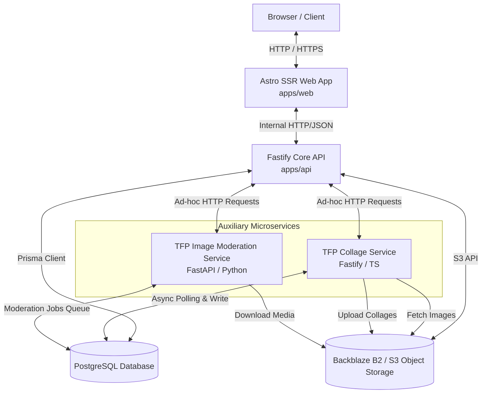

# TFP Multi-Service Creative Platform Orchestrator

This repository is the central orchestrator and superproject for the **TFP (Time For Print) Creative Collaboration Platform**. It manages the main application ecosystem and its specialized, production-ready microservices designed for high-throughput image rendering and AI-powered content moderation.

---

## System Topology & Architecture

The following diagram illustrates how the user-facing client, Astro SSR frontend, Fastify API backend, database, and auxiliary microservices connect and coordinate:



---

## Services Overview

The orchestration layer coordinates three main subprojects, each serving a distinct architectural role in the production pipeline:

### 1. [TFP Photographers Platform](file:///Users/hexa/Desktop/tfp-main-orchestator/tfpphotographers)
* **Role**: Primary user-facing platform and JSON REST API.
* **Tech Stack**: [Astro v4 (SSR)](https://astro.build/) frontend, [Fastify](https://fastify.dev/) API backend, [Prisma ORM](https://www.prisma.io/) with PostgreSQL, SCSS, Zod.
* **Key Features**: Authentication & OAuth, portfolios, contests, event RSVPs, direct messaging, subscriptions (Free, Pro, Pro Plus), and region-gated localization.
* **Documentation**: See [tfpphotographers/README.md](file:///Users/hexa/Desktop/tfp-main-orchestator/tfpphotographers/README.md).

### 2. [TFP Collage Service](file:///Users/hexa/Desktop/tfp-main-orchestator/tfp-collage-service)
* **Role**: Mood-board generation service for collaboration opportunities.
* **Tech Stack**: Fastify, TypeScript, Node Canvas, PostgreSQL, Backblaze B2.
* **Key Features**: 
  - Ad-hoc HTTP rendering via `/api/v1/generate-collage`.
  - Stateful background worker polling approved opportunities, applying focus-metadata, stitching layouts to a 16:9 canvas, and writing back to B2/S3.
* **Documentation**: See [tfp-collage-service/README.md](file:///Users/hexa/Desktop/tfp-main-orchestator/tfp-collage-service/README.md).

### 3. [TFP Image Moderation Service](file:///Users/hexa/Desktop/tfp-main-orchestator/tfp-image-moderation-service)
* **Role**: Signal-only AI inference engine for automated moderation and translation.
* **Tech Stack**: FastAPI (Python), Uvicorn, Nginx, CTranslate2.
* **Models Hosted**:
  - `falconsai` (NSFW image detection)
  - `nudenet` (Intimate body-part detection with bounding boxes)
  - `clip` (Zero-shot semantic prompt classification)
  - `toxic_bert` (Text toxicity classifier)
  - `rules` (Local keyword/regex matching engine)
  - `nllb` (CTranslate2 distilled translation)
* **Key Features**: High-performance image and text analysis, translation, external PostgreSQL-driven moderation job worker.
* **Documentation**: See [tfp-image-moderation-service/README.md](file:///Users/hexa/Desktop/tfp-main-orchestator/tfp-image-moderation-service/README.md).

---

## Service Deployment Matrix

The orchestrator utilizes Oracle Cloud Infrastructure (OCI) VMs behind Nginx reverse proxies.

| Service | Port (Public) | Port (Private) | Runtime | Profile Map | Service Name |
| :--- | :---: | :---: | :--- | :--- | :--- |
| **Main App / Web** | `4321` | — | Node.js / Astro SSR | Dev / UAT / Prod | `tfp-web` |
| **Main App / API** | `4000` | — | Node.js / Fastify | Dev / UAT / Prod | `tfp-api` |
| **Moderation Service** | `7001` | `7002` | Python / FastAPI / Uvicorn | `it` (dev) / `uat` / `prod` | `tfp-image-moderation-service` |
| **Collage Service** | `7003` | `7004` | Node.js / Fastify | `it` (dev) / `uat` / `prod` | `tfp-collage-service` |

---

## Shared DevOps & Deployment Scripting

Deployments are orchestrated from the root using automated, interactive shell wrappers located in [scripts/oci](file:///Users/hexa/Desktop/tfp-main-orchestator/scripts/oci).

### Deploying Both Microservices (Recommended)
To run a unified, interactive deployment for both the Collage and Moderation services:
```bash
bash scripts/oci/deploy-both-services.sh
```
This script will:
1. Prompt you to choose the environment: `local` (1), `UAT` (2), or `PROD` (3).
2. Load the matching environment variables from [tfpphotographers](file:///Users/hexa/Desktop/tfp-main-orchestator/tfpphotographers) (e.g., `.env.production.local`).
3. Run database migrations on the target database (e.g., creating external image moderation job tables).
4. SSH into the OCI host, sync the code repositories, install dependencies via `pnpm` (Collage) and `uv` (Moderation).
5. Build and configure Systemd service scripts and Nginx routing blocks.
6. Verify service health and print live endpoints.

### Targeted Service Deployment
You can disable deployment of individual services using flags:
```bash
# Deploy ONLY the Collage Service
DEPLOY_AI=false bash scripts/oci/deploy-both-services.sh

# Deploy ONLY the Moderation Service
DEPLOY_COLLAGE=false bash scripts/oci/deploy-both-services.sh
```

---

## Local Development Setup

To run the entire ecosystem locally:

### 1. Prerequisites
- **Node.js**: `v24+` (managed via `.nvmrc`)
- **pnpm**: `v10+`
- **Python**: `v3.11` (with `uv` installed)
- **PostgreSQL**: `v14+` running locally

### 2. Environment Configuration
Generate the canonical local, UAT, and production env files from the orchestrator root:
```bash
bash scripts/setup-env.sh --target all
```

This writes ignored runtime files in `tfpphotographers`:
- `.env.local`: local PostgreSQL, local filesystem storage, local moderation at `http://127.0.0.1:7001`, local collage at `http://127.0.0.1:4001`.
- `.env.uat.local`: OCI UAT PostgreSQL, UAT B2 bucket/prefix, UAT moderation/collage endpoints.
- `.env.production.local`: production PostgreSQL placeholder, production B2 bucket/prefix, production moderation/collage endpoints.

The command will not overwrite existing files unless `--force` is passed. UAT and production files intentionally contain `REPLACE_*` placeholders for secrets that must be filled from the secure runtime source.

For the complete secret inventory and exact update locations, see
[tfpphotographers/docs/operations/ENVIRONMENT_AND_SECRETS_GUIDE.md](file:///Users/hexa/Desktop/tfp-main-orchestator/tfpphotographers/docs/operations/ENVIRONMENT_AND_SECRETS_GUIDE.md).

### 3. Spin Up Local Stack
Run the clean local startup script from the main platform folder:
```bash
cd tfpphotographers
pnpm start:local:clean
```
This launches:
- Astro Web App (`http://localhost:3000`)
- Fastify API (`http://localhost:4000`)
- The outbox/moderation background worker.

To run the helper microservices locally:
```bash
# Run Collage Service locally (Fastify app on port 4001)
cd tfp-collage-service
pnpm dev

# Run Image Moderation Service locally (runs FastAPI app on port 7001)
cd tfp-image-moderation-service
uv run ai-inference-api
```

---

## Global Repository & Branch Guidelines

Please review the workspace-wide development rules in [AGENTS.md](file:///Users/hexa/Desktop/tfp-main-orchestator/AGENTS.md). 

> [!IMPORTANT]
> **Commit and Push Preference**
> - Commit completed work by default unless explicitly requested otherwise.
> - Ensure Git commit subjects are scoped (50-72 chars) using imperative format: `feat(...)`, `fix(...)`, `docs(...)`.
> - Always run local verification (`tsc`, builds, or unit tests) before pushing changes to remote branch.

> [!TIP]
> **Brand Protection Rule**
> - The proper nouns `"TFP"` and `"TFP Photographers"` are protected proper nouns. They must remain verbatim in all translations and must never be transliterated or translated.
