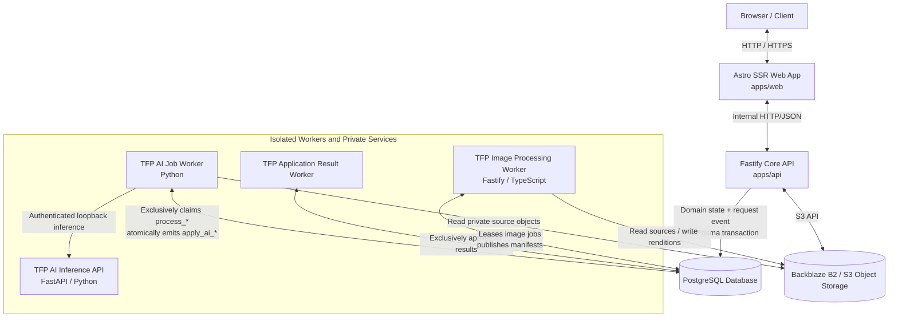

# TFP Multi-Service Creative Platform Orchestrator

This repository is the central orchestrator and superproject for the **TFP (Time For Print) Creative Collaboration Platform**. It manages the main application ecosystem and its specialized, production-ready microservices designed for high-throughput image rendering and AI-powered content moderation.

The cross-repository AI handoff has one machine-readable source of truth:
[`contracts/ai-outbox.schema.json`](contracts/ai-outbox.schema.json). It defines
the durable request/result event names and payload discriminators shared by the
TypeScript application and isolated Python worker. Validate every pinned
consumer together with:

```bash
node --test scripts/contracts/validate-ai-outbox-contract.test.mjs
```

---

## System Topology & Architecture

The following diagram illustrates how the user-facing client, Astro SSR frontend, Fastify API backend, database, and auxiliary microservices connect and coordinate:


```mermaid
graph TD
    Client[Browser / Client] <-->|HTTP / HTTPS| AstroWeb[Astro SSR Web App<br/>apps/web]
    AstroWeb <-->|Internal HTTP/JSON| FastifyAPI[Fastify Core API<br/>apps/api]
    FastifyAPI -->|Domain state + request event<br/>one Prisma transaction| Postgres[(PostgreSQL Database)]
    FastifyAPI <-->|S3 API| Storage[(Backblaze B2 / S3 Object Storage)]

    subgraph "Isolated Workers and Private Services"
        AppWorker[TFP Application Result Worker]
        ImageWorker[TFP Image Processing Worker<br/>Fastify / TypeScript]
        AIWorker[TFP AI Job Worker<br/>Python]
        InferenceService[TFP AI Inference API<br/>FastAPI / Python]
    end

    AIWorker <-->|Exclusively claims process_*<br/>atomically emits apply_ai_*| Postgres
    AIWorker -->|Authenticated loopback inference| InferenceService
    AppWorker <-->|Exclusively applies AI results| Postgres
    ImageWorker <-->|Leases image jobs<br/>publishes manifests| Postgres
    AIWorker -->|Read private source objects| Storage
    ImageWorker -->|Read sources / write renditions| Storage
```

---

## Services Overview

The orchestration layer coordinates three main subprojects, each serving a distinct architectural role in the production pipeline:

### 1. [TFP Photographers Platform](tfpphotographers/)
* **Role**: Primary user-facing platform and JSON REST API.
* **Tech Stack**: [Astro v7 (SSR)](https://astro.build/) frontend, [Fastify](https://fastify.dev/) API backend, [Prisma ORM](https://www.prisma.io/) with PostgreSQL, SCSS, Zod.
* **Key Features**: Authentication & OAuth, portfolios, contests, event RSVPs, direct messaging, subscriptions (Free, Pro, Pro Plus), and region-gated localization.
* **Documentation**: See [tfpphotographers/README.md](tfpphotographers/README.md).

### 2. [TFP Image Processing Service](tfp-collage-service/)
* **Role**: Isolated rendition, manifest, lifecycle, and non-blocking opportunity-collage worker. The repository/systemd compatibility name remains `tfp-collage-service`; the runtime package is `tfp-image-processing-service`.
* **Tech Stack**: Fastify, TypeScript, Node Canvas, PostgreSQL, Backblaze B2.
* **Key Features**: 
  - Ad-hoc HTTP rendering via `/api/v1/generate-collage`.
  - Stateful background worker polling approved opportunities, applying focus-metadata, stitching layouts to a 16:9 canvas, and writing back to B2/S3.
* **Documentation**: See [tfp-collage-service/README.md](tfp-collage-service/README.md).

### 3. [TFP AI Inference Service](tfp-ai-interface/)
* **Role**: Private inference API and isolated PostgreSQL-backed AI job worker
  for image moderation, text safety, and translation.
* **Tech Stack**: FastAPI, OpenRouter/Qwen vision, ToxicBERT, and M2M100.
* **Key Features**: metadata-free 600px image submission, strict binary image output,
  local CPU text/translation models, internal authentication, bounded concurrency, and
  privacy-safe telemetry.
* **State boundary**: The app owns product policy and domain state.
  `tfp-ai-interface` claims only `process_moderation` and
  `process_translation` requests through a least-privilege database role and
  atomically emits result events; the app worker applies those results.
* **Documentation**: See [tfp-ai-interface/README.md](tfp-ai-interface/README.md).

The canonical moderation, outbox, worker-ownership, deployment, and rollback
contract is [Durable Moderation, AI Worker, Event Outbox, and Deployment Readiness](tfpphotographers/docs/architecture/EVENT_OUTBOX_AND_DEPLOYMENT_READINESS.md).

`tfp-moderation-service` is a retained historical checkout and is not part of
active deployment or runtime orchestration.

---

## Service Deployment Matrix

The orchestrator deploys the complete private UAT stack to the OCI Always Free Ampere host. Nginx and every application service listen only on loopback; Cloudflare Tunnel is the tester ingress.

| Service | Loopback Port | Internal App Port | Runtime | Profile Map | Service Name |
| :--- | :---: | :---: | :--- | :--- | :--- |
| **Main App / Web** | `8080` | — | Node.js / Astro SSR | Dev / UAT / Prod | `tfp-main-uat-web` |
| **Main App / API** | `4000` | — | Node.js / Fastify | Dev / UAT / Prod | `tfp-main-uat-api` |
| **AI Inference Service** | `7011` | — | Python / FastAPI / Uvicorn | Local / UAT / Prod | `tfp-ai-interface` |
| **Image Processing Service** | `7003` | `7004` | Node.js / Fastify | `it` (dev) / `uat` / `prod` | `tfp-collage-service` (compatibility name) |

### Current OCI UAT Host

- Instance: `tfp-a1-free-2ocpu-12gb`
- Public/private IP: `161.118.161.98` / `10.0.1.114`
- Shape: `VM.Standard.A1.Flex`, `2 OCPU / 12 GB RAM`, ARM64
- Region: `ap-mumbai-1`
- SSH: `ubuntu@161.118.161.98`
- Tester URL: `https://uat.tfpphotographers.com`
- Tunnel: `tfp-oci-uat` -> `http://localhost:8080`
- Database and app/service ports: loopback-only on the OCI host

Use [scripts/oci/deploy-all-uat.sh](scripts/oci/deploy-all-uat.sh) for a fresh full-stack deployment. The older OCI E2 micro at `140.245.30.133` is not the UAT host. Contabo `13.140.189.236` is retired and must not be used as a deployment or database target.

---

### Folder Moderation Exclusion

Normal OCI UAT deployments intentionally exclude folder moderation. `/srv/tfp-folder-moderation`, source images, reports, reviewer chunks, and raw audit payloads must not be transferred. The old Contabo-backed wrapper is retired and requires an explicit future redesign before reuse.

---

## Shared DevOps & Deployment Scripting

OCI UAT deployments are orchestrated from [scripts/oci](scripts/oci/). The full-stack entrypoint calls the main app, AI inference, and collage deploy scripts directly.

### Deploying the Full UAT Stack (Recommended)
To deploy the complete fresh UAT stack:
```bash
bash scripts/oci/deploy-all-uat.sh
```
This bootstraps fresh OCI-local PostgreSQL, deploys only required application/service payloads, preserves the folder-moderation exclusion, and verifies loopback listeners.

### Targeted Service Deployment
Deploy an individual service through its owned entrypoint:
```bash
bash tfp-ai-interface/scripts/deploy-uat.sh
bash tfp-collage-service/scripts/deploy/deploy.sh uat
```

### OCI A1 Capacity Acquisition

OCI free-tier capacity acquisition is managed separately from the active OCI UAT deployment flow. To run the background acquisition loop on macOS:

```bash
scripts/oci/acquire-a1-free.sh --daemon
```

For a LaunchAgent-managed background run, check:

```bash
tail -f .run-state/oci/launchd-a1-acquire.out.log
launchctl print gui/$(id -u)/com.tfp.oci-a1-acquire
```

---

## Local Development Setup

To run the entire ecosystem locally:

### 1. Prerequisites
- **Node.js**: `v24+` (managed via `.nvmrc`)
- **pnpm**: `v10+`
- **Python**: `v3.11` (with `uv` installed)
- **PostgreSQL**: `v14+` running locally

### 2. Environment Configuration
Generate the canonical local, UAT, and production env files from the orchestrator root:
```bash
bash scripts/setup-env.sh --target all
```

This writes ignored runtime files in `tfpphotographers`:
- `.env.local`: local PostgreSQL, local filesystem storage, `tfp-ai-interface` on `127.0.0.1:7011`, and local collage on `127.0.0.1:7003/7004`.
- `.env.uat.local`: OCI host-local UAT PostgreSQL, UAT B2 bucket/prefix, and loopback AI/collage endpoints.
- `.env.production.local`: production PostgreSQL placeholder, production B2 bucket/prefix, and production AI/collage endpoints.

The command will not overwrite existing files unless `--force` is passed. UAT and production files intentionally contain `REPLACE_*` placeholders for secrets that must be filled from the secure runtime source.

For the complete secret inventory and exact update locations, see
[tfpphotographers/docs/operations/ENVIRONMENT_AND_SECRETS_GUIDE.md](tfpphotographers/docs/operations/ENVIRONMENT_AND_SECRETS_GUIDE.md).

### 3. Spin Up Local Stack
Run the clean local startup script from the main platform folder:
```bash
cd tfpphotographers
pnpm start:local:clean
```
This launches:
- Astro Web App (`http://localhost:3000`)
- Fastify API (`http://localhost:4000`)
- The outbox/moderation background worker.

To run the helper microservices locally:
```bash
# Run the image-processing service locally (compatibility repo name)
cd tfp-collage-service
pnpm dev

# Run AI Inference Service locally (FastAPI on loopback port 7011)
cd tfp-ai-interface
uv sync --extra local-ml
uv run tfp-ai-inference-api
```

---

## Global Repository & Branch Guidelines

Please review the workspace-wide development rules in [AGENTS.md](AGENTS.md).

> [!IMPORTANT]
> **Commit and Push Preference**
> - Commit completed work by default unless explicitly requested otherwise.
> - Ensure Git commit subjects are scoped (50-72 chars) using imperative format: `feat(...)`, `fix(...)`, `docs(...)`.
> - Always run local verification (`tsc`, builds, or unit tests) before pushing changes to remote branch.

> [!TIP]
> **Brand Protection Rule**
> - The proper nouns `"TFP"` and `"TFP Photographers"` are protected proper nouns. They must remain verbatim in all translations and must never be transliterated or translated.
