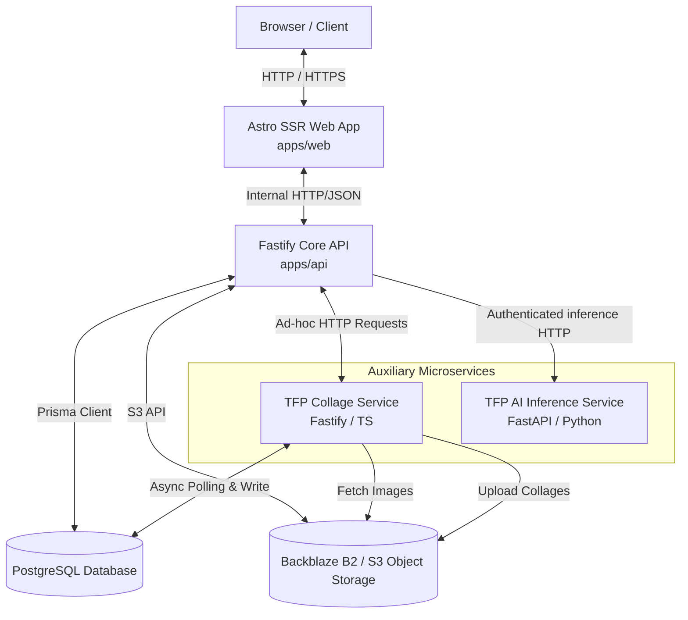

# TFP Multi-Service Creative Platform Orchestrator

This repository is the central orchestrator and superproject for the **TFP (Time For Print) Creative Collaboration Platform**. It manages the main application ecosystem and its specialized, production-ready microservices designed for high-throughput image rendering and AI-powered content moderation.

---

## System Topology & Architecture

The following diagram illustrates how the user-facing client, Astro SSR frontend, Fastify API backend, database, and auxiliary microservices connect and coordinate:


```mermaid
graph TD
    Client[Browser / Client] <-->|HTTP / HTTPS| AstroWeb[Astro SSR Web App<br/>apps/web]
    AstroWeb <-->|Internal HTTP/JSON| FastifyAPI[Fastify Core API<br/>apps/api]
    FastifyAPI <-->|Prisma Client| Postgres[(PostgreSQL Database)]
    FastifyAPI <-->|S3 API| Storage[(Backblaze B2 / S3 Object Storage)]

    subgraph "Auxiliary Microservices"
        CollageService[TFP Collage Service<br/>Fastify / TS]
        InferenceService[TFP AI Inference Service<br/>FastAPI / Python]
    end

    CollageService <-->|Async Polling & Write| Postgres
    CollageService -->|Fetch Images| Storage
    CollageService -->|Upload Collages| Storage

    FastifyAPI <-->|Ad-hoc HTTP Requests| CollageService
    FastifyAPI -->|Authenticated inference HTTP| InferenceService
```

---

## Services Overview

The orchestration layer coordinates three main subprojects, each serving a distinct architectural role in the production pipeline:

### 1. [TFP Photographers Platform](file:///Users/hexa/Desktop/tfp-main-orchestator/tfpphotographers)
* **Role**: Primary user-facing platform and JSON REST API.
* **Tech Stack**: [Astro v4 (SSR)](https://astro.build/) frontend, [Fastify](https://fastify.dev/) API backend, [Prisma ORM](https://www.prisma.io/) with PostgreSQL, SCSS, Zod.
* **Key Features**: Authentication & OAuth, portfolios, contests, event RSVPs, direct messaging, subscriptions (Free, Pro, Pro Plus), and region-gated localization.
* **Documentation**: See [tfpphotographers/README.md](file:///Users/hexa/Desktop/tfp-main-orchestator/tfpphotographers/README.md).

### 2. [TFP Collage Service](file:///Users/hexa/Desktop/tfp-main-orchestator/tfp-collage-service)
* **Role**: Mood-board generation service for collaboration opportunities.
* **Tech Stack**: Fastify, TypeScript, Node Canvas, PostgreSQL, Backblaze B2.
* **Key Features**: 
  - Ad-hoc HTTP rendering via `/api/v1/generate-collage`.
  - Stateful background worker polling approved opportunities, applying focus-metadata, stitching layouts to a 16:9 canvas, and writing back to B2/S3.
* **Documentation**: See [tfp-collage-service/README.md](file:///Users/hexa/Desktop/tfp-main-orchestator/tfp-collage-service/README.md).

### 3. [TFP AI Inference Service](file:///Users/hexa/Desktop/tfp-main-orchestator/tfp-ai-inference-service)
* **Role**: Stateless image moderation, text-safety, and translation inference.
* **Tech Stack**: FastAPI, OpenRouter/Qwen vision, ToxicBERT, and M2M100.
* **Key Features**: metadata-free 600px image submission, strict binary image output,
  local CPU text/translation models, internal authentication, bounded concurrency, and
  privacy-safe telemetry.
* **State boundary**: The TFP app owns PostgreSQL jobs, decisions, retries, and
  `TranslationCache`; the inference service never reads or writes the product database.
* **Documentation**: See [tfp-ai-inference-service/README.md](file:///Users/hexa/Desktop/tfp-main-orchestator/tfp-ai-inference-service/README.md).

`tfp-moderation-service` is retained unchanged as the V1 rollback codebase. It is not
part of the default OCI UAT deployment.

---

## Service Deployment Matrix

The orchestrator deploys the complete private UAT stack to the OCI Always Free Ampere host. Nginx and every application service listen only on loopback; Cloudflare Tunnel is the tester ingress.

| Service | Loopback Port | Internal App Port | Runtime | Profile Map | Service Name |
| :--- | :---: | :---: | :--- | :--- | :--- |
| **Main App / Web** | `8080` | — | Node.js / Astro SSR | Dev / UAT / Prod | `tfp-main-uat-web` |
| **Main App / API** | `4000` | — | Node.js / Fastify | Dev / UAT / Prod | `tfp-main-uat-api` |
| **AI Inference Service** | `7011` | — | Python / FastAPI / Uvicorn | Local / UAT / Prod | `tfp-ai-inference-service` |
| **Collage Service** | `7003` | `7004` | Node.js / Fastify | `it` (dev) / `uat` / `prod` | `tfp-collage-service` |

### Current OCI UAT Host

- Instance: `tfp-a1-free-2ocpu-12gb`
- Public/private IP: `161.118.161.98` / `10.0.1.114`
- Shape: `VM.Standard.A1.Flex`, `2 OCPU / 12 GB RAM`, ARM64
- Region: `ap-mumbai-1`
- SSH: `ubuntu@161.118.161.98`
- Tester URL: `https://uat.tfpphotographers.com`
- Tunnel: `tfp-oci-uat` -> `http://localhost:8080`
- Database and app/service ports: loopback-only on the OCI host

Use [scripts/oci/deploy-all-uat.sh](file:///Users/hexa/Desktop/tfp-main-orchestator/scripts/oci/deploy-all-uat.sh) for a fresh full-stack deployment. The older OCI E2 micro at `140.245.30.133` is not the UAT host. Contabo `13.140.189.236` is retired and must not be used as a deployment or database target.

---

### Folder Moderation Exclusion

Normal OCI UAT deployments intentionally exclude folder moderation. `/srv/tfp-folder-moderation`, source images, reports, reviewer chunks, and raw audit payloads must not be transferred. The old Contabo-backed wrapper is retired and requires an explicit future redesign before reuse.

---

## Shared DevOps & Deployment Scripting

OCI UAT deployments are orchestrated from [scripts/oci](file:///Users/hexa/Desktop/tfp-main-orchestator/scripts/oci). Service-local scripts retain their historical `scripts/vps` directory name but receive the OCI host and user from the OCI wrapper.

### Deploying the Full UAT Stack (Recommended)
To deploy the complete fresh UAT stack:
```bash
bash scripts/oci/deploy-all-uat.sh
```
This bootstraps fresh OCI-local PostgreSQL, deploys only required application/service payloads, preserves the folder-moderation exclusion, and verifies loopback listeners.

### Targeted Service Deployment
You can disable deployment of individual services using flags:
```bash
# Deploy ONLY the Collage Service
DEPLOY_AI=false bash scripts/vps/deploy-both-services.sh

# Deploy ONLY the AI inference service
bash tfp-ai-inference-service/scripts/deploy-uat.sh
```

### OCI A1 Capacity Acquisition

OCI free-tier capacity acquisition is managed separately from the active OCI UAT deployment flow. To run the background acquisition loop on macOS:

```bash
scripts/oci/acquire-a1-free.sh --daemon
```

For a LaunchAgent-managed background run, check:

```bash
tail -f .run-state/oci/launchd-a1-acquire.out.log
launchctl print gui/$(id -u)/com.tfp.oci-a1-acquire
```

---

## Local Development Setup

To run the entire ecosystem locally:

### 1. Prerequisites
- **Node.js**: `v24+` (managed via `.nvmrc`)
- **pnpm**: `v10+`
- **Python**: `v3.11` (with `uv` installed)
- **PostgreSQL**: `v14+` running locally

### 2. Environment Configuration
Generate the canonical local, UAT, and production env files from the orchestrator root:
```bash
bash scripts/setup-env.sh --target all
```

This writes ignored runtime files in `tfpphotographers`:
- `.env.local`: local PostgreSQL, local filesystem storage, configurable V1/V2 inference URL, and local collage at `http://127.0.0.1:4001`.
- `.env.uat.local`: OCI host-local UAT PostgreSQL, UAT B2 bucket/prefix, and loopback moderation/collage endpoints.
- `.env.production.local`: production PostgreSQL placeholder, production B2 bucket/prefix, production moderation/collage endpoints.

The command will not overwrite existing files unless `--force` is passed. UAT and production files intentionally contain `REPLACE_*` placeholders for secrets that must be filled from the secure runtime source.

For the complete secret inventory and exact update locations, see
[tfpphotographers/docs/operations/ENVIRONMENT_AND_SECRETS_GUIDE.md](file:///Users/hexa/Desktop/tfp-main-orchestator/tfpphotographers/docs/operations/ENVIRONMENT_AND_SECRETS_GUIDE.md).

### 3. Spin Up Local Stack
Run the clean local startup script from the main platform folder:
```bash
cd tfpphotographers
pnpm start:local:clean
```
This launches:
- Astro Web App (`http://localhost:3000`)
- Fastify API (`http://localhost:4000`)
- The outbox/moderation background worker.

To run the helper microservices locally:
```bash
# Run Collage Service locally (Fastify app on port 4001)
cd tfp-collage-service
pnpm dev

# Run AI Inference Service locally (FastAPI on loopback port 7011)
cd tfp-ai-inference-service
uv sync --extra local-ml
uv run tfp-ai-inference-api
```

---

## Global Repository & Branch Guidelines

Please review the workspace-wide development rules in [AGENTS.md](file:///Users/hexa/Desktop/tfp-main-orchestator/AGENTS.md). 

> [!IMPORTANT]
> **Commit and Push Preference**
> - Commit completed work by default unless explicitly requested otherwise.
> - Ensure Git commit subjects are scoped (50-72 chars) using imperative format: `feat(...)`, `fix(...)`, `docs(...)`.
> - Always run local verification (`tsc`, builds, or unit tests) before pushing changes to remote branch.

> [!TIP]
> **Brand Protection Rule**
> - The proper nouns `"TFP"` and `"TFP Photographers"` are protected proper nouns. They must remain verbatim in all translations and must never be transliterated or translated.
