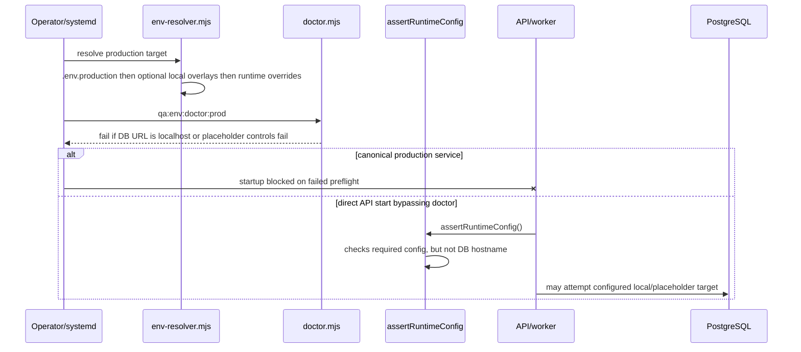
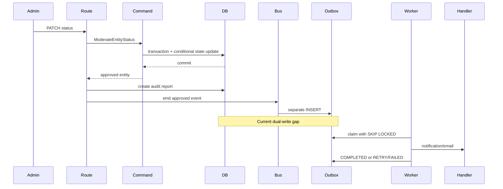
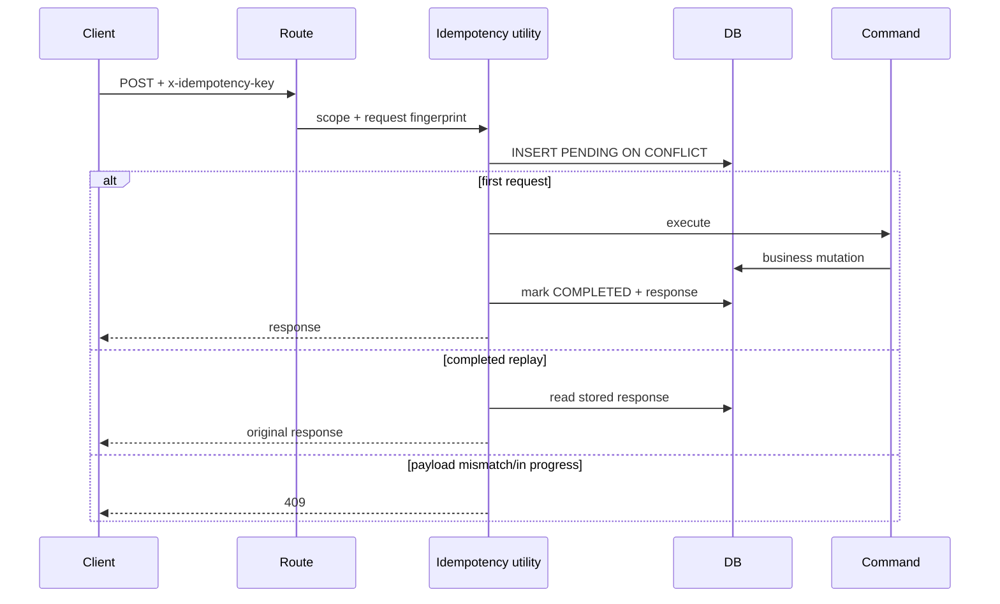
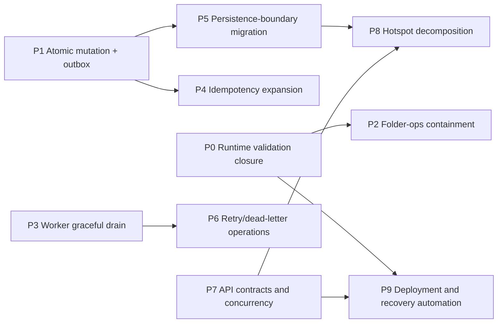

# 🔎 Validated Architecture Audit and Implementation Plan

> **Repository:** `/Users/hexa/Desktop/tfp-main-orchestator`
> **Validation date:** 2026-07-26
> **Mode:** Static, read-only validation and planning
> **Original audit:** `ENTERPRISE_CODEBASE_ARCHITECTURE_AUDIT.md`
> **Output status:** Implementation code was not changed. This document is the only file created.

---

## 1. Cover Page

| Item | Validated value |
| --- | --- |
| Root branch | `feature/async-moderation` |
| Root commit | `1efc2806fa39c0909b2d65789aa2d959bbf68670` |
| Root worktree before validation | Untracked original audit only |
| `tfpphotographers` | `main` at `eb1eb76a6893a9cc9d9ea312f2d033e8fd3741b4`, clean |
| `tfp-collage-service` | `main` at `70f4d82e25b37721a50474b219125988143acc55`, clean |
| `tfp-moderation-service` | `feature/async-moderation` at `58e44796784a5588251c0e49fc20c1412d986339`, clean |
| Validation confidence | High for static code/config findings; runtime-dependent deployment claims are labelled |
| Source coverage | Root plus all three submodules; application source, schemas, migrations, tests, scripts, deployment configuration, and relevant docs |
| Prohibited actions | No pull, build, tests, dependency installation, migration, runtime mutation, commit, or push |

### Audit-count integrity warning

The source audit claims **55 findings** and **12 informational findings**, but it contains only **54 identifiable finding headings**:

- 43 numbered findings, `A01` through `A43`;
- 11 positive findings, `PF-01` through `PF-11`;
- no twelfth informational finding.

This report validates all 54 identifiable findings and carries a synthetic register row named `MISSING-INFO-12` solely to prove that the source report omitted the claimed 55th item. No conclusion was invented for it.

---

## 2. Executive Summary

The original conclusion—two Critical blockers, eight High findings, and a platform that is not enterprise-ready because foundational controls are absent—is **not supported by the current repository**.

Several claimed gaps are already implemented:

- Redis absence does **not** disable rate limiting. `@fastify/rate-limit` uses its in-memory store when Redis is absent, and the application-level provider also falls back to `createInMemoryRateLimiter()`.
- Strict production startup rejects missing shared Redis when rate limiting is enabled.
- `/ready` checks PostgreSQL, production Redis, worker heartbeat, and moderation queue age.
- Idempotency is wired to opportunity and event creation and has unit and route coverage.
- Admin commands have a dedicated, substantial test suite.
- Outbox rows stuck in `PROCESSING` are reclaimed after five minutes.
- Outbox retry is exponential, although it still lacks jitter.
- Circuit breakers already protect translation and image moderation.
- Database uniqueness constraints already protect contest entries, opportunity applications, event RSVPs, and active duplicate reports.
- `opportunity.routes.ts` is 519 lines, not at its 1,100-line cap.
- Prisma CLI/client versions are aligned at 6.19.3.

The validation did, however, uncover a more consequential issue omitted by the audit: the event outbox is not consistently written in the same transaction as the business mutation. Most event emissions use the root Prisma-backed adapter after the command transaction has committed. This creates a dual-write failure window and invalidates the audit's strongest positive outbox claim.

### Validated disposition totals

These totals cover the 54 identifiable original findings.

| Validation status | Count |
| --- | ---: |
| Confirmed | 12 |
| Confirmed with Corrections | 11 |
| Partially Confirmed | 7 |
| Already Resolved | 5 |
| Mitigated | 5 |
| Intentional Trade-Off | 5 |
| Duplicate | 0 |
| Not Reproducible | 2 |
| False Positive | 6 |
| Requires Runtime Validation | 1 |
| **Total identifiable original findings** | **54** |

Three new findings were identified:

- `NEW-001` — Event outbox enqueue is not transactionally coupled to domain writes.
- `NEW-002` — Folder-operations mutating routes do not enforce the internal API key used by adjacent routes.
- `NEW-003` — The TypeScript worker shutdown path stops timers but does not drain in-flight jobs.

### Revised severity totals

| Severity | Original claimed | Validated original findings | New findings | Programme total |
| --- | ---: | ---: | ---: | ---: |
| Critical | 2 | 0 | 0 | 0 |
| High | 8 | 2 | 1 | 3 |
| Medium | 19 | 9 | 2 | 11 |
| Low | 14 | 16 | 0 | 16 |
| Informational | 12 claimed / 11 present | 27 | 0 | 27 |
| **Total** | **55 claimed / 54 present** | **54** | **3** | **57** |

### Overall readiness

**Static codebase readiness: conditionally ready for controlled UAT, not yet evidenced for production launch.**

The principal production gates are:

1. Make domain mutation plus outbox enqueue atomic.
2. Prove effective production environment injection, Redis, observability, backups, and edge exposure at runtime.
3. Close folder-operations authorization inconsistency before exposing the UAT operator UI outside a private boundary.
4. Add graceful in-flight worker drain.
5. Extend idempotency only to write routes whose side effects or retry behaviour justify it.

---

## 3. Repository State

### Projects and technologies

| Component | Current stack | Persistence/integration | Tests |
| --- | --- | --- | --- |
| `tfpphotographers/apps/web` | Astro 6.4, React 18.3 | HTTP `/api/v1` | Vitest, Playwright |
| `tfpphotographers/apps/api` | Fastify 5.8, TypeScript | Prisma 6.19/PostgreSQL, Redis optional outside strict production | Vitest integration/unit |
| `tfpphotographers/apps/mobile` | Expo 52, RN 0.76, React 18.3 | Real `/api/v1` adapter, SecureStore | Vitest/typecheck/doctor |
| Shared packages | config, database, email, i18n, moderation, shared, storage, uploads | pnpm workspace | package/app tests |
| `tfp-collage-service` | Fastify 5.8, Node 24 | PostgreSQL, B2/S3, Canvas | 2 test files with server, worker, and storage cases |
| `tfp-moderation-service` | Python 3.11, FastAPI 0.116 | PostgreSQL, B2/S3, model providers | Pytest unit/integration/contract |

### Measured inventory

| Area | Files observed |
| --- | ---: |
| Root tracked entries | 29 |
| `tfpphotographers` tracked entries | 7,420 |
| Collage tracked entries | 26 |
| Moderation tracked entries | 77 |
| API source | 301 |
| API tests | 162 |
| Web source | 341 |
| Web tests | 36 |
| Mobile source | 100 |
| Shared-package files | 228 |
| Root test tree | 5,882, dominated by seed assets |

The Prisma schema currently has **58 models and 50 enums**, not the audit's 42-table/37-enum inventory.

### Build, runtime, deployment, and CI

- Node runtime is pinned to 24 in both TypeScript repositories.
- Package management is pnpm; Python dependency management is `uv`.
- PostgreSQL is the durable state and job/outbox store.
- Docker Compose, systemd units, VPS scripts, Cloudflare routing docs, and database backup/restore scripts exist.
- No checked-in `.github/workflows` CI workflow was found.
- The canonical production systemd example runs `qa:env:doctor:prod` before Docker Compose startup and runs as user `tfp`.
- Collage and moderation deploy scripts still default their SSH deploy user to `root`, although app processes can run as the selected deployment user.

### Structure mismatch with the original audit

- The actual submodule is `tfp-moderation-service`, not `tfp-image-moderation-service`.
- The audit says `TranslationService.ts` is 1,383 lines; it is 1,327.
- The audit says `opportunity.routes.ts` is at 1,100 lines; it is 519.
- The audit says `process-image-moderation-job.ts` is at 1,300; it is 1,424 and exceeds the configured cap.
- The direct-database baseline contains 23 entries, while the audit alternates between 22 and 23.

---

## 4. Validation Method

1. Parsed every source-audit finding heading and cross-checked its stated `Axx` identifier.
2. Captured branch, commit, dirty status, submodules, package manifests, runtime pins, and tracked-file counts.
3. Read referenced implementation and surrounding code, not isolated snippets.
4. Followed call sites from route/handler through commands, Prisma transactions, event bus, outbox, and worker.
5. Inspected schema constraints and launch-baseline migration SQL.
6. Searched relevant unit, integration, contract, concurrency, health, and route tests.
7. Inspected environment precedence, strict runtime checks, env doctor, Compose substitution, systemd preflight, and VPS deployment scripts.
8. Rejected claims based only on line count, filenames, or the absence of a specific fashionable pattern.
9. Kept runtime-only facts—live firewall, live secrets, backup evidence, actual reverse-proxy behaviour—explicitly unconfirmed.

No build or test suite was run because the attached prompt permits only read operations plus creation of this document.

---

## 5. Validation Summary Table

### Critical and High source findings

| ID | Original severity | Validation status | Revised severity | Confidence | Root cause / correction | Plan |
| --- | --- | --- | --- | --- | --- | --- |
| A01 / CRIT-01 | Critical | Partially Confirmed | High | Confirmed static | Local overlays resolve production to localhost, but canonical production preflight rejects it; live injection unknown | P0 |
| A15 / CRIT-02 | Critical | Mitigated | Medium | Confirmed static | Redis controls distributed consistency, not existence of rate limiting; strict production requires Redis | P0 |
| A02 / HIGH-01 | High | Confirmed with Corrections | Medium | Confirmed | 22 real command/service persistence violations plus one type-only debt entry; generic repositories are not justified everywhere | P5 |
| A10 / HIGH-02 | High | Partially Confirmed | High | Confirmed | Idempotency is active for event/opportunity create, absent on many other retry-prone writes | P4 |
| A04 / HIGH-03 | High | Intentional Trade-Off | Low | High | Filesystem heartbeat is valid single-host/container health; not cross-host coordination | P0/P9 |
| A07 / HIGH-04 | High | Already Resolved | Informational | Confirmed | Dedicated `admin.commands.test.ts` and multiple admin route suites exist | Excluded |
| A05 / HIGH-05 | High | Confirmed with Corrections | Medium | Confirmed | Retry is exponential, not linear; jitter is absent | P6 |
| A08 / HIGH-06 | High | Confirmed with Corrections | Medium | Confirmed | 1,327 lines; provider/orchestrator separation and direct tests already exist | P8 |
| A16 / HIGH-07 | High | Confirmed with Corrections | Medium | High | Fixed command is composed in web module; config paths need quoting; no demonstrated user-input injection | P2 |
| A03 / HIGH-08 | High | Mitigated | Low | Confirmed | Wildcard CORS has credentials disabled; API key and loopback app binding mitigate; UAT proxy exposure still needs validation | P0/P2 |

### Medium source findings

| ID | Status | Revised severity | Confidence | Validated conclusion | Plan |
| --- | --- | --- | --- | --- | --- |
| A09 / MED-01 | Confirmed | Low | Confirmed | `admin.commands.ts` is 1,089 lines and has no cap | P8 |
| A06 / MED-02 | Partially Confirmed | Low | High | ORM types cross application boundaries, but the schema has 50 enums and wholesale duplicate domain enums would add harmful mapping | P5 |
| A11 / MED-03 | Confirmed | Low | High | General edit workflows lack compare-and-swap/version checks; state transitions often use conditional `updateMany` | P7 optional |
| A12 / MED-04 | Confirmed | Low | Confirmed | `/api/v1` exists without deprecation/version governance | P7 |
| A13 / MED-05 | Not Reproducible | Informational | Medium | Structure alone does not demonstrate N+1; file uses batched `Promise.all` paths | Runtime profile only |
| A14 / MED-06 | Mitigated | Low | Confirmed | Circuit breakers exist for translation and image moderation; timeouts protect other provider calls | P6 optional |
| A17 / MED-07 | Already Resolved | Informational | Confirmed | `/ready` checks DB, production Redis, worker, and queue age | Excluded |
| A18 / MED-08 | Already Resolved | Informational | Confirmed | Outbox reclaims `PROCESSING` rows older than five minutes | Excluded |
| A19 / MED-09 | Intentional Trade-Off | Informational | Confirmed | Node 24 wrappers and `.nvmrc` are the repository runtime contract | Excluded |
| A20 / MED-10 | Confirmed with Corrections | Low | Confirmed | Terminal `FAILED` is already dead-letter state; operator query/replay UX is the gap | P6 |
| A21 / MED-11 | Confirmed with Corrections | Medium | Confirmed | No web/mobile-to-API contract suite; `test:e2e:contract` currently runs i18n tests | P7 |
| A22 / MED-12 | Confirmed | Medium | Confirmed | Multiple service deployment scripts default SSH to root; systemd app units are non-root in main app | P9 |
| A23 / MED-13 | Mitigated | Low | High | Python worker lacks SIGTERM drain, but expiring DB leases recover work | P3 |
| A24 / MED-14 | Partially Confirmed | Low | Confirmed | Concurrency tests exist for reports, applications, upload completion, referrals, and moderation races; coverage is not comprehensive | P7 |
| A25 / MED-15 | Already Resolved | Informational | Confirmed | DB uniques exist for contest submission, application, RSVP, report, and reactions | Excluded |
| A26 / MED-16 | Confirmed with Corrections | Medium | Confirmed | Most cited files are below caps; moderation processor is 1,424 vs 1,300 cap | P8 |
| A27 / MED-17 | Confirmed | Medium | Confirmed | Deployment is script/systemd/Compose based; no declarative provisioning or checked-in CI | P9 |
| A28 / MED-18 | False Positive | Informational | Confirmed | Boolean privacy/remote availability accurately model current binary product rules | Excluded |
| A29 / MED-19 | Intentional Trade-Off | Low | Confirmed | Expo/React pin is documented and stable; upgrade requires a deliberate monorepo plan | Deferred |

### Low source findings

| ID | Status | Revised severity | Confidence | Validated conclusion | Plan |
| --- | --- | --- | --- | --- | --- |
| A30 / LOW-01 | Intentional Trade-Off | Informational | Confirmed | 180-day JWT plus session-version revocation; mobile clears on 401 by design | Deferred ADR |
| A31 / LOW-02 | False Positive | Informational | Confirmed | Schema contains no mixed `@db.Timestamp`/`@db.Timestamptz` annotations | Excluded |
| A32 / LOW-03 | Partially Confirmed | Low | High | Typed env SSOT exists in config, but operator documentation is distributed | P9 |
| A33 / LOW-04 | Partially Confirmed | Low | Confirmed | Outbox adapter/runner tests exist; full database state-transition integration coverage is incomplete | P1/P6 |
| A34 / LOW-05 | False Positive | Informational | Confirmed | `src/ai/prompts/moderation-policy.md` is explicitly referenced as canonical | Excluded |
| A35 / LOW-06 | Confirmed with Corrections | Low | Confirmed | Two files include meaningful worker/server/storage tests; direct collage-maker composition coverage is limited | P8 |
| A36 / LOW-07 | Not Reproducible | Informational | Low | Multiple historical docs do not prove dead code or harmful drift | Product confirmation |
| A37 / LOW-08 | Already Resolved | Informational | Confirmed | Opportunity route file is 519 lines | Excluded |
| A38 / LOW-09 | Partially Confirmed | Low | High | Baseline guard and runtime-image contract tests exist; no restored production-like migration CI gate | P9 |
| A39 / LOW-10 | False Positive | Informational | Confirmed | Server owns rate limits; mobile need not implement a limiter. `Retry-After` UX is optional | Excluded |
| A40 / LOW-11 | Intentional Trade-Off | Informational | High | One-off translation utility is not a production service; smoke coverage is optional | Deferred |
| A41 / LOW-12 | Mitigated | Informational | Confirmed | Seed asset/contract tests and dry-run validation are checked in | Excluded |
| A42 / LOW-13 | Requires Runtime Validation | Low | Medium | Backup/restore scripts and runbooks exist; scheduled successful restore evidence is external | P0/P9 |
| A43 / LOW-14 | False Positive | Informational | Confirmed | `prisma` and `@prisma/client` are both `^6.19.3`; lock resolves 6.19.3 | Excluded |

### Positive and informational source findings

| ID | Status | Revised severity | Correction |
| --- | --- | --- | --- |
| PF-01 | Confirmed | Informational | Rulebook and enforcement are active |
| PF-02 | Confirmed | Informational | No `@ts-ignore` found in product source |
| PF-03 | Confirmed with Corrections | Informational | Idempotency is not merely purpose-built; it is active on two creation routes |
| PF-04 | Confirmed | Informational | Session-version revocation is implemented |
| PF-05 | False Positive | High concern | Durable outbox exists, but same-transaction atomicity is not generally true; see `NEW-001` |
| PF-06 | Confirmed | Informational | Collage URL fetch validates protocol, IP class, redirects, type, and size |
| PF-07 | Confirmed | Informational | Soft-delete extension centralises filtering |
| PF-08 | Confirmed with Corrections | Informational | Strong controls exist, but folder-ops authorization is inconsistent |
| PF-09 | Confirmed | Informational | Shared i18n is used by web/mobile |
| PF-10 | Confirmed with Corrections | Informational | Package boundaries are strong; application-to-persistence debt remains |
| PF-11 | Confirmed | Informational | URL-critical normalization extension exists |
| MISSING-INFO-12 | False Positive | Informational | No twelfth informational finding exists in the source document |

---

## 6. Revised Severity Summary

| Severity | Original count | Validated count, originals only | Difference |
| --- | ---: | ---: | ---: |
| Critical | 2 | 0 | -2 |
| High | 8 | 2 | -6 |
| Medium | 19 | 9 | -10 |
| Low | 14 | 16 | +2 |
| Informational | 12 claimed | 27 | +15 |

Severity fell because the original audit repeatedly:

- ignored current safeguards;
- treated future multi-node requirements as present defects;
- treated file size as a correctness issue;
- inferred performance without measurement;
- counted absent optional patterns rather than demonstrated failure modes.

---

## 7. Critical Findings Validation

### A01 — Production database configuration

**Original claim:** all production database URLs resolve to localhost and can silently connect production to a local database.

**Actual execution path**

**Evidence**

- `scripts/env/env-resolver.mjs:216-320` defines precedence and runtime override.
- With local files enabled, current workstation resolution loads `.env.production`, `apps/api/.env`, and `.env.production.local`, producing localhost production URLs.
- With local files disabled, tracked `.env.production` contains a `HOST` placeholder, not a real production target.
- `scripts/env/doctor.mjs:208-217` rejects local production database URLs.
- `deploy/systemd/tfp-production.service.example:13-15` runs strict env doctor before startup.
- `packages/config/src/config-sections.ts:597-675` does not itself reject local/placeholder DB hosts.
- `apps/api/src/server.ts:590-617` and `worker.ts:97-117` call runtime assertion.

**Impact**

- Canonical deployment: availability blocker, because preflight should fail.
- Direct process start bypassing preflight: unsafe connection attempt is possible.
- Live production: unknown until the effective service environment is inspected.

**Final result:** Partially Confirmed; **High**, not Critical.

**Remediation assessment**

- Do not commit live credentials to `.env.production`.
- Add database-host validation to `assertRuntimeConfig()` so every production entry point has the same guard.
- Keep the strict doctor as deployment preflight.
- Verify secret injection and effective URLs on the host using redacted output.

### A15 — Redis and rate limiting

**Original claim:** without Redis, all rate limiting is silently disabled.

**Actual behaviour**

- `server.ts:330-353` always registers `@fastify/rate-limit` when `RATE_LIMIT_ENABLED`; omitting `redis` selects its process-local store.
- `server.ts:424-433` decorates an in-memory rate limiter when Redis is absent.
- `assertRuntimeConfig():643-645` rejects missing Redis in strict production.
- `/ready` returns 503 if production rate limiting is enabled and Redis is absent or does not `PING`.
- Docker Compose supplies `redis://redis:6379` by default for the container stack.

**Residual risk**

- In-memory counters are per process, so limits multiply across instances and reset on restart.
- Direct local production preview intentionally relaxes real-infrastructure requirements.

**Final result:** Mitigated; **Medium** distributed abuse-control risk, not Critical.

**Required runtime proof**

1. Verify strict production mode, Redis URL source, and Redis `PING`.
2. Confirm Cloudflare/WAF per-path limits.
3. Run non-destructive burst tests against login, reset, upload, moderation, search, reports, and telemetry.

---

## 8. High Findings Validation

### A02 — Direct Prisma usage

The enforcement baseline contains 23 paths. `CreateContest.ts` imports Prisma value/types but performs creation through `ContestCreateRepository`; the remaining 22 own persistence directly or manipulate injected Prisma clients:

1. `admin/admin.commands.ts`
2. `auth/auth.commands.ts`
3. `contest/commands/ModerateContestStatus.ts`
4. `contest/commands/RecordSubmissionReaction.ts`
5. `contest/commands/SetContestWinner.ts`
6. `contest/commands/SoftDeleteContest.ts`
7. `contest/commands/SubmitContestEntry.ts`
8. `contest/commands/UpdateContestById.ts`
9. `event/event-update-moderation.service.ts`
10. `event/event.commands.ts`
11. `moderation/ModerationService.ts`
12. `moderation/manual-analysis/ManualImageAnalysisService.ts`
13. `opportunity/OpportunityCleanupService.ts`
14. `opportunity/opportunity-update-moderation.service.ts`
15. `opportunity/opportunity.commands.ts`
16. `referral/referral.service.ts`
17. `report/report-submission.service.ts`
18. `report/report.commands.ts`
19. `search/search.service.ts`
20. `translation/TranslationService.ts`
21. `user/user.commands.ts`
22. `user/user.notification.commands.ts`

This violates the explicit Rulebook import law. It does **not** establish 22 correctness failures. Several paths are transaction-heavy use cases, query infrastructure, or cohesive services where a generic CRUD repository would obscure atomicity.

**Correct target**

- command-specific persistence ports when isolation or substitution has value;
- explicit Unit of Work/transaction executor where multiple aggregates/outbox rows must commit together;
- read-model adapters for raw/optimized search queries;
- no duplicate domain enums merely to hide Prisma names.

**Final result:** Confirmed with Corrections; **Medium** architectural debt.

### A10 — Idempotency coverage

`executeIdempotentRequest` is active in:

- opportunity creation at `opportunity.routes.ts:218-224`;
- event creation at `event.handlers.ts:81-91`.

It is backed by the Prisma `IdempotencyKey` model and launch migration, with collision, replay, expiry, reclaim, and in-progress tests in `apps/api/tests/utils/idempotency.test.ts`. Event route tests exercise duplicate keys.

**Route classification**

| Class | Routes/workflows |
| --- | --- |
| Mandatory | Any future payment/charge; external irreversible provider write; contest winner selection if clients retry automatically |
| Strongly recommended | Contest entry completion, opportunity application, RSVP, report creation, message send, upload finalization |
| Optional | Profile/content update with natural resource ID and deterministic `PATCH`; admin moderation guarded by conditional update |
| Inappropriate | GET/search/read routes; polling/status endpoints; delete endpoints already naturally idempotent |

Database unique constraints already prevent several duplicates, but do not replay the original response or protect non-database side effects.

**Final result:** Partially Confirmed; **High** until retry-prone side-effecting writes are classified and covered.

### A04 — Worker heartbeat

The heartbeat is intentionally a **container/process health signal**, not the job ownership mechanism. Job ownership uses PostgreSQL row locks and stale recovery. Docker Compose shares the heartbeat only between the worker and API health reader on one host.

For multi-host deployment, each host should expose its own worker readiness; a global worker registry is useful only for fleet operations. Replacing this with Redis is not a correctness prerequisite.

**Final result:** Intentional Trade-Off; Low.

### A07 — Admin command tests

The audit's assertion that no dedicated `admin.commands.test.ts` exists is directly false. The test imports command functions and covers entity moderation, report enforcement actions, manual events, appeals, and error paths. Separate admin route suites cover users, queues, overrides, and authorization.

Remaining improvement: map all exported commands to risk cases, especially user disable/delete and scheduled no-winner finalization.

**Final result:** Already Resolved.

### A05 — Retry jitter

`buildOutboxBackoffSeconds()` implements capped exponential delays of 5, 10, 20 … 300 seconds. Python moderation retry is also exponential. Neither adds jitter.

The worker processes claimed events sequentially inside each poll loop, which reduces the audit's “50 simultaneous requests” scenario. Multi-worker deployments can still synchronize retry timestamps.

**Final result:** Confirmed with Corrections; Medium.

### A08 — Translation service

Current state:

- 1,327 lines, below its 1,383 cap;
- dedicated `TranslationService.test.ts`;
- provider factory, provider adapters, orchestrator, strategy, and circuit breaker already extracted;
- remaining responsibilities include canonicalization, cache persistence, pretranslation/fanout, policy/tier extraction, and entity field handling.

Natural split boundaries are cache repository, canonicalization policy, and fanout coordinator. Entity-specific classes are justified only where behaviour differs.

**Final result:** Confirmed with Corrections; Medium maintainability risk.

### A16 — Folder operations in `web.py`

The process command uses `["bash", "-lc", cmd]`; command components are fixed except trusted environment-derived filesystem paths. Request fields do not reach the command. Therefore no direct remote command-injection exploit is demonstrated.

Risks that remain:

- configuration paths are interpolated without shell quoting;
- process discovery uses broad `pgrep -f`;
- route, process, and filesystem concerns are co-located;
- child stdout file handles and process lifecycle are not managed through a dedicated service abstraction;
- mutating operator routes use password validation but omit the internal API-key guard used by adjacent GET routes.

**Final result:** Confirmed with Corrections; Medium. Authorization inconsistency is separately tracked as `NEW-002`.

### A03 — Wildcard CORS

`web.py:358-365` explicitly documents the local browser-tooling intent and sets:

- `allow_origins=["*"]`;
- `allow_credentials=False`;
- all methods/headers.

Sensitive API routes require an internal API key. The deployed app process binds to `127.0.0.1`; nginx controls exposure. CORS is not an authorization boundary and does not expose responses without a valid key.

UAT enables the playground and nginx listens on port 7001, so live firewall/tunnel exposure must still be checked.

**Final result:** Mitigated; Low static risk, runtime validation required.

---

## 9. Medium Findings — Evidence Notes

### A09 / A26 — Hotspots

- `admin.commands.ts`: 1,089, no cap.
- `TranslationService.ts`: 1,327 / cap 1,383.
- `process-image-moderation-job.ts`: **1,424 / cap 1,300**.
- mobile operations: 966 / cap 970.
- mobile mappers: 745 / cap 780.
- web admin index: 2,840 / cap 2,900.
- opportunity routes: 519 / cap 1,100.

Line caps prevent growth but do not prove poor cohesion. Fix the over-cap moderation processor first; add an admin cap only as a shrink-only guard.

### A06 — ORM enum/type leakage

The schema contains 50 enums. Database exports are used widely in API source. This is tight coupling, but generated enum types are not inherently a domain leak when the database package is the application's canonical persistence contract. Extract shared/domain concepts only when:

- clients also own the concept;
- mapping isolates a volatile provider/persistence representation;
- domain logic benefits from persistence-independent tests.

### A11 — Optimistic concurrency

Moderation state transitions already use conditional `updateMany` to avoid stale-state writes. General content edits do not carry versions. Add compare-and-swap only to demonstrated collaborative/admin edit surfaces. A blanket `version` column on `user` is not justified.

### A12 / A21 — API governance and contracts

`/api/v1` is stable but there is no deprecation/sunset policy or generated consumer contract. The script named `test:e2e:contract` runs i18n tests, not API contracts. Shared Zod/types reduce drift but do not prove response compatibility across web/mobile and API.

### A13 — Mobile N+1

The cited 966-line file alone cannot establish N+1. It uses batch `Promise.all` flows. Capture network requests and server traces for list → detail → return before planning endpoints or a BFF. GraphQL is not warranted by current evidence.

### A14 — Circuit breaking

`utils/circuit-breaker.ts` is used by translation and image moderation factories. External providers also implement timeouts. Email/storage do not use the same breaker, but backgrounding, provider SDK retries, and operation semantics differ. Extend only after measured cascading failures.

### A17 / A18 — Readiness and stale recovery

Both are already implemented in `plugins/health.ts` and `background/event-outbox.ts`.

### A20 — Terminal failures

The event outbox uses terminal `FAILED`, not `DEAD`. That is a valid dead-letter state in the same table. Add indexed operator queries, metrics, reason classification, and controlled replay before adding another table.

### A22 / A27 — Deployment maturity

The codebase has extensive reproducible scripts but not declarative host provisioning or checked-in CI. Default root SSH remains in service deploy wrappers. This is real operational debt, best addressed together.

### A23 — Python worker shutdown

No signal handler/drain exists in `run_worker_loop()`. Work is not permanently lost because `locked_until` expires and another worker reclaims it. Shutdown can duplicate expensive inference and delays recovery up to the lease window.

### A24 / A25 — Concurrency and invariants

Actual concurrent/race tests exist for report duplication, opportunity applications, upload completion, referral creation, and moderation status. Database uniqueness exists for the named “one-per-user” invariants. Remaining work is targeted concurrency coverage, not a new constraint programme.

### A28 / A29 — Product state and React

Binary discoverability and remote availability match current UI/contract behaviour. Richer enums are speculative. React 18/Expo 52 is an explicitly documented compatibility choice; upgrade as a separate platform programme.

---

## 10. Low Findings — Evidence Notes

- **A30:** No first-party refresh-token endpoint; OAuth provider refresh tokens are a different concern. Current long-lived JWT plus session-version invalidation is intentional.
- **A31:** No explicit mixed timestamp annotations exist in the current schema.
- **A32:** `env-core.ts`, config sections, examples, doctor, and runbooks collectively form an SSOT, but a generated operator catalog would improve discoverability.
- **A33:** Outbox adapter and job-runner tests exist. Full PostgreSQL claim/retry/reclaim integration coverage remains useful.
- **A34:** Root `src/ai/prompts/moderation-policy.md` is referenced as canonical by the API prompt file.
- **A35:** Collage tests cover worker stale writes and retryable failures in addition to server/storage. Direct composition-output tests remain sparse.
- **A36:** Historical audit documents may be stale, but no concrete runtime harm was shown.
- **A37:** Route file has already shrunk to 519 lines.
- **A38:** Migration baseline guard and runtime-image contract tests exist; restored-data CI is absent.
- **A39:** Client-side limiting is not required. The mobile HTTP adapter may later map 429/`Retry-After` into a user-safe error.
- **A40:** Utility-script smoke test is optional.
- **A41:** `qa:create-data:validate:real` runs asset validation, two seed contract tests, and a dry run.
- **A42:** Backup and destructive-restore scripts exist, with documented disposable restore drills. Actual scheduled success evidence is outside Git.
- **A43:** Prisma packages are aligned.

---

## 11. Informational and Positive Findings to Preserve

Preserve:

- the architecture rulebook's anti-ceremony clauses;
- strict TypeScript and runtime Zod validation;
- PostgreSQL-backed idempotency and queue/outbox state;
- session-version revocation;
- SSRF controls in collage fetching;
- soft-delete filtering;
- shared i18n and mobile/web catalogs;
- curated workspace package exports;
- URL-critical normalization;
- PostgreSQL `FOR UPDATE SKIP LOCKED`, stale recovery, and terminal failure state.

Do **not** preserve the inaccurate assertion that every domain event is transactionally inserted with its business write.

---

## 12. False Positives and Rejected Findings

| Finding | Why rejected | Remaining concern |
| --- | --- | --- |
| A25 database constraints absent | Named constraints exist in Prisma and migration | Validate any additional future invariant individually |
| A28 booleans should be enums | Product currently exposes binary states | Revisit only after approved richer requirements |
| A31 timestamp types mixed | No cited annotations exist | Establish a future timestamp convention |
| A34 unused root `src` | Canonical prompt is referenced | Keep the reference test |
| A39 no mobile rate limiting | Server is enforcement owner | Optional 429 UX |
| A43 Prisma mismatch | Versions are aligned | Renovate/CI can preserve alignment |
| PF-05 transactional outbox | Enqueue uses root adapter after business commit in common paths | `NEW-001` |
| MISSING-INFO-12 | No source entry exists | Correct the source-audit count |

---

## 13. Duplicate and Consolidated Findings

No original finding is a strict duplicate, but the plan consolidates related symptoms:

- A01 + A15 + A03 + A42 → production runtime proof and fail-fast controls.
- A02 + A06 + A11 + `NEW-001` → transaction/persistence boundary programme.
- A04 + A17 + A18 + A20 + A23 + `NEW-003` → worker operations and recovery.
- A07 + A09 + A08 + A26 + A35 → risk-based decomposition/test work.
- A12 + A21 + A24 + A38 → compatibility and quality gates.
- A16 + `NEW-002` → folder-ops containment.

---

## 14. New Findings

### NEW-001 — Domain writes and outbox inserts are not atomic

| Field | Result |
| --- | --- |
| Severity | High |
| Confidence | Confirmed |
| Category | Data Integrity / Distributed Systems |
| Services | API and background worker |

**Evidence**

- `application/runtime-services.ts:35-49` creates the event bus with a root Prisma client.
- `shared/src/eventBus.ts:63-70` calls adapter enqueue separately.
- `background/event-outbox.ts:29-36` inserts through that client.
- `event.handlers.ts:210-238` commits moderation in `ModerateEventStatus`, creates audit data, then enqueues.
- Contest and opportunity approval paths follow the same pattern.
- `queuePostWriteSideEffects()` intentionally schedules other persistent work after response-path mutation.

**Failure scenarios**

1. Business update commits; outbox insert fails; API returns 500; retry sees “already moderated” and event is never emitted.
2. Business update commits; process crashes before enqueue; notifications/email never occur.
3. Client retries an apparent failure; natural state guard prevents duplicate write but cannot reconstruct the missing event.

**Root cause**

The outbox adapter accepts only a root Prisma client and commands do not receive a transaction-scoped event publisher.

**Target**

Create a transaction-scoped Unit of Work that exposes command-specific persistence plus `enqueueOutbox(tx, event, payload)`. Do not build a generic repository hierarchy.

### NEW-002 — Folder-ops mutating authorization is inconsistent

| Field | Result |
| --- | --- |
| Severity | Medium |
| Confidence | High static; runtime exposure unverified |
| Category | Security |
| Service | Moderation |

`/folder-ops/status`, report download, and page GET call `_require_api_key()`. Upload, run, stop, restart, and delete actions validate only a form password. UAT enables the playground. If nginx/firewall exposes the port, possession of the folder password alone authorizes process and filesystem mutations.

**Target**

- Require the internal API key/session on every folder-ops route.
- Add CSRF protection or move operator mutations to authenticated JSON actions.
- Retain the password only as step-up confirmation for destructive actions.
- Bind public exposure through Cloudflare Access/private network, not CORS.

### NEW-003 — TypeScript worker shutdown does not drain in-flight jobs

| Field | Result |
| --- | --- |
| Severity | Medium |
| Confidence | Confirmed |
| Category | Reliability |
| Service | API worker |

`BackgroundJobRunner.stop()` clears intervals but does not await active `execute()` promises. `worker.ts` then clears listeners, shuts translation down, disconnects Prisma, and exits. In-flight jobs can fail mid-operation. Outbox reclaim mitigates permanent loss but may cause delay or duplicate external work.

**Target**

- Track active promises, stop accepting new work, and await them with a bounded grace timeout.
- On timeout, log job names and exit non-zero or let leases recover.
- Align systemd/Docker stop timeout with the grace window.

---

## 15. Root-Cause Analysis

```mermaid
graph TD
    RC1["Transaction ownership is not propagated"] --> N1["NEW-001 dual-write gap"]
    RC1 --> A2["A02 persistence debt"]
    RC1 --> A11["A11 selective concurrency gaps"]

    RC2["Local/UAT operator convenience"] --> A1["A01 local overlays"]
    RC2 --> A3["A03 wildcard CORS"]
    RC2 --> N2["NEW-002 folder-ops auth mismatch"]
    RC2 --> A22["A22 root SSH defaults"]

    RC3["Operational control exists but fleet proof is external"] --> A15["A15 distributed rate limits"]
    RC3 --> A42["A42 restore evidence"]
    RC3 --> A27["A27 no declarative provisioning/CI"]

    RC4["Large workflows accumulated incrementally"] --> A8["A08 translation coordinator"]
    RC4 --> A26["A26 moderation processor"]
    RC4 --> A9["A09 admin commands"]

    RC5["Recovery prioritized over graceful lifecycle"] --> A23["A23 Python shutdown"]
    RC5 --> N3["NEW-003 TS worker drain"]
    RC5 --> A5["A05 no retry jitter"]
```

The dominant root cause is not “missing enterprise patterns.” It is **inconsistent ownership of transactions and runtime boundaries**.

---

## 16. Architecture Validation

### Dependency direction

| Source | Imported/used target | Rule | Result |
| --- | --- | --- | --- |
| Commands/services | `database` Prisma client/types | Persistence only in repositories/read infrastructure/composition | 22 active debt paths |
| `CreateContest.ts` | Prisma value/types + repository | Types leak, persistence delegated | Near compliant |
| Routes | Handlers/commands/services | Transport should remain thin | Mixed but improving |
| Mobile | HTTP repository adapter | No server persistence imports | Compliant |
| Packages | Curated package roots | No deep cross-package imports | Enforced |
| Event bus | Root Prisma outbox adapter | Domain mutation and event should share transaction | Non-compliant for atomic outbox |

### Bounded contexts

The shared PostgreSQL database is intentional. Cross-context consistency is acceptable when:

- one use case owns the transaction;
- event contracts are explicit;
- modules do not reach into unrelated internals;
- state changes are protected by DB constraints/conditional updates.

Do not split services or introduce event sourcing to satisfy a diagram.

### Persistence approach

Recommended:

- use-case-specific ports;
- optimized read adapters;
- transaction-scoped Unit of Work for multi-write commands;
- Prisma types at adapter/composition edges where useful;
- domain/shared types only for stable cross-client contracts.

Rejected:

- one generic repository per model;
- duplicate enums for all 50 Prisma enums;
- mandatory repository interfaces with only one trivial implementation;
- a Redis/BullMQ migration without measured PostgreSQL queue pain.

---

## 17. Critical Workflow Traces

### Moderation approval and event publication

### Idempotent creation

Idempotency record and business write are not one transaction. A handler success followed by failure to mark `COMPLETED` can re-execute after lock expiry; natural constraints remain necessary.

---

## 18. Validated Implementation Strategy

1. Close runtime unknowns without changing behaviour.
2. Fix atomicity before broad repository refactoring.
3. Harden exposed operator mutations.
4. Make workers terminate predictably.
5. Expand idempotency route by route, preserving DB uniqueness.
6. Refactor persistence only where it improves transactions, testing, or ownership.
7. Add API contracts and targeted concurrency tests.
8. Decompose hotspots only along existing responsibility seams.
9. Automate deployment identity, provisioning, migration, and restore proof.

---

## 19. Remediation Dependency Graph

**Critical path:** P0 → P1 → P3 → P4/P6 → P7 → P9.

P2 can run after exposure is understood. P5 and P7 can run in parallel after P1 establishes transaction ownership.

---

## 20. Phased Implementation Plan

### Phase 0 — Validation closure and baselines

**Entry:** Current static snapshot.
**Exit:** Redacted evidence bundle for effective production config, edge exposure, Redis, backups, worker readiness, and route behaviour.

#### P0 — Production runtime proof

| Metadata | Value |
| --- | --- |
| Related | A01, A15, A03, A04, A42 |
| Priority / effort / risk | P0 / S / Low |
| Change type | Mostly runtime evidence; one config guard |
| Dependencies | Production/UAT operator access |

**Files definitely changed later**

- `packages/config/src/config-sections.ts`
- config tests for strict production validation
- `docs/operations/DEPLOYMENT_RUNBOOK.md`

**Steps**

1. Add public/non-placeholder DB-host validation to `assertRuntimeConfig()`.
2. Unit-test localhost, loopback, `HOST`, missing, and legitimate private production DB targets.
3. On the host, capture redacted systemd/container env sources and `qa:env:doctor:prod`.
4. Verify `/ready`, Redis `PING`, worker heartbeat, and queue-age response.
5. Verify nginx/firewall/Cloudflare exposure of 7001/7003/4000 and CORS headers.
6. Restore the latest backup into a disposable database and record checksums/row counts.

**Rollback:** Revert only the new hostname guard if it rejects an approved private hostname; retain preflight evidence.

**Definition of done**

- No production entry point can start with localhost or placeholder DB targets.
- Redis and readiness evidence is current.
- Successful disposable restore evidence has owner/date/artifact.

### Phase 1 — Atomic domain mutation and outbox

#### P1 — Transaction-scoped outbox Unit of Work

| Metadata | Value |
| --- | --- |
| Related | NEW-001, PF-05, A02, A33 |
| Priority / effort / risk | P0 / L / High |
| Services | API, database package, worker |
| Database migration | None initially |

**Target state**

Every business transition that promises an event writes the domain state, audit state where required, and outbox row using the same Prisma transaction client.

**Exact scope**

- `packages/database/src/adapters/outbox-shared.ts`
- `packages/database/src/adapters/job-queue.adapter.ts`
- `apps/api/src/background/event-outbox.ts`
- `apps/api/src/application/runtime-services.ts`
- event, contest, opportunity moderation commands/handlers
- moderation processor approval/rejection paths
- relevant command and outbox tests

**Sequence**

1. Define a small transaction-scoped enqueue function that accepts `Prisma.TransactionClient`.
2. Define use-case Unit of Work ports for moderation transitions; do not expose a generic repository registry.
3. Move state update, audit record, and event enqueue into one transaction per workflow.
4. Keep current event payloads and `event_outbox` schema unchanged.
5. Update handlers to return the committed result and stop emitting the same event afterward.
6. Add failure-injection tests: outbox insert failure rolls back domain state; domain failure creates no event; retry does not duplicate.
7. Migrate one workflow at a time: event → contest → opportunity → worker-applied decisions.
8. Remove legacy post-commit event calls only after each workflow passes.

**Compatibility**

- API payloads unchanged.
- Event names/payloads unchanged.
- Existing worker remains compatible.
- Mixed-version deploy: deploy consumers first if payload changes are ever needed; this plan avoids payload changes.

**Observability**

- metric: `outbox_enqueue_total{event,status}`;
- metric: transaction rollback by use case;
- alert: domain success without expected outbox row should be zero, checked by reconciliation query.

**Rollback**

- Per-workflow feature flag selecting legacy or atomic path.
- Do not dual-enqueue.
- Roll back application version; schema is unchanged.

**Definition of done**

- Failure-injection proves atomicity for all approval/rejection and action-required events.
- No handler emits those events after its domain transaction.

### Phase 2 — Operator and worker safety

#### P2 — Folder-ops containment

| Metadata | Value |
| --- | --- |
| Related | A16, A03, NEW-002 |
| Priority / effort / risk | P0 / M / Medium |

**Files**

- `tfp-moderation-service/src/tfp_moderation_service/web.py`
- new `folder_ops/service.py` and tests if extraction remains cohesive
- settings/config for explicit allowed origins
- nginx/deployment scripts

**Steps**

1. Require `_require_api_key()` for every folder-ops route.
2. Add CSRF token or authenticated JSON mutation contract.
3. Use `shlex.quote` or, preferably, an argument/environment array without a composed shell string.
4. Replace broad `pgrep -f` ownership with the PID file plus process identity verification.
5. Close output handles and define subprocess timeout/termination behaviour.
6. Restrict UAT operator surface with Cloudflare Access/private network.
7. Add tests for missing key, wrong key, wrong password, traversal, malicious configured path, and concurrent run lock.

**Rollback:** Keep existing process command behind a disabled feature flag until the extracted service passes UAT.

#### P3 — Graceful worker drain

| Metadata | Value |
| --- | --- |
| Related | A23, NEW-003 |
| Priority / effort / risk | P1 / M / Medium |

**Steps**

1. TypeScript runner tracks active promises and returns a bounded `stop()`.
2. Stop heartbeat only after the runner enters draining state; expose `draining` readiness.
3. Set systemd/Docker stop timeout above the grace window.
4. Python worker traps SIGTERM, stops polling, finishes current job, then exits.
5. If grace expires, leave lease recovery intact and log job IDs/worker ID.
6. Test SIGTERM during DB update, external provider call, and idle sleep.

**Rollback:** Restore immediate stop; leases continue to protect eventual recovery.

### Phase 3 — Idempotency and reliability

#### P4 — Route-specific idempotency

| Metadata | Value |
| --- | --- |
| Related | A10, A24 |
| Priority / effort / risk | P1 / M / Medium |
| Dependency | P1 transaction contract |

**Steps**

1. Inventory all non-GET routes and classify them using Section 8.
2. Document key ownership, TTL, scope, request fingerprint, and response replay.
3. Add idempotency to one naturally constrained route first (opportunity application).
4. Add contest entry, RSVP, report, message, and upload finalization based on retry evidence.
5. Require a key only where clients can generate stable operation IDs; otherwise support it optionally.
6. Add concurrent identical-key and mismatched-payload tests.
7. Add cleanup/expiry metric and table-size alert.

**Risk:** Business write can succeed before idempotency status update. Either include the idempotency state in the same Unit of Work or retain natural uniqueness and make retry recovery explicit.

#### P6 — Retry and terminal-failure operations

| Metadata | Value |
| --- | --- |
| Related | A05, A20, A33, A14 |
| Priority / effort / risk | P2 / M / Low |

**Steps**

1. Add full jitter to outbox and Python moderation delay calculation.
2. Keep exponential cap configurable with safe bounds.
3. Index/query terminal `FAILED` rows; do not add a second table initially.
4. Add admin/operator read and controlled replay with reason, attempts, and actor audit.
5. Add metrics for pending age, retries, terminal failures, replay, and stale recovery.
6. Add deterministic tests by injecting a random source/clock.

### Phase 4 — Architecture boundaries and compatibility

#### P5 — Incremental persistence-boundary migration

| Metadata | Value |
| --- | --- |
| Related | A02, A06, A11 |
| Priority / effort / risk | P2 / XL / High |
| Dependency | P1 |

**Order**

1. Moderation transition Unit of Work.
2. Report enforcement commands.
3. Contest submission/winner commands.
4. Opportunity/event commands.
5. Auth/user commands.
6. Translation cache repository.
7. Search remains an optimized read adapter.

For every move:

- preserve SQL/Prisma query shape;
- preserve transaction boundaries;
- introduce a port only if testing/substitution/ownership benefits;
- compare query plans for search/hot paths;
- remove exactly one debt entry;
- add command-level tests before removing old access.

**Do not change**

- PostgreSQL queue model;
- external API/event contracts;
- domain behaviour;
- all Prisma enums at once.

#### P7 — API contracts, version policy, and targeted concurrency

| Metadata | Value |
| --- | --- |
| Related | A12, A21, A24, A11, A38 |
| Priority / effort / risk | P2 / L / Medium |

**Steps**

1. Rename or correct the misleading `test:e2e:contract` alias.
2. Generate OpenAPI from route schemas where feasible; fill gaps explicitly.
3. Create consumer assertions for web/mobile response fields on critical workflows.
4. Define URL-version policy, breaking-change definition, support window, and `Deprecation`/`Sunset` headers.
5. Add true parallel-request tests for contest entry, RSVP, winner selection, moderation, and idempotency.
6. Add optimistic version checks only to collaborative edit flows with demonstrated lost-update risk.
7. Run migration validation on a disposable restored dataset in CI.

### Phase 5 — Maintainability and deployment

#### P8 — Risk-based hotspot decomposition

| Metadata | Value |
| --- | --- |
| Related | A07, A08, A09, A26, A35 |
| Priority / effort / risk | P3 / L / Medium |

**Sequence**

1. Split moderation processor by entity decision applier and external-result consumer; bring below cap.
2. Add a shrink-only cap for admin commands, then separate user enforcement, report resolution, moderation appeals, and contest finalization.
3. Extract translation cache persistence and fanout coordination; retain existing providers/strategies.
4. Add direct collage composition tests with deterministic fixtures.
5. Lower caps after each successful split.

#### P9 — Deployment identity, provisioning, and recovery automation

| Metadata | Value |
| --- | --- |
| Related | A22, A27, A32, A38, A42 |
| Priority / effort / risk | P2 / L / High operational |

**Steps**

1. Create a non-root deploy identity with least-privilege sudo rules.
2. Remove root defaults from collage/moderation wrappers after bootstrap path exists.
3. Add Ansible or equivalent idempotent provisioning for users, packages, firewall, nginx, systemd, directories, and permissions.
4. Add checked-in CI for typecheck, architecture, targeted tests, migration guard, secret scan, and image contract.
5. Generate environment-variable documentation from config metadata to prevent drift.
6. Automate encrypted off-host backup and disposable restore verification.
7. Record immutable deployment, backup, migration, and rollback evidence.

---

## 21. File-Level Change Matrix

### Definitely affected

| File | Current responsibility | Planned change | Related | Risk | Tests |
| --- | --- | --- | --- | --- | --- |
| `packages/config/src/config-sections.ts` | Runtime validation | Reject production DB placeholders/local hosts | A01 | Medium | config unit |
| `packages/database/src/adapters/outbox-shared.ts` | Outbox SQL | Accept transaction client; jitter/replay helpers | NEW-001, A05 | High | DB integration |
| `apps/api/src/background/event-outbox.ts` | Event adapter | Transaction-scoped enqueue/reconciliation | NEW-001 | High | outbox |
| `apps/api/src/application/runtime-services.ts` | Composition | Expose Unit of Work | NEW-001, A02 | High | composition |
| Event/contest/opportunity moderation commands | State transitions | State + audit + outbox atomic transaction | NEW-001 | High | failure injection |
| `apps/api/src/background/BackgroundJobRunner.ts` | Scheduler | Track/drain active promises | NEW-003 | Medium | fake timers |
| `apps/api/src/worker.ts` | Worker lifecycle | Draining readiness and timeout | NEW-003 | Medium | signal test |
| `tfp-moderation-service/.../web.py` | FastAPI and folder ops | Consistent auth, safer process adapter | A16, NEW-002 | Medium | integration/security |
| `tfp-moderation-service/.../moderation_worker.py` | Polling worker | SIGTERM drain + jitter | A23, A05 | Medium | worker failure |
| API route files selected by inventory | Writes | Scoped idempotency | A10 | Medium | route/concurrency |

### Likely affected

| File/area | Planned change | Reason |
| --- | --- | --- |
| `apps/api/src/utils/idempotency.ts` | Transaction integration/metrics | Avoid write-complete/status-failed ambiguity |
| `apps/api/src/plugins/health.ts` | Draining/fleet status | Worker lifecycle visibility |
| `apps/api/src/modules/translation/TranslationService.ts` | Extract cache/fanout | Cohesion |
| `process-image-moderation-job.ts` | Split decision appliers | Over cap |
| `admin.commands.ts` | Split and cap | Risk ownership |
| `scripts/architecture/enforce-boundaries.mjs` | Shrink debt/caps | Guard migration |
| package scripts and test README | Correct contract alias | Discoverability |
| deploy/systemd/Compose/VPS scripts | Timeouts/non-root/env proof | Operations |

### Investigation during implementation

- Exact collaborative edit routes needing optimistic locking.
- Email/storage breaker need based on latency/error metrics.
- Mobile 429 UX based on API adapter behaviour.
- Whether global worker registry is needed for the chosen topology.
- Exact IaC tool after operator ownership decision.

---

## 22. Change-Impact Matrix

| Plan | Services | Shared packages | DB | API/events | Web | Mobile | Infrastructure | Tests | Deploy risk |
| --- | --- | --- | --- | --- | --- | --- | --- | --- | --- |
| P0 | API/worker | config | No schema | Startup/readiness | None | None | Yes | Config/runtime | Medium |
| P1 | API/worker | database/shared | Existing outbox | Internal transaction; same payload | None | None | No | Heavy | High |
| P2 | moderation | None | None | Operator routes | Operator UI | None | nginx/Access | Security | Medium |
| P3 | API + moderation workers | None | Existing leases | No public contract | None | None | stop timeouts | Signal/failure | Medium |
| P4 | API | database | Existing idempotency | Selected write headers | Transparent | Key generation | Metrics | Concurrency/E2E | Medium |
| P5 | API | database/shared | Usually none | Preserve | None | None | None | Command/integration | High |
| P6 | workers | database | Index optional | Replay operator API | Admin optional | None | Alerts | Retry/recovery | Medium |
| P7 | API | shared | Version column only if approved | OpenAPI/version policy | Consumer tests | Consumer tests | CI | Contract/concurrency | Medium |
| P8 | API/collage | None | None | Preserve | Admin JS optional | None | None | Regression | Medium |
| P9 | all | config | Backup/migration gates | Preserve | Preserve | Preserve | Major | CI/deploy | High |

---

## 23. Test Strategy

| Workflow | Unit | Integration | Contract | E2E | Security | Concurrency | Failure recovery | Current → required |
| --- | --- | --- | --- | --- | --- | --- | --- | --- |
| Authentication | Strong | Strong | Limited | Present | Lockout/MFA | Limited | Session revoke | Preserve; add Redis outage burst |
| Authorization/admin | Present | Route suites | Limited | Present | Admin guards | State races | Audit recovery | Add export-to-risk matrix |
| Idempotent writes | Utility | Event route | None | Limited | Key collision | Needed | Expired lock | Per mandatory route |
| Domain + outbox | Adapter | Incomplete | Event payload | None | N/A | Needed | Inject enqueue failure | Atomic rollback proof |
| Transaction rollback | Some | Some | N/A | N/A | N/A | Limited | Needed | Every Unit of Work |
| Duplicate consumption | Limited | Needed | Event payload | N/A | N/A | Needed | Handler retry | Idempotent consumers |
| Worker coordination | Runner tests | Health tests | N/A | N/A | N/A | Partial | Stale reclaim | Add SIGTERM/multi-worker |
| Retry/jitter | Limited | Needed | N/A | N/A | N/A | Multi-worker clock | Terminal/replay | Deterministic injected RNG |
| CORS/folder ops | Limited | GET auth only | HTTP | Manual | Key/password/CSRF | Run lock | Kill/restart | Cover all mutations |
| Translation | Service/providers | Opportunity flows | Response fields | Locale E2E | Provider failure | Fanout | Circuit/cache | Preserve during split |
| Production config | Doctor tests | Compose contract | N/A | Deploy smoke | Secrets/CORS | N/A | Dependency down | Add direct-start guard |
| Rate limiting | Route tests | Redis needed | Headers | Burst smoke | IP/user spoof | Multi-instance | Redis outage | Verify fail-closed prod |
| Migrations | Guard unit | Deploy script | Schema | None | N/A | Lock check | Restore rollback | Restored-data CI |

---

## 24. Runtime Validation Plan

| Question | Environment/data | Safe procedure | Success | Failure evidence | Cleanup |
| --- | --- | --- | --- | --- | --- |
| Effective prod DB/Redis? | Production service manager | Print redacted host/key presence; strict doctor | Non-placeholder DB, Redis set | localhost/placeholder/missing | None |
| Is rate limiting shared? | UAT, two API processes | Burst same key through load balancer | Combined threshold enforced | threshold multiplies | Clear test keys |
| Edge CORS/exposure? | UAT public route | OPTIONS/GET without and with key from allowed/untrusted origin | Only intended routes reachable | operator mutation reachable | None |
| Outbox atomicity baseline? | Test DB | Inject enqueue failure in test transaction | Write rolls back after P1 | state changed/no event | Rollback transaction |
| Worker crash recovery? | UAT isolated test job | SIGTERM after claim | drain or lease reclaim within SLO | stuck/duplicate side effect | Remove fixture |
| Retry herd? | UAT isolated downstream stub | Fail batch, observe retry distribution | spread across jitter window | clustered retry | Remove jobs |
| Backup usable? | Disposable PostgreSQL | Verify checksum; restore; row/invariant queries | recorded successful restore | restore/invariant failure | Drop disposable DB |
| Admin permission matrix? | UAT seeded roles | Read-only/isolated mutations | non-admin denied | unauthorized success | Delete fixtures |
| Mobile API call count? | Simulator + tracing | list → detail → return | bounded calls | per-item requests | None |

No destructive runtime validation should run against production.

---

## 25. Deployment and Rollout Plan

### Atomic outbox

1. Deploy new consumer-compatible code and metrics.
2. Enable atomic path for event moderation only.
3. Compare domain transitions to outbox rows.
4. Promote contest, opportunity, then worker decisions.
5. Roll back a workflow flag if mismatch/latency/rollback rate exceeds threshold.

### Idempotency

1. Deploy metrics and optional-key support.
2. Enable one naturally constrained route.
3. Test duplicate same-key/mismatch/in-progress.
4. Promote by route.
5. Never require keys from clients until web and mobile both support them.

### Worker drain

1. Deploy readiness state.
2. Increase stop timeout.
3. Canary one worker and terminate during controlled job.
4. Promote when no stuck/duplicate side effects occur.

### Folder operations

1. Restrict edge access first.
2. Deploy dual API-key + password requirement.
3. Verify operator flow.
4. Then replace shell composition.

### Rollback indicators

- domain/outbox mismatch;
- increased transaction deadlocks or p95 write latency;
- spike in 409 idempotency conflicts;
- worker drain time exceeds stop budget;
- folder operators locked out without break-glass path;
- migration or restore invariant failure.

---

## 26. Risk Register

| ID | Plan | Risk | Likelihood | Impact | Mitigation/detection | Rollback |
| --- | --- | --- | --- | --- | --- | --- |
| R1 | P1 | Transaction refactor changes behaviour | Medium | High | Golden integration + failure injection | Per-workflow flag |
| R2 | P1 | Longer transactions/deadlocks | Medium | High | p95/locks/deadlock metrics | Revert workflow |
| R3 | P4 | Key scope collision | Low | High | Scope/user/fingerprint tests | Disable route enforcement |
| R4 | P4 | Business write succeeds but key not completed | Medium | High | Include in UoW/natural unique | Reclaim/manual reconcile |
| R5 | P3 | Shutdown exceeds platform timeout | Medium | Medium | Align timeouts; drain metric | Immediate stop |
| R6 | P6 | Jitter delays urgent work | Low | Medium | Cap by job class | Restore prior schedule |
| R7 | P2 | Operator loses access | Medium | Medium | Break-glass private CLI | Feature flag |
| R8 | P5 | Repository abstraction harms query plan | Medium | Medium | SQL/query-plan comparison | Retain read adapter |
| R9 | P7 | Generated spec diverges from runtime | Medium | Medium | Schema response tests | Mark incomplete; do not publish |
| R10 | P9 | Non-root deploy lacks permission | Medium | High | Staged sudo test | Root break-glass during bootstrap |
| R11 | P9 | Restore automation targets wrong DB | Low | Critical | Disposable-host allowlist + confirmation | Abort before destructive step |
| R12 | P8 | Decomposition breaks translation/moderation | Medium | High | Characterization tests | Revert module split |

---

## 27. ADRs Required

| ADR | Decision | Recommended option | Related |
| --- | --- | --- | --- |
| ADR-01 | Transaction/outbox ownership | Use-case Unit of Work with tx-scoped enqueue | NEW-001, A02 |
| ADR-02 | Idempotency route policy | Optional-by-default, mandatory for irreversible external writes | A10 |
| ADR-03 | Persistence ports | Command-specific ports; optimized read adapters | A02, A06 |
| ADR-04 | Worker lifecycle | Bounded drain plus DB lease recovery | A23, NEW-003 |
| ADR-05 | Retry policy | Per-job capped exponential full jitter | A05 |
| ADR-06 | Folder operator trust model | Internal key/session + step-up + private edge | A16, NEW-002, A03 |
| ADR-07 | API versioning | URL major version plus documented deprecation headers/window | A12, A21 |
| ADR-08 | Deployment provisioning | Non-root, idempotent IaC, break-glass root | A22, A27 |
| ADR-09 | Mobile auth lifetime | Retain long session or introduce rotating refresh tokens | A30 |

---

## 28. Definition of Done

The remediation programme is complete when:

1. Every event promised by a successful domain transition is inserted atomically.
2. Failure injection proves rollback on event enqueue failure.
3. Strict production entry points reject unsafe DB targets and missing required dependencies.
4. Effective production Redis, edge, observability, backup, and restore evidence is recorded.
5. All folder-ops mutations require consistent authentication and CSRF-safe authorization.
6. Both worker implementations drain or recover inside a measured SLO.
7. Mandatory idempotent routes pass duplicate, mismatch, concurrent, expiry, and failure tests.
8. Direct database debt shrinks workflow by workflow without query regressions.
9. API consumer contract tests protect web and mobile critical workflows.
10. The over-cap moderation processor is below its lowered cap.
11. Deployment defaults no longer require root SSH.
12. CI validates architecture, types, targeted tests, migrations, secrets, and runtime-image contracts.
13. No false-positive remediation—BullMQ migration, generic repositories, 50 duplicate enums, speculative boolean migrations—has been introduced.

---

## 29. Recommended Guardrails

- Production runtime config tests shared by API, worker, and deployment doctor.
- Transactional-outbox invariant tests.
- Shrink-only direct-database baseline.
- Per-route idempotency policy registry and tests.
- DB unique-constraint contract tests.
- OpenAPI/consumer contract diff gate.
- Multi-request concurrency tests against real PostgreSQL.
- Worker SIGTERM and stale-lease recovery tests.
- Retry-policy helper with deterministic clock/RNG.
- Folder-ops authorization and configured-path injection tests.
- Non-root deployment lint.
- Backup checksum plus disposable restore evidence.
- Secret and dependency scanning in CI.

---

## 30. Open Questions

Only questions not answerable statically:

1. What environment variables are actually injected into the live production service?
2. Which ports/routes are reachable after firewall, nginx, Cloudflare Tunnel, and Access policies?
3. Is production Redis provisioned and shared by every API replica?
4. What is the target production topology and throughput?
5. When was the latest successful off-host backup restore drill?
6. Which content edit screens genuinely permit concurrent editors and require optimistic locking?
7. Should UAT folder operations remain browser-accessible, or become CLI-only?
8. What API compatibility window must the released mobile app receive?

---

## 31. Validation Limitations

- Static analysis only; no live production/VPS access.
- No build, test, migration, seed, browser, load, or failure-injection execution.
- Local untracked env overlays were inspected only through redacted host classification.
- No third-party Cloudflare, Redis, Sentry, Axiom, B2, email, or backup console was inspected.
- Performance findings were not accepted without profiling.
- Git history was not used to determine when a finding was introduced.
- The original audit's missing 55th finding cannot be validated because it is absent.

---

## 32. Audit Integrity Statement

- The validation was read-only except for creation of this report.
- No source, configuration, test, infrastructure, dependency, migration, or lock file was modified.
- No application build, test suite, migration, seed, deployment, or destructive command was run.
- All 54 identifiable original findings were reviewed.
- The claimed 55th finding was explicitly marked unavailable rather than invented.
- Critical and High claims were traced through current source, configuration, tests, and deployment controls.
- False positives and already-resolved findings were excluded from implementation work.
- Missing findings were searched for across API, workers, database, mobile, services, and deployment paths.
- Recommendations preserve the PostgreSQL-backed queue/outbox architecture and avoid unnecessary abstractions.
- Runtime assumptions are labelled and assigned explicit validation procedures.

---

## Final Quality Gate

| Gate | Result |
| --- | --- |
| All source finding headings extracted | ✅ 54 present; source count mismatch documented |
| Every identifiable finding has one status | ✅ |
| Two Critical and eight High traced | ✅ |
| Referenced files/symbols verified | ✅, with corrections |
| Relevant tests/config/infrastructure checked | ✅ static |
| Duplicate/root-cause analysis complete | ✅ |
| Missing findings searched and numbered | ✅ 3 new |
| Severity independently reassessed | ✅ |
| Plan maps only to validated value | ✅ |
| Affected files/tests/rollback listed | ✅ |
| Transaction and deployment order identified | ✅ |
| Unnecessary patterns rejected | ✅ |
| Source code modified | ❌ No |
