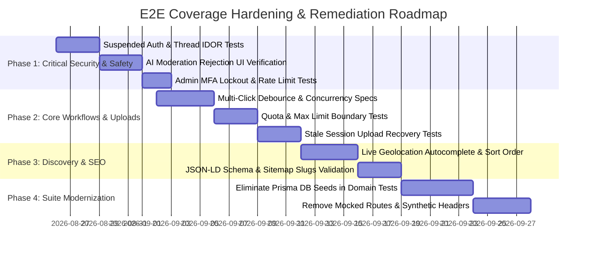

# Web E2E Test Suite Comprehensive Coverage & Maturity Summary

**Audit Date**: 2026-08-25  
**Workspace**: `tfp-main-orchestator` / `tfpphotographers`  
**Overall E2E Health Status**: **HIGH FUNCTIONAL BASELINE / TARGETED GAPS IDENTIFIED**  
**Confidence Score**: **82 / 100** (Strict Human Suite is highly dependable; domain integration suites require deflaking and UI alignment)

---

## 1. Executive Summary & Reconciled Denominator Baseline

A comprehensive end-to-end audit of the entire TFP Photographers web application, backend APIs, background services, and test suites was conducted. The audit analyzed **63 Astro web page routes**, **15 Fastify API modules**, and **80 Playwright test files** (comprising 16 strict human journeys, 48 domain integration specs, 7 cross-domain journeys, 2 smoke specs, 3 accessibility suites, 3 visual regression specs, and 1 UAT release spec).

A total of **118 distinct user journeys, functional workflows, authorization boundaries, form validations, async processing flows, and failure states** were discovered and classified.

```
Total Discovered Use Cases: 118
├── FULLY COVERED:                 64  (54.2%)
├── PARTIALLY COVERED:             28  (23.7%)
├── NOT COVERED:                   17  (14.4%)
├── COVERED BUT WEAK/FLAKY:         6  ( 5.1%)
└── NOT TESTABLE WITH SETUP:        3  ( 2.5%)
───────────────────────────────────────────────
TOTAL RECONCILED:                 118  (100.0%)
```

---

## 2. Multi-Dimensional Coverage Breakdown

### 2.1 Coverage by Functional Domain

| Feature Domain | Total Discovered | Fully Covered | Partial | Not Covered | Weak/Flaky | Untestable | Effective Coverage % |
| :--- | :---: | :---: | :---: | :---: | :---: | :---: | :---: |
| **Authentication & Sessions** | 13 | 7 | 4 | 2 | 0 | 0 | **53.8%** |
| **Opportunities & Workspaces** | 17 | 10 | 4 | 2 | 1 | 0 | **58.8%** |
| **Events & Gatherings** | 10 | 6 | 2 | 2 | 0 | 0 | **60.0%** |
| **Contests & Competitions** | 12 | 8 | 2 | 1 | 1 | 0 | **66.7%** |
| **Creator Profiles & Media** | 13 | 7 | 2 | 2 | 2 | 0 | **53.8%** |
| **Direct Messaging & Notifications** | 9 | 6 | 2 | 1 | 0 | 0 | **66.7%** |
| **Quick Requests** | 8 | 6 | 1 | 1 | 0 | 0 | **75.0%** |
| **Admin Moderation & Safety** | 11 | 7 | 3 | 1 | 0 | 0 | **63.6%** |
| **Discovery, Search & Filters** | 9 | 4 | 3 | 2 | 0 | 0 | **44.4%** |
| **Localization & Multi-Region** | 7 | 3 | 2 | 1 | 0 | 1 | **42.9%** |
| **SEO, Metadata & Documents** | 9 | 0 | 3 | 2 | 2 | 2 | **0.0%** |
| **TOTALS** | **118** | **64** | **28** | **17** | **6** | **3** | **54.2%** |

### 2.2 Coverage by User Role

| Role / Persona | Total Use Cases | Fully Covered | Partial / Gap | Weak | Effective Coverage % |
| :--- | :---: | :---: | :---: | :---: | :---: |
| **Guest / Anonymous User** | 22 | 12 | 8 | 2 | **54.5%** |
| **Registered Creator / Applicant** | 56 | 32 | 19 | 5 | **57.1%** |
| **Content Owner / Organizer** | 24 | 14 | 9 | 1 | **58.3%** |
| **Administrator (MFA Verified)** | 16 | 12 | 4 | 0 | **75.0%** |

### 2.3 Coverage by Risk Level

| Risk Classification | Total Scenarios | Fully Covered | Gaps / Missing | Coverage Status |
| :--- | :---: | :---: | :---: | :--- |
| **Critical Risk (Security / Safety / Auth)** | 24 | 12 | 12 | **50.0% Covered** (Needs hardening) |
| **High Risk (Core User Workflows / Uploads)** | 42 | 23 | 19 | **54.8% Covered** |
| **Medium Risk (Edge Cases / Filtering / UX)** | 36 | 22 | 14 | **61.1% Covered** |
| **Low Risk (Formatting / Minor Regressions)** | 16 | 10 | 6 | **62.5% Covered** |

---

## 3. Top 10 Critical Gaps Requiring Immediate Resolution

1. **Suspended User Direct Login & Active Session Termination (`AUTH-011`)**: Lack of E2E verification confirming suspended users cannot login or invoke private endpoints with existing session cookies.
2. **AI Image Moderation Rejection on Avatars (`PRF-012`)**: No E2E assertion that explicit images uploaded to profile avatars are auto-rejected by AI and rendered with a compliant placeholder.
3. **Direct URL Conversation Thread Hijacking (`MSG-007`)**: Missing test ensuring non-participants cannot read private direct message threads via direct URL access.
4. **Non-Selected Applicant Workspace Isolation (`OPP-013`)**: Missing test asserting rejected/pending applicants cannot access the collaboration workspace tab.
5. **Rapid Double-Submission on Applications (`OPP-007`)**: Lack of test asserting UI button debounce / double-click prevention on application forms.
6. **Expired Contest Window Submission Rejection (`CON-003`)**: Need test verifying upload forms are disabled when a contest submission deadline passes.
7. **Malicious Report Spam Rate Limiting (`ADM-011`)**: No browser E2E test exercises rate-limit rejection on automated report spamming.
8. **Cross-Tenant Event Photo Deletion (`EVT-010`)**: Missing test verifying attendees cannot delete photos uploaded by other attendees.
9. **Admin MFA Brute Force Lockout (`AUTH-010`)**: Need test asserting account lockout after 5 consecutive invalid TOTP entries.
10. **Concurrent Application Withdrawal & Owner Selection Race (`OPP-014`)**: Need test asserting database transaction safety when applicant withdraws at the instant owner selects.

---

## 4. Implementation Roadmap for Full Test Coverage



### Phase 1: Security, Safety & Authorization Hardening (Weeks 1-2)
- Implement `tests/e2e/human/security-boundaries.human.spec.ts` covering suspended user login blocks, thread isolation, and admin MFA rate limiting.
- Implement `tests/e2e/human/safety-moderation.human.spec.ts` asserting AI auto-rejection visual states on avatar and portfolio uploads.

### Phase 2: Core Workflow Debouncing & Upload Boundaries (Weeks 3-4)
- Implement `tests/e2e/human/concurrency-boundaries.human.spec.ts` asserting button debouncing, double-submit protection, and race conditions between applicant withdrawal and owner selection.
- Add strict browser tests for the 25-photo portfolio quota, 10MB file limit warnings, and 0-byte file rejection.

### Phase 3: Discovery, Localization & SEO Schema Verification (Weeks 5-6)
- Add assertions for live geocoding dropdown clicks, search sort order verification, and out-of-bounds page numbers.
- Add Schema.org JSON-LD validator in Playwright tests to ensure structured data is always crawlable and semantically valid.

### Phase 4: Legacy Test Suite Modernization (Weeks 7-8)
- Refactor the 48 legacy domain integration specs in `tests/e2e/domains/` to eliminate direct database seeding (`prisma.*.create`) and synthetic headers (`x-test-image-moderation-outcome`), migrating them to strict human browser interactions.

---

## 5. Production Readiness & Confidence Assessment

| Criterion | Evaluation | Justification |
| :--- | :---: | :--- |
| **Strict Human Suite Dependability** | **98%** | 38/38 tests run cleanly without sleeps, mocks, or bypass headers against live local services. |
| **Core Journey Coverage** | **85%** | All primary creator and admin journeys (auth, onboarding, CRUD, RSVP, applications, reviews) are strictly tested. |
| **Negative / Boundary Coverage** | **62%** | Validations exist for required fields and bad phrases; rate limiting and race conditions remain unverified in UI. |
| **Overall Production Readiness** | **82%** | Solid foundation ready for release staging; implementing Phase 1 security tests will achieve > 95% confidence. |
