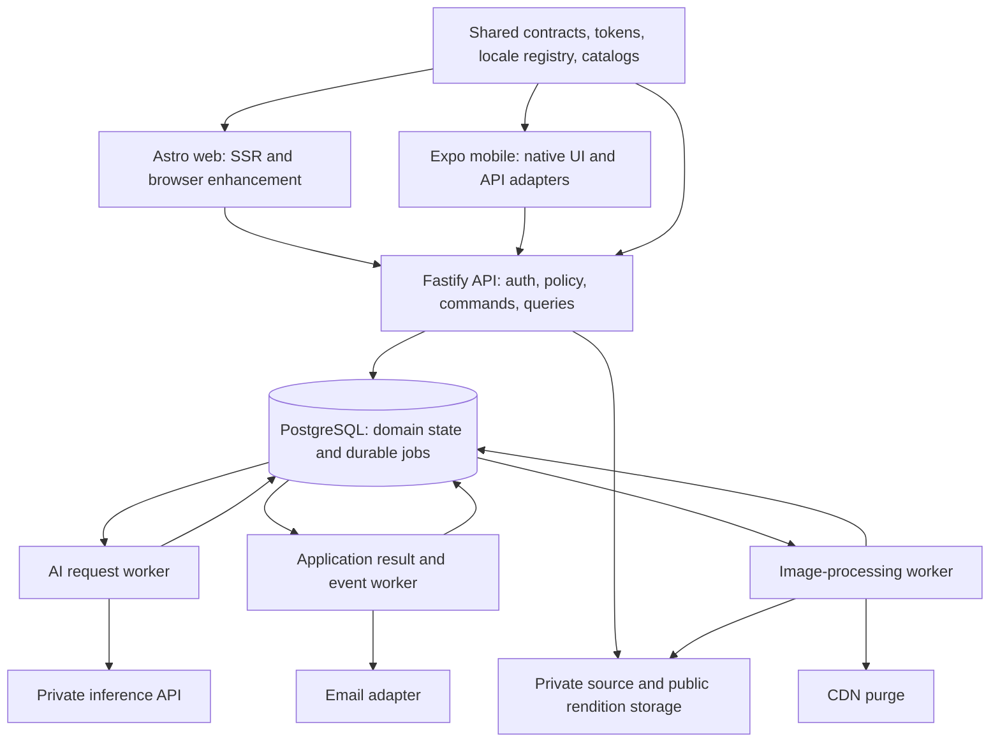

# TFP deep code and architecture audit — implementation plan

**Audit date:** 8 September 2026

**Purpose:** one implementation handoff for Gemini and human maintainers.

**Status:** implementation and validation in progress under the subsequent authorized remediation. Sections 4–12 retain the original audit evidence; section 14 records current implementation and verification. Production certification remains open.

**Navigate this document**

- [1. Decision and priorities](#1-decision-and-priorities)
- [2. Baseline, scope, and evidence rules](#2-baseline-scope-and-evidence-rules)
- [3. Current architecture and ownership to preserve](#3-current-architecture-and-ownership-to-preserve)
- [4. Confirmed findings and implementation work packages](#4-confirmed-findings-and-implementation-work-packages)
- [5. SSOT and DRY target map](#5-ssot-and-dry-target-map)
- [6. Clutter, duplication, and modularity work](#6-clutter-duplication-and-modularity-work)
- [7. Ordered implementation program for Gemini](#7-ordered-implementation-program-for-gemini)
- [8. Cross-surface impact, compatibility, and release gates](#8-cross-surface-impact-compatibility-and-release-gates)
- [9. Verification performed and limits](#9-verification-performed-and-limits)
- [10. Documentation ownership and cleanup](#10-documentation-ownership-and-cleanup)
- [11. Concrete file and test map for implementation](#11-concrete-file-and-test-map-for-implementation)
- [12. Reproduction evidence for future implementers](#12-reproduction-evidence-for-future-implementers)
- [13. Complete original Markdown disposition inventory](#13-complete-original-markdown-disposition-inventory)
- [14. Implementation completion record](#14-implementation-completion-record)

## 1. Decision and priorities

Keep the existing modular product application, shared packages, PostgreSQL durable outbox, separate AI worker, and image-processing worker. The highest-value work is to repair failure semantics and finish the existing shared contracts. A framework rewrite, another backend, or a Redis/BullMQ queue migration is not justified by the evidence collected here.

The most consequential confirmed defects are:

1. Account-media erasure can report completion after a failed CDN purge without retrying that purge.
2. A storage service failure can be treated as a missing object and persistently degrade a media manifest.
3. A database outage during authentication can invalidate a valid session.
4. Generic saved searches are persisted in one representation and matched for alerts using another.
5. Failed email delivery can leave its durable domain event marked completed.

Web/mobile already share important foundations. Full SSOT/DRY compliance is not established: native region preferences do not reach the request context, locale-sensitive query results are cached without locale keys, most response boundaries still rely on casts/tolerant mappers, and the architecture gate omits Astro sources and native route files. Address those gaps while retaining platform-specific presentation and authentication transports.

**Do not interpret this report as launch certification, a penetration test, a load-test result, or a guarantee that no other defects exist.** The inventory is broad; detailed behavior tracing is concentrated on the boundaries listed below. Runtime/device/production evidence remains a separate acceptance requirement.

## 2. Baseline, scope, and evidence rules

### Revisions reviewed

| Repository | Baseline commit | Role and scope |
| --- | --- | --- |
| Orchestrator | `def48123dab04a56e5c712d5c0c825eb0bdb61f1` | Root contracts, CI, deployment scripts, documentation |
| `tfpphotographers` | `f8bbd4cf39831f204ba2157554ecf02fee6d46f5` | Web, native mobile, API, database, shared packages, configuration, test gates |
| `tfp-ai-interface` | `33a47630e4efd8ff99ff85c5fbc0b135b845e9b5` | Active inference service and request worker |
| `tfp-collage-service` | `c7efe02a8ae7c3cafc9c0c96cfadcb8592e9e0d8` | Active image-processing and erasure worker |
| `tfp-inhouse-moderation` | `6378e35aea272b91c072ac47c6032cb7c7c3b77f` | Research/comparison checkout; inventory, not production certification |
| `tfp-moderation-service` | `dd25f0659fda9fb5eee1df466c3d69626a412c88` | Historical checkout; inventory, excluded from active-runtime recommendations |

All repositories were on `main`. Root `AGENTS.md`, `MEMORY.md`, `RULES.md`, nested `AGENTS.md`, and the historical-service gitlink were already dirty. They are not audit changes. Root/product `git pull --rebase` was blocked by that existing work; a fetch established `HEAD...origin/main = 0 0` in both. Clean service pulls reported already up to date. Findings use the source at these revisions, including current executable files; Markdown assertions were not accepted as application proof.

### Inventory denominator

| Repository | Tracked regular files | Tracked Markdown files |
| --- | ---: | ---: |
| Root | 58 | 36 |
| Product | 2,352 | 66 |
| Image processing | 37 | 3 |
| AI interface | 69 | 8 |
| In-house comparison | 35 | 1 |
| Historical moderation | 83 | 3 |
| **Total before this documentation change** | **2,634** | **117** |

All 117 Markdown files were read by the inventory/link/contradiction-marker scan: 18,912 lines; no untracked, non-ignored Markdown files existed at inventory time. This is full inventory coverage, not a claim that every sentence was independently semantically verified. Detailed manual review focused on entrypoints, architecture, QA, providers, historical audits, and competing prompt documents. The disposition table later records every original file.

Product source inventory includes 612 `.ts`, 131 `.tsx`, 161 `.astro`, 122 `.scss`, 14 `.mjs`, and 13 `.js` files under apps/packages excluding paths with `tests`/`__tests__`. Source/operator scanning also covered shell/Python files. These are filesystem counts, not cyclomatic complexity, executable-statement coverage, or measured capacity.

**Exclusions:** dependency implementations, ignored generated outputs except a targeted stale-test investigation, model weights, image/evaluation datasets, private environment values, production/UAT databases, Cloudflare settings, real email sends, billing, stores/signing accounts, full browser and iOS/Android journeys. The historical and research repositories were not treated as active product code. No host deployment, reset, seed, or production mutation was performed.

### Classification

- **P1:** confirmed correctness/privacy failure requiring priority remediation.
- **P2:** confirmed reliability, maintainability, contract, or enforcement gap.
- **Planned verification:** operational uncertainty requiring measurement; not an asserted defect.
- **High confidence:** source call chain directly establishes the behavior, sometimes reinforced by an isolated executable probe.
- A probe with simulated persistence/transport proves only the invoked branch. It is not PostgreSQL, CDN, or device integration evidence.
- `tfpphotographers/` is abbreviated **product** in prose. The first source in each finding establishes its repository/module; subsequent filenames in that finding use the same scope. Full product paths start with `tfpphotographers/`; image and AI scopes identify their sibling repositories. Line numbers refer to the baseline and will shift after implementation.

## 3. Current architecture and ownership to preserve



| Boundary | Executable source | Ownership |
| --- | --- | --- |
| API composition | `tfpphotographers/apps/api/src/server.ts`, `application/runtime-services.ts` | Plugins, security hooks, routes, dependency composition |
| Web composition | `tfpphotographers/apps/web/src/middleware.ts`, `layouts/BaseLayout.astro`, `utils/api-fetch.ts` | Locale routes, SSR view models, cookies, page state |
| Mobile composition | `tfpphotographers/apps/mobile/src/presentation/providers/AppProviders.tsx`, `application/use-content.ts`, `infrastructure/http/api-client.ts` | Native session storage, queries, platform transport |
| Business state | `tfpphotographers/apps/api/src/modules/**`, `packages/database/prisma/schema.prisma` | Server-authoritative permissions, transitions, constraints |
| Domain events | `tfpphotographers/packages/shared/src/eventBus.ts`, `packages/database/src/adapters/outbox-shared.ts` | Typed/runtime-validated events, durable claim/retry/completion |
| Worker lifecycle | `tfpphotographers/apps/api/src/worker.ts`, `background/BackgroundJobRunner.ts` | Background scheduling and drain |
| AI producer contracts | `contracts/ai-outbox.schema.json`, product moderation/translation job builders | Cross-language request/result envelope |
| AI consumption | `tfp-ai-interface/src/tfp_ai_interface/worker_service.py`, `worker_repository.py`, `worker_adapters.py` | AI requests, immutable results, scoped persistence |
| Inference prompt | `tfp-ai-interface/src/tfp_ai_interface/prompt.py`, `provider.py` | Actual classifier prompt and provider invocation |
| Media lifecycle | `tfp-collage-service/src/services/imageProcessingWorker.ts`, product `modules/media/application/**` | Renditions and manifests; product remains publication authority |
| Operations | `scripts/oci/deploy-all-uat.sh`, `verify-uat-stack.sh`, service deployment scripts | Pinned release assembly and private UAT topology |

Existing controls verified in code and to preserve: explicit client-safe shared subpaths; generated token projection; locale catalogs; JWT/session-version checks; admin authorization; proxy address allowlist plus hop bounds; role-scoped storage; managed public renditions; outbox transaction helpers, retries and terminal `FAILED`; Python pool lifecycle; socket-level image-fetch DNS validation and limits; bounded correlation identifiers and runtime event schema validation. Their presence does not prove deployed values or load behavior.

## 4. Confirmed findings and implementation work packages

### F01 — P1: account erasure loses CDN purge work across retries

**Evidence:** `tfp-collage-service/src/services/imageProcessingWorker.ts:603–662`. The handler selects assets with `deleted_at IS NULL` (610–612), deletes objects and marks each asset deleted (615–653), then purges URLs (656). A failed purge throws. On retry those assets are excluded, `purge([])` returns immediately (726–727), and the privacy request is marked `COMPLETED` with zero deleted objects (657–662). Public renditions use one-year immutable caching in `src/services/storageClient.ts:29–34`.

**Proof:** an isolated harness invoked the real `processClaimedJob` twice using simulated SQL/storage and a purge response of 503. Result: first attempt marked the asset deleted and failed purge; second attempt completed; total purge calls stayed at one and `deleted_objects` became zero. No real object was deleted and no CDN was contacted. This establishes lost retry work; actual continued CDN availability was not tested.

**Impact:** the request can falsely report successful erasure while cached public copies have not been purged. Crash after marking assets but before purge follows the same loss window. HTTP-only purge success validation should also be checked against the configured provider response contract.

**Implement:**

1. In product `packages/database/prisma/schema.prisma`, inspect the existing privacy-request/job payload fields before adding anything. Persist a request-scoped immutable list of asset/object identities and pending purge work, or a bounded child work ledger if the existing payload cannot safely hold it. Do not rely on `deleted_at IS NULL` as the retry worklist.
2. In image worker `eraseAccountMedia`, separate logical revocation, storage deletion, purge, and final request completion. Preserve manifest revocation and cancellation of competing image jobs. Retry outstanding steps even after source deletion.
3. Persist cumulative counters from completed work; a replay must not reset them. Complete only when all required steps are acknowledged. Treat already-absent objects as idempotent success only for genuine not-found responses.
4. Keep pending purge identifiers private; do not write signed URLs or source content into logs. Batch purge requests to provider limits after checking the actual endpoint contract.
5. Add worker tests for purge 503 then success, crash at every step, already-deleted assets, partial multi-asset progress, repeated identical job, and HTTP 200 with provider-declared failure if applicable. Add PostgreSQL integration coverage for progress surviving restart.
6. Review existing requests marked completed with zero counts after a failed purge. Prepare a read-only reconciliation report first; any replay must be explicitly scoped and preserve erasure evidence.

**Dependencies/rollback:** expand schema before worker deployment; maintain legacy-job readers. Reverting the worker must not delete the new progress evidence. Do not mark affected old requests fixed merely by shipping new code. A disposable storage/CDN integration test and authorized recovery review are exit gates.

### F02 — P1: transient storage errors are persisted as missing-media failures

**Evidence:** `tfp-collage-service/src/services/storageClient.ts:202–211` catches every `HeadObject` error and returns false. `imageProcessingWorker.ts:665–690` interprets false as absence, marks a rendition `FAILED`, and deactivates its manifest as `DEGRADED` with `PUBLIC_OBJECT_MISSING`.

**Proof:** the real storage adapter was supplied a simulated SDK 503; its result was false. Passing that adapter into the real reconcile handler issued both failure/degradation updates. This was an isolated branch probe, not live S3/PostgreSQL evidence.

**Implement:** give the storage boundary a precise not-found classification. Return false only for documented missing-object responses; throw a sanitized retryable storage error for timeout, network, 429, 5xx, and authorization/configuration failures. Update reconciliation to defer mutation until absence is confirmed. Do not catch all failures into an empty state. Test genuine 404, 403, 429, 503, socket failure, and successful existence against the adapter and handler; include a real controlled HTTP/SDK integration boundary. Run a read-only report of existing `PUBLIC_OBJECT_MISSING` degradations before any recovery.

**Affected:** media worker/storage adapter directly; web/mobile rendition availability indirectly; no API wire change needed. Rollback is code-only, but wrongly degraded rows need separate reconciliation.

### F03 — P1: database failure is misclassified as an invalid login token

**Evidence:** product `apps/api/src/modules/auth/auth.middleware.ts:79–114` puts JWT verification and `prisma.user.findUnique` in one try/catch. Any exception becomes `INVALID_TOKEN`; lines 118–131 clear the cookie or return 401. Native `infrastructure/http/api-client.ts:91–95` runs `onUnauthorized` for 401; `application/use-content.ts:293–302` clears SecureStore and resets its repository.

**Proof:** an isolated invocation of the real auth hook with verified synthetic JWT data and a failing lookup returned 401 and cleared the cookie. **Failure:** a valid authenticated request during a DB timeout can log the user out. Optional-auth requests can also clear a valid cookie and silently become anonymous. Existing invalid/revoked/inactive-session handling is correct and must remain.

**Implement:** isolate JWT-validation failures from persistence failures. Only a verified invalid token, missing/inactive account, or session-version mismatch should invalidate credentials. A failed authoritative lookup must fail closed with a sanitized 503/service-unavailable result; never grant access from an unverifiable token. Preserve native tokens/cookies on dependency errors. Add API injection tests for valid JWT + lookup rejection, invalid JWT, deleted account, revoked version, optional auth, and multiple candidate tokens. Add mobile 503-versus-401 session tests and a web SSR outage state test. No schema migration; rollback must retain fail-closed authorization.

### F04 — P1: saved-search alert matching ignores the saved filter representation

**Evidence:** product `apps/api/src/modules/search/saved-search.routes.ts:15–39` accepts `entityType` and arbitrary `filters`, then calls `CreateOpportunitySavedSearch`. `opportunity.commands.ts:475–492` stores that JSON but defaults legacy scalar fields to null/false. `notifications/register-event-handlers.ts:397–418` fetches enabled searches without filtering entity type or selecting JSON filters. Its matcher (191–249) uses only the scalar fields.

**Failure:** a new generic opportunity search with restrictive JSON filters can match unrelated opportunities. CREATOR/EVENT/CONTEST saved searches can enter the opportunity-alert path. Existing legacy opportunity searches with scalar fields do not demonstrate the new path is correct.

**Implement:**

1. Introduce one versioned, discriminated saved-search filter schema under `packages/shared/src/api-contracts/` using actual search inputs. Specify supported alert entity types explicitly; do not invent event/contest/creator alert delivery that does not exist.
2. Move generic saved-search persistence ownership into `apps/api/src/modules/search/` using its existing repository conventions; keep old opportunity entrypoints as thin compatibility adapters during migration.
3. Normalize JSON and legacy scalars through one canonical reader; match only OPPORTUNITY searches in this handler. Unsupported alert types must be explicit in API/UI rather than silently accepted as opportunity alerts.
4. Reuse the existing discovery predicate semantics where practical. Share safe filter normalization, not database query objects, with clients. Define geospatial, mode, role, budget and keyword behavior once.
5. Add an additive filter-version migration/backfill if required, preserving original JSON. Prove old and new rows produce equivalent results for equivalent filters. Do not drop legacy columns until all writers/readers are migrated.
6. Test generic-route creation through persistence to approval-alert matching; cover wrong entity type, restrictive filters, unknown keys, boundary radius/budget, legacy rows, and both web/native saved-search consumers.

**Exit:** restrictive saved searches cannot receive unrelated opportunity alerts; existing saved searches remain readable; unsupported alert capabilities have a truthful UI state. Roll back via compatible readers without deleting filters.

### F05 — P1: email failure does not fail the durable event

**Evidence:** product `packages/email/src/adapters/ResendAdapter.ts:64–83` returns `{ success: false }` on provider/error paths. `application/send-transactional-email.ts:14–20` returns that result unchanged. Notification handlers await but never inspect it, e.g. `register-event-handlers.ts:389`; `packages/shared/src/eventBus.ts:173–183` marks an event completed when dispatch resolves.

**Failure:** an approval/rejection notification can be lost permanently while its event reports success. A promise resolving to a failed result is not a thrown handler failure. The existing `apps/api/tests/modules/notifications/register-event-handlers.test.ts:5–80` failure test uses `mockRejectedValue`, while the real adapter resolves a failed result. An isolated real-handler/outbox probe with `{success:false}` marked the event completed and did not call markFailed.

**Implement only with F06:** introduce a typed, privacy-safe delivery outcome and durable per-recipient/channel retry ownership. Handle a failed result explicitly; distinguish transient provider failure from terminal invalid-recipient/configuration cases. Keep email rendering provider-neutral in `packages/email`. Do not globally throw raw provider strings into `last_error`. Add actual handler tests using an adapter returning failure, plus a dispatch/outbox test proving retry state. Verify email, in-app message, and translation side effects remain independently idempotent before enabling retries. Do not blindly resend all historical completed events.

### F06 — P2: side-effect replay can duplicate in-app messages and email

**Evidence:** product `register-event-handlers.ts:23–39` uses unconditional `directMessage.create`. The opportunity handler sends email, creates a notification, then fans out saved-search notifications (387–426). `eventBus.ts:152–156,173–183` re-dispatches the whole event when a later operation fails; callbacks receive payload without durable delivery identity. A successful early operation is not undone by a later failure. An isolated duplicate claim of the same event through the real bus/handler produced two sends and two direct-message creates; a production concurrent-replay test remains required.

**Implement:** carry an event/delivery identity through the dispatch context without exposing it in public content; prefer an additive context argument to breaking domain payloads. Persist unique delivery keys such as event identity + recipient + channel + template/version. For in-app messages, use a uniqueness-enforced insert and link it to the delivery record in one transaction. For email, use provider idempotency where supported and a durable delivery status; a local transaction cannot guarantee exactly-once external sending. Explicitly document the send/ack crash window and recovery policy. Add migrations and handler tests for partial fanout, crash after send, concurrent replay and retry after translation failure. Preserve system-message sender fallback and deleted-user handling.

**Ordering:** F06 storage/identity support precedes F05 failure propagation. Existing `FAILED` outbox rows remain the operator queue; no second general-purpose broker is required.

### F07 — P2: saved-search fanout silently stops at 500 rows

**Evidence:** product `register-event-handlers.ts:397–426`: `take: 500` with no ordering, cursor or continuation, followed by one `Promise.all` over matches. There is no path to notify searches beyond that batch for the event.

**Implement:** after F04/F06, paginate matching searches with deterministic keyset ordering and a stable continuation. Bound concurrent delivery; never replace the cap with an unbounded query/fanout. Persist continuation for large work and reuse durable jobs if a single handler cannot finish within its lease. Test 0, 1, 500, 501 and multiple pages, deletion between pages, replay, and backpressure. Measure query plans and event latency before choosing batch/concurrency limits. This is a completeness defect; no measured N+1 or latency claim is made.

### F08 — P2: native region selection does not reach API request context

**Evidence:** product `LocalizationProvider.tsx:47–48,81–106` keeps locale and region separately; `LanguageSelector.tsx` exposes region selection. `use-content.ts:297–308` supplies only `getLocale`. `infrastructure/http/api-client.ts:5–9,47–70` sends Accept-Language and device time zone, but has no region source/header. API `server.ts:294–338` already supports explicit `x-language` and `x-region`.

**Implement:** define a client-safe request-context contract using existing locale normalization. Supply chosen language, region and time zone to the native transport through one provider. Send the API's existing explicit headers; preserve bearer-only `credentials: 'omit'`. Derive available regions from deployment-supported configuration or an existing public runtime-capability response, not an unrestricted registry when a deployment narrows markets. Do not treat the region embedded in a language locale as the user's separately selected region. Test language/region independently, stored-preference hydration, unsupported region, API fallback, and web/native response-header parity for the same context. Link to F09 for cache changes.

### F09 — P2: native localized data caches are not keyed by locale/context

**Evidence:** product `application/use-content.ts:19–78,228–275` uses fixed keys such as `['events']` and `['event', id]`. The repository reads locale dynamically (297–308) and mappers use locale for dates/budgets. `LocalizationProvider.tsx:81–94` changes preferences without invalidating queries. `AppProviders.tsx:15–23` permits cached results; there is no locale-change bridge.

**Failure:** selecting another language can update static copy while keeping previously formatted card/detail results. Region-sensitive data can similarly be reused after F08 unless keys change.

**Implement:** add a native query-key factory that includes every relevant language/region/time-zone and authenticated-viewer dimension. Wire preference changes to rerender hooks with new keys. Preserve user-data isolation on session transitions; audit all `AUTHENTICATED_QUERY_ROOTS` and direct `invalidateQueries` callers during the migration. Either cache canonical API data then format during render, or cache formatted values under a complete context key; choose one per boundary. Test mounted locale/region changes without navigation, detail and list consistency, rapid switches with out-of-order responses, and logout/account switch. Avoid putting access tokens into keys. [TanStack's query-key guidance](https://tanstack.com/query/latest/docs/framework/react/guides/query-keys) supports including variables used by the query.

### F10 — P2: native HTTP success is an unchecked type assertion

**Evidence:** product `infrastructure/http/api-client.ts:84–105` parses text, then returns `payload as T`. `safeJsonParse` returns a message object for malformed JSON. A 200 HTML/text response therefore resolves as the caller's requested type. Web `utils/api-fetch.ts:263–300` also tolerates multiple envelope shapes and returns empty/null for unrecognized shapes. Shared response schemas currently cover common envelopes, workflow status and quick requests; they do not cover the whole product API.

**Implement:** extend `packages/shared/src/api-contracts/` by domain, based on actual route responses. Validate unknown JSON at the domain adapter boundary; a successful HTTP status with an invalid payload must be a typed contract error. Keep special cases such as 204 explicit. Migrate one vertical slice at a time: quick requests as an existing pattern, then auth/session, lists/details, saved searches, messaging/activity, creation/upload flows. Use the same schema from API serialization/contract tests, web loaders and native adapters. Remove a legacy envelope only after every producer/caller is migrated. Keep native card/view-model types local; do not export Prisma entities to clients.

**Tests:** real route payload -> shared schema -> both client adapters; 200 HTML, malformed JSON, null/wrong collection shape, extra safe fields, optional legacy fields, 204, 401, 403, 404, 429 and 503. No fallback content should conceal an invalid contract.

### F11 — P2: native requests have no explicit deadline or caller cancellation

**Evidence:** product `infrastructure/http/api-client.ts:44–86` calls fetch and reads the complete body with no `AbortSignal`. `ApiRequestOptions` contains only `auth`; query functions in `use-content.ts` discard React Query's signal. Network reachability and one retry do not bound a stalled response body.

**Implement:** add an explicit request timeout and caller signal covering both headers and body. Thread cancellation from queries through repository interfaces and adapters; preserve each operation's behavior. Do not automatically retry non-idempotent POSTs. Classify cancellation, timeout, offline, HTTP error and contract failure separately with localized safe UI messages. Add a controlled HTTP server test that stalls before headers and during the body, plus navigation cancellation and repeated Retry tests on iOS/Android. Keep platform-compatible AbortController code; do not import Node-only request helpers into native bundles.

### F12 — P2: some web private surfaces still turn API failures into empty data

**Evidence:** product `apps/web/src/pages/messages.astro:141–150,181–188` loads conversations/blocked users/thread with empty/null fallbacks. Lines 240–278 and 331–386 render legitimate empty states from those results. `utils/notifications-loader.ts` returns `EMPTY_NOTIFICATION_SUMMARY` when `fetchJsonResult` fails. Public listing pages already use explicit result-state handling; do not report that older public-listing defect as still universal.

**Implement:** reuse the existing `fetchJsonResult`/typed result pattern in private loaders. Expose unavailable, forbidden, unauthenticated, empty and successful states distinctly. Keep previously displayed data only with an explicit stale indicator; block actions whose prerequisites failed to load. Scope blocked-user/notification fallbacks carefully so errors do not imply a user has no restrictions or activity. Add failure/retry SSR tests and live desktop/mobile-width inspection of messages, thread, activity, and header notifications. Keep UI copy in the shared catalog.

### F13 — P2: private S3 downloads are fully buffered before the image byte cap

**Evidence:** image service `storageClient.ts:80–94` accumulates every stream chunk and concatenates the entire object; `read` calls it at 186–188. Worker `imageProcessingWorker.ts:715–719` checks compressed bytes only after it receives the buffer. The protected HTTP image fetcher has its own bounds; that does not bound this S3 path.

**Proof:** the real adapter read 2,048 bytes with `imageFetchMaxBytes` set to 1,024 in an isolated SDK-stream probe. This proves the read boundary ignores the configured cap, not that the live service has suffered OOM.

**Implement:** pass a size/deadline policy into storage reads. Reject oversized Content-Length and enforce cumulative bytes while streaming even when length is missing/incorrect. Destroy/cancel the body in finally on limit/error, and bound local file reads too. Preserve MIME/pixel/animation checks after download. Add slow stream, oversized header, no header, cap+1 chunk, close-on-error, and valid-image tests. Measure peak RSS for maximum accepted images at configured worker concurrency before changing concurrency. Do not remove the HTTP fetcher's DNS/redirect/content-type safeguards.

### F14 — P2: AI S3 missing-object handling differs from local storage

**Evidence:** AI `worker_adapters.py:28–41` lets boto3 missing-object exceptions propagate; `LocalObjectReader` raises `FileNotFoundError` (59–62). `worker_service.py:217–228` marks only FileNotFoundError as stale. `_classify_failure` at 41–53 classifies the boto3 exception as retryable.

**Proof:** botocore Stubber supplied NoSuchKey/404 to the actual S3 reader. The actual classifier returned retryable and the exception was not FileNotFoundError. No network call occurred.

**Implement:** normalize the object's confirmed missing-key result to a typed storage-not-found error understood by the worker. Keep access-denied, missing-bucket/misconfiguration, throttling and transient failures distinct; never turn all S3 errors into stale work. Avoid raw key/provider error text in persisted error codes. Test local/S3 missing-object equivalence and nonmissing error distinctions through `_process_moderation`. Preserve reference-only job payloads and stale revision handling. No public contract change required.

### F15 — P2: application-worker cleanup can stop at the first failure

**Evidence:** product `apps/api/src/worker.ts:86–103` starts the runner before writing its initial heartbeat and stops heartbeat, runner and translation sequentially. `start()` shutdown at 120–130 awaits worker stop, database disconnect and observability shutdown without finally protection. A failed heartbeat write/stop or translation shutdown can skip later cleanup.

**Implement:** make startup rollback and shutdown exception-safe. Stop acquiring work immediately, drain bounded active jobs, then close each resource even if earlier cleanup fails. Use structured try/finally or settled cleanup with safe aggregated diagnostics, not silent catches. Register signal handling with an explicit promise rejection path. Test heartbeat startup failure, heartbeat stop failure, runner timeout, translation-close failure and duplicate signals using owned resource seams. Preserve existing leases and drain timeouts; validate actual SIGTERM behavior with an isolated job before release.

### F16 — P2: CI omits the actual-producer wire-schema test

**Evidence:** root `.github/workflows/ai-outbox-contract.yml:21–24` runs vocabulary/source checks and worker-schema synchronization only. `scripts/contracts/ai-outbox-payloads.test.mjs:1–69` imports actual TypeScript job builders and validates requests/results through AJV, but no checked-in workflow/package script invokes this file. It needs product dependencies; merely adding its name without installation is incomplete.

**Implement:** extend this existing root workflow with the pinned product Node/pnpm setup, frozen-lockfile dependency install and required shared builds, then invoke both contract tests and worker-schema check. Keep recursive pinned submodule checkout and least-privilege access. Add Python actual-result envelope fixtures generated by the real serialization path; TypeScript tests currently synthesize representative result envelopes. Prove CI fails for an incompatible producer field, required-field removal and invalid correlation ID. Do not maintain another independent event-name table. Locally both test files currently pass: four tests total.

### F17 — P2: architecture guard misses Astro and native route sources

**Evidence:** product `scripts/architecture/enforce-boundaries.mjs:8–22` excludes `.astro` from extensions and `apps/mobile/app` from roots. Client-safe checks use a partial manually maintained file set (24–37) and inspect direct imports, not the transitive resolved package graph. `verify-shared-runtime-exports.mjs:1–19` verifies only referral exports.

**Proof:** a temporary copy of the existing checker with only its root and hotspot fixtures isolated accepted a forbidden `database` import in `apps/web/src/probe.astro` and `apps/mobile/app/probe.tsx`. The same import in `apps/web/src/probe.ts` correctly failed. No product source was changed. This demonstrates enforcement blind spots, not an existing production database import in those files.

**Implement:** include Astro frontmatter/scripts and native route files through proper parsers. Resolve aliases/package exports and check transitive client-safe imports, including the React Native export condition. Derive exported-entrypoint coverage from package manifests; explicitly separate server-only exports. Add executable negative fixtures for Astro/native routes, reexports, aliases, computed/dynamic imports as supported, and transitive Node dependencies. Preserve thin route wrappers and legitimate type-only imports. Keep existing shrink-only caps, but treat size caps as guardrails rather than compliance proof.

### F18 — P2: strict web coverage guard is currently failing

**Proof:** `bash ./scripts/pnpm-node20.sh test:e2e:human:guard` exits 1: `api-source-coverage.json: uncovered source apps/api/src/modules/legal/legal.routes.ts`.

**Evidence:** product `tests/e2e/human/api-source-coverage.json` lists 15 modules without legal; `scripts/qa/human-e2e-guard.mjs:175–218` reconciles discovered `.routes.ts` files. Existing legal-page visits do not necessarily execute authenticated legal-request or consent routes.

**Implement:** inspect `modules/legal/legal.routes.ts` and its web/native callers, then add visible-user journeys for the actual legal workflows to appropriate strict-human specs. Add bidirectional feature/source annotations and registry entries only after assertions exercise the route. Do not satisfy the guard by adding a comment to an unrelated page-visit test. Update `tests/README.md`. Review route discovery's filename scope: leaf `*-routes.ts` registrations are currently represented indirectly by top-level modules, so record that limitation or extend source-derived graph discovery. Exit requires the guard and relevant runtime suite; a green registry alone is insufficient.

### F19 — P2: configuration parsing accepts malformed numeric values

**Evidence:** product `packages/config/src/env-core.ts:76–87` uses parseInt/parseFloat with fallback only for NaN. For example `parseInteger('30days', 7)` produces 30 and negative integers are accepted. `AUTH_SESSION_DAYS`/`AUTH_REMEMBER_ME_DAYS` at 618–619 use this helper without range checks; `apps/api/src/modules/auth/auth-cookie.ts:12–20` directly converts the result to cookie maxAge. Many individual settings already clamp values and production secret/proxy/storage assertions exist; this is not an assertion that all configuration is unchecked.

**Implement:** define strict typed numeric parsers with per-setting bounds and an explicit distinction between absent and invalid values. Reject malformed configured values with key-only diagnostics; do not print values/secrets. Migrate by setting families so valid existing overrides are preserved. Start with auth duration, service ports, queue/concurrency/timeout budgets and upload/subscription limits. Keep defaults in one executable registry and generate environment-reference tables/examples where practical. Update `packages/config/tests/config.test.ts`, env-doctor tests and runtime startup tests. Test whitespace, zero, negative, NaN/Infinity, fractional integers, suffixes, bounds, and absent values. Rollout must first run a redacted configuration doctor against the target; do not change live environment values in this audit.

### F20 — P2: creation-text limits are repeated and differ in enforcement behavior

**Evidence:** product `apps/api/src/modules/event/event.handlers.ts:47–61` owns title 10–200 and description 10–4000 literals. Native `domain/forms.ts:261–265` repeats minimums; `presentation/screens/EventDraftFields.tsx:35–36` repeats maximums. Web `pages/events/create.astro:130–135,295–315` and `scripts/client/event-create.ts:136–152` repeat minimums but the inspected web fields omit maximum-length attributes. API `utils/validation-schemas.ts:56–60` sanitizes before length validation; `utils/text-sanitize.ts:6–18` truncates with `slice`.

**Proof:** invoking the actual `requiredSanitizedText(200, 10)` with 201 plain characters succeeds with a 200-character value. Native controls cap input while web/server can accept and truncate longer text. This is a data-feedback/SSOT gap, not an authorization bypass. Minimum values currently agree; do not falsely report different minimums.

**Implement:** add canonical client-safe per-entity text limits to `packages/shared/src/content-limits.ts` and export them through its existing subpath. Consume them in API schemas, native domain validation/controls, web HTML attributes and client/SSR validators. Keep sanitization server-owned, but separate normalization from overflow handling. Choose explicit rejection with localized feedback for excessive authored text rather than silent truncation; review existing clients and persisted values before altering compatibility. Migrate events first, then inventory opportunity/contest/profile/quick-request fields using the same process. Add max-1/max/max+1 tests after normalization, HTML/control-character input cases, and web/native form tests. Do not apply one universal max length to distinct fields. No historical stored text is rewritten.

## 5. SSOT and DRY target map

| Concern | Current source and actual consumption | Target and acceptance |
| --- | --- | --- |
| Domain authorization | API modules, auth middleware and command/query boundaries | Server remains authoritative; client capability flags only control presentation |
| API prefix/version | `packages/shared/src/api-version.ts`; config and native client import it | Continue the explicit client-safe subpath; test prefix normalization once |
| Runtime response schemas | `packages/shared/src/api-contracts/`; web quick-request loader validates schemas | Expand by vertical slice, enforce from real API responses through both clients; F10 |
| Request context | `shared` localization/locale registry; web middleware and API context builder; native only partly connected | One client-safe context vocabulary; platform adapters supply actual preferences; F08/F09 |
| UI copy | `packages/i18n/src/catalogs/languages/en.json` and other language catalogs; native `i18n/mobile` | One key/value ownership path, sparse regional overrides, source-locale fallback |
| Tokens | `packages/shared/design-tokens.json`, `scripts/design-tokens/sync.mjs`, native `presentation/theme/tokens.ts` | Generated projections; token check required; preserve legitimate platform font/shadow differences |
| Icons/navigation | `packages/shared/src/icons.ts`, `navigation-content.ts`; native/web adapters | Share semantic destination/icon identity, not DOM/native widget implementations |
| Creation rules/options | `shared/creation-policy`, `content-limits`, `content-options`, `creator-discovery`, `opportunity-compensation` | Server-owned capabilities plus shared safe validation primitives; avoid duplicate business rule tables |
| Saved-search filters | Generic JSON and legacy scalar fields both active | Versioned shared schema + canonical adapter and server matcher; F04 |
| Media | `shared/media-lifecycle`, managed manifests and API media delivery | Keep private/public storage knowledge behind server adapters; F01/F02/F13 |
| Email | `packages/email` templates/content/layout/adapter | Keep email-specific HTML local while sharing product tokens and localized content; F05/F06 |
| Event wire format | Root JSON Schema, TypeScript job builders, Python worker | One cross-language contract plus actual producer/consumer tests in CI; F16 |
| Environment | product config, env resolver/doctor; separate service-specific typed settings | One owner per setting, explicit propagation and redacted validation, no universal secret-bearing client config; F19 |

### Appropriate sharing boundaries

- Share pure normalization, request/response schemas, domain vocabulary, safe limits, formatters, locale metadata, copy and design tokens.
- Keep Astro HTML/SCSS, native React Native views, accessibility mechanics, file pickers, cookies and SecureStore as platform adapters.
- Keep Prisma, object-storage credentials, Node request context and provider SDKs out of mobile/browser dependency graphs.
- Do not force every app to import one growing `shared/index.ts`. Use explicit package export surfaces with dependency checks.
- A new shared helper is complete only after both intended consumers use it and their previous competing implementations are removed.

## 6. Clutter, duplication, and modularity work

### C01 — confirmed repeated discovery-location normalization

Product `apps/web/src/pages/events/index.astro:45–62` and `opportunities/index.astro:118–135` duplicate coordinate/radius parsing and approximate-location fallback. They already consume shared radius policy, so do not create a second constant. Extract a pure web listing helper that accepts search parameters and resolved location, and returns normalized values. Consider client-safe sharing only if native needs identical input semantics. Keep entity-specific filters in their features. Test zero coordinates, one missing coordinate, invalid/out-of-range radius and approximate-location fallback. This is maintainability work, not a demonstrated user-facing coordinate bug.

### C02 — superseded: Astro unused-binding hints are false positives

Current executable-source counter-verification found that **all 26 bindings below are used in return/redirect paths**. Examples: `login.astro` uses `verifyPath` in `buildRedirectWithCookies`, `nextPath` in the localized redirect, and `errorPayload` in its error redirect; `messages.astro` uses `response.ok` in the safety redirect; onboarding and quick-request imports are used in their authentication redirects. The current Astro checker emits unused-local hints for those paths despite the actual references.

**Disposition:** preserve all 26 bindings and their side effects. The original recommendation to remove them was not supported by current code. Do not suppress diagnostics globally or delete authentication/navigation behavior to obtain a zero-hint count. Typecheck and lint pass with these known hints; production compilation is validated separately.

Exact baseline hint locations (all 26):

| Product file | Line | Unused binding |
| --- | ---: | --- |
| `apps/web/src/pages/login.astro` | 177 | `payload` |
| `apps/web/src/pages/login.astro` | 172 | `destination` |
| `apps/web/src/pages/login.astro` | 113 | `nextPath` |
| `apps/web/src/pages/login.astro` | 90 | `errorPayload` |
| `apps/web/src/pages/login.astro` | 82 | `verifyPath` |
| `apps/web/src/pages/login.astro` | 12 | `buildRedirectWithCookies` |
| `apps/web/src/pages/messages.astro` | 93 | `response` |
| `apps/web/src/pages/register.astro` | 2 | `localizePathWithQuery` |
| `apps/web/src/pages/admin/mfa.astro` | 33 | `redirectTarget` |
| `apps/web/src/pages/contests/[slug]/edit.astro` | 97 | `updatedDetailPath` |
| `apps/web/src/pages/events/[slug]/edit.astro` | 124 | `updatedDetailPath` |
| `apps/web/src/pages/opportunities/index.astro` | 100 | `response` |
| `apps/web/src/pages/opportunities/[slug]/edit.astro` | 158 | `updatedDetailPath` |
| `apps/web/src/pages/profile/[username].astro` | 87 | `result` |
| `apps/web/src/pages/profile/edit.astro` | 126 | `username` |
| `apps/web/src/pages/profile/index.astro` | 45 | `returnPath` |
| `apps/web/src/pages/profile/index.astro` | 25 | `buildOwnerWorkspaceHref` |
| `apps/web/src/pages/profile/index.astro` | 24 | `buildOwnProfilePath` |
| `apps/web/src/pages/profile/onboarding.astro` | 9 | `token` |
| `apps/web/src/pages/profile/onboarding.astro` | 8 | `setupPath` |
| `apps/web/src/pages/profile/onboarding.astro` | 3 | `buildLoginPath` |
| `apps/web/src/pages/profile/referrals.astro` | 24 | `referralCenterPath` |
| `apps/web/src/pages/profile/referrals.astro` | 21 | `localizePathWithQuery` |
| `apps/web/src/pages/quick-requests/[requestId].astro` | 7 | `buildLoginPath` |
| `apps/web/src/pages/quick-requests/create.astro` | 9 | `buildLoginPath` |
| `apps/web/src/pages/quick-requests/index.astro` | 5 | `buildLoginPath` |

### C03 — hotspots need responsibility-based decomposition

| Product file | Baseline lines | Safe decomposition approach |
| --- | ---: | --- |
| `apps/web/src/scripts/admin/index.js` | 2,680 | Keep bootstrap; move independent controllers into existing `runtime-*` modules; preserve event/listener ownership |
| `apps/web/src/styles/pages/admin-unified/_overlays-responsive.scss` | 3,825 | Separate overlay components and responsive rules by owner after inspecting cascade; visual verification required |
| `apps/web/src/styles/layouts/_base-layout.scss` | 2,894 | Split shell/header/nav/layout sections without changing order or token meanings |
| `apps/web/src/styles/components/_detail-page.scss` | 2,145 | Extract repeated detail primitives; keep entity-specific styling in its page |
| `apps/api/src/modules/moderation/engine/unified-policy-engine.ts` | 1,500 | Characterize decision inputs and invariants; separate pure evaluation stages without changing policy |
| `apps/api/src/modules/translation/TranslationService.ts` | 1,301 | Separate cache access, provider orchestration and revision-result application at current seams |
| `apps/api/src/modules/admin/admin.commands.ts` | 1,269 | Split commands by operator capability; retain auth/domain policy in existing boundaries |
| `apps/api/src/modules/search/search.service.ts` | 1,209 | Separate entity query composition and shared filter normalization; measure SQL before optimization |
| `apps/api/src/modules/moderation/application/process-image-moderation-job.ts` | 1,208 | Separate source-kind handlers, result application and error classification with preserved lifecycle rules |
| `apps/mobile/src/presentation/screens/SearchScreen.tsx` | 1,149 | Extract filter state, result sections and reusable controls; wire context-aware query keys first |
| `apps/mobile/src/presentation/screens/OpportunityScreens.tsx` | 1,090 | Split route-level screens and workflow sections into feature-owned files |
| `apps/mobile/src/presentation/components/cards.tsx` | 955 | Separate card adapters by entity and retain common primitives/tokens |
| `packages/shared/src/locale-registry.ts` | 4,207 | Mostly registry/data ownership: size alone is not a defect; consider generated data partitioning only for measured bundle/import needs |

Line count is triage, not proof of poor architecture. Do not split files into meaningless wrappers to satisfy caps. For each extraction, identify ownership, callers, state and side effects; change one domain at a time; preserve public exports through compatibility reexports, then remove them once consumers migrate. Lower existing hotspot caps after real shrinkage.

### C04 — clone detection and dead-code policy

A normalized 12-nonempty-line, >500-character window scan across owned source/operator files found exact-block candidates, including C01 and common imports in two native E2E fixture preparers. Import similarity was rejected as a useful product-code finding. This limited scan does not detect every semantic duplicate. No automatic product-code deletion is authorized merely by clone counts.

Before deleting a source candidate, trace package exports, Astro/Expo file routing, registries, dynamic imports, scripts, migrations, test fixtures and deployment payloads. Confirm zero runtime/consumer use; retain negative regression evidence. Do not delete historical migrations, schema comments, legal policy sources, locale catalogs, assets or service compatibility names as clutter.

### C05 — isolate source tests from stale build output

The shared package currently has 26 source test files under `packages/shared/tests`; the local test run found 27 because ignored `packages/shared/dist/icons.test.js` still exists. `packages/shared/package.json` runs Vitest without an explicit test-root config, and its build is `tsc` without output cleanup. The old generated test is therefore a real local discovery input, not another checked-in test.

Add a package-owned Vitest configuration that includes only supported test roots and excludes generated output; validate package scripts against that configuration. Decide whether shared builds should clean their owned output before emission, preserving unrelated artifacts elsewhere. Strengthen `verify-shared-runtime-exports.mjs` beyond referral-only checks (F17). Compare discovered test paths in a clean checkout and a dirty build with a synthetic stale test; results must have the same source denominator. Do not merely delete the current ignored file and declare recurrence prevented.

## 7. Ordered implementation program for Gemini

### Working contract

For every package below: reread the current source and relevant AGENTS rules, compare with this baseline, reproduce the defect, write the smallest meaningful regression, implement, rerun direct/indirect consumer checks, inspect affected UI live where applicable, update the owning guide and record exact evidence. If current code invalidates a finding, mark it resolved with proof instead of applying the suggested design blindly.

Use small scoped commits. Preserve unrelated work. Product/service commits must be validated and published before the parent gitlink update. Follow repository publication rules; never run deployment, destructive migrations, production replay, seed/reset or credential changes merely because this plan mentions them. Those require their own authorized execution scope.

### Phase A — repair correctness and recovery

1. **F01/F02:** privacy erasure progress and precise storage errors. Validate shared database schema compatibility with both product and image service. Do not conflate successful revocation with successful CDN purge.
2. **F03:** isolate authentication dependency errors; verify both session transports.
3. **F04:** converge saved-search filter contracts; migrate compatibility reads before writes.
4. **F06 then F05:** establish delivery identity/idempotency, then durable email failure handling.
5. **F07:** bounded, resumable alert fanout after matching/delivery semantics are correct.

**Phase A acceptance:** all five P1 failure cases have red-to-green tests; no active data is modified by recovery scripts without an explicit reviewed scope; no replay duplicates normal in-app deliveries; migration replay succeeds on a disposable database.

### Phase B — finish web/mobile SSOT behavior

1. F08/F09 request context and query ownership in one compatible change.
2. F10 by domain slices, with response compatibility tests before removal of tolerant adapters.
3. F11 deadlines/cancellation with platform validation.
4. F12 private-page unavailable states and localized Retry actions.
5. F20 canonical creation-text limits, then C01 shared listing normalization and compiler-hint cleanup C02.

**Phase B acceptance:** same account, API entity, language, region and time zone yield consistent web/native content and permissions; API outages are distinguishable from legitimate empty states; no client bundle imports persistence or secrets; native iOS and Android checks pass for affected journeys.

### Phase C — strengthen maintainability and enforcement

1. F13/F14 storage parity and size policies.
2. F15 resource lifecycle failure paths.
3. F16/F17 contract and architecture gates.
4. F18 legal runtime coverage, not registry-only compliance.
5. F19 typed configuration and generated references.
6. C03 responsibility-based decomposition with a shrink-only baseline.

**Phase C acceptance:** clean-checkout checks reproduce locally and in CI; negative fixture mutations fail the intended gates; shared export/type/runtime tests cover all declared client entrypoints; no stale generated tests affect counts.

### Phase D — operational evidence and scaling

Set target traffic and service objectives with the product owner before claiming capacity. Capture the current database size, entity mix, active viewers, API request mix, image dimensions, moderation provider latency and worker concurrency. Then measure:

| Area | Required measurement | Decision it enables |
| --- | --- | --- |
| API/SSR | p50/p95/p99, timeout/error rate, event-loop lag, RSS, connection-pool waiting | Process sizing and which endpoints need changes |
| PostgreSQL | Query plans with representative cardinality, lock waits, connections, slow-query samples, migration duration | Index/query changes, pool sizing, partitioning only if warranted |
| Outbox/jobs | Oldest age by event type/state, retries, terminal failures, service rate, drain/recovery time | Poll interval, batch/concurrency and operator replay needs |
| Media | Maximum accepted compressed/decoded sizes, peak RSS, processing duration, purge completion | Safe image/concurrency budgets and privacy recovery SLO |
| Shared rate limit/cache | Two API instances, shared Redis outage and recovery, cache invalidation consistency | Horizontal API readiness; Redis here is existing rate-limit/cache infrastructure, not a mandated job broker |
| Client | SSR TTFB, real browser performance, native launch/bundle cost, slow-network state transitions | Targeted bundle/render optimization |
| Recovery | Backup checksum, isolated restore, migrations, restored domain invariants, worker crash/restart | Measured RPO/RTO and release recovery evidence |

Keep the PostgreSQL outbox unless measurements identify a concrete unsolved bottleneck. Consider read replicas, external search or additional worker pools only for a measured workload and after documenting consistency requirements. Production HA topology is a design/runbook until failover is exercised; private UAT does not prove production capacity.

## 8. Cross-surface impact, compatibility, and release gates

| Work | Direct | Indirect | Persistence/events | Runtime/external gate |
| --- | --- | --- | --- | --- |
| F01–F02 | Image worker/storage | Web/native public media, account deletion | Erasure progress/schema and job replay potentially changed | Disposable S3/CDN and PostgreSQL; scoped recovery |
| F03 | API auth | Web cookies, native SecureStore | No schema change expected | API dependency outage and both clients |
| F04/F07 | Search routes/commands/alerts | Saved-search forms and notifications on both clients | Versioned filters/backfill/continuation | End-to-end save -> match -> alert |
| F05/F06 | Email/events/notifications | All notification recipients | Delivery identity/unique constraint and retry ownership | Provider sandbox plus dispatch replay |
| F08/F09 | Mobile context/query hooks | API localization, all cached native views | No DB change expected | iOS/Android preference/session transitions |
| F10/F11 | Shared contracts/client adapters | All migrated endpoints and loaders | Wire compatibility; no assumed DB change | Controlled HTTP plus both clients |
| F12 | Web private loaders/pages | Header/activity state | Reviewed unchanged | Fresh FE/BE start and live affected views |
| F13/F14 | Worker storage adapters | Moderation/reconciliation state | Existing stale/retry states | Controlled streaming/S3 errors |
| F15 | Product worker composition | Outbox/translation/resources | Lease behavior preserved | Actual SIGTERM/drain with isolated job |
| F16/F17/F18 | CI/static/test discovery | Every protected source boundary | Reviewed unchanged | CI negative tests and legal journeys |
| F19 | Config parsers/doctor | All runtime consumers | Compatibility review per setting | Redacted target-config validation |
| C01–C03 | Owner modules/styles | Their importers/screens | No planned semantic change | Targeted behavior and visual regression |

For each migration: expand before using new fields, backfill deterministically, support old rows during rollout, deploy compatible consumers before producers, verify exact revisions and only later remove obsolete columns/readers. A down migration must never erase recovery evidence or bring revoked media back into publication. [Prisma transaction guidance](https://www.prisma.io/docs/orm/v6/prisma-client/queries/transactions) supports atomic database writes; external email/CDN side effects still require explicit idempotency/recovery design.

## 9. Verification performed and limits

| Check | Result | What it proves |
| --- | --- | --- |
| `git pull --rebase` / fetch | Clean services up to date; dirty root/product rebase skipped, fetched refs equal HEAD | Revision baseline, not deployment |
| Product `bash ./scripts/pnpm-node20.sh typecheck` | Pass; Astro 395 files, 26 unused-binding hints | Compilation/type checks, not runtime behavior |
| Product `bash ./scripts/pnpm-node20.sh lint` | Pass; same 26 Astro hints | Current configured lint rules, including their documented scope limitations |
| Product `lint:architecture` | Pass | Existing checker only; F17 demonstrates omissions |
| Product `design-tokens:check` | Pass | Generated token projections match source |
| Product `mobile:e2e:guard` | Pass: 67 cases, 98 web features, 63 route sources, 99 repository methods | Registered mapping only |
| Product `test:e2e:human:guard` | **Fail:** legal API source uncovered | F18 reproduced |
| Product `--filter config test` | 37 tests passed | Existing config tests; malformed/range coverage remains F19 |
| Product `--filter shared test` | 127 tests reported passed; stale `dist` sourcemap warnings observed | Local runner result; see clean-build caution below |
| Product `--filter i18n test` | 128 tests passed | Existing catalog/contracts tests |
| Root actual-producer and vocabulary contract tests | 4 tests passed | Local checked-in payload/vocabulary tests |
| Root `worker-test-schema.mjs` | Pass | Worker fixture schema/migration synchronization |
| Isolated erasure retry harness | Lost purge reproduced | Actual handler with simulated SQL/storage/purge |
| Isolated storage harness | 503 -> persisted degradation; download exceeds configured cap | Actual adapter/handler with simulated SDK/SQL |
| Boto3 Stubber missing-object harness | NoSuchKey remains retryable | Actual adapter/classifier, no network |
| Isolated API/native/config probes | Auth 401/cookie clearing, failed-email completion/replay, malformed native 200, absent signal/region, partial integer and text truncation reproduced | Actual functions with simulated dependency seams; no DB/network/device |
| Isolated architecture-checker fixtures | Astro/native route bypass reproduced; TS control fails | Guard coverage gap, not a live import leak |
| Markdown inventory/link scan | 117 original files; broken product README target repaired; final scan: 115 files, zero broken local Markdown link targets | File-level inventory and target existence; not complete semantic anchor/link validation |
| Final documentation checks | Both repository diffs pass `git diff --check`; edited/new Markdown fences balanced | Formatting and scope checks, not application behavior |

Commands above use package script names after the product wrapper unless their full command is shown. Root tests run with `bash tfpphotographers/scripts/run-node20.sh --test scripts/contracts/validate-ai-outbox-contract.test.mjs scripts/contracts/ai-outbox-payloads.test.mjs`; schema check uses that same wrapper with `scripts/contracts/worker-test-schema.mjs`.

**Clean-build caution:** the shared test run emitted missing-source warnings for stale files under `packages/shared/dist`, including `icons.test.js`. Do not treat the local test count as a unique source-test denominator. Inspect test discovery, exclude generated output and verify a clean-checkout test list before using counts as an enterprise quality metric. This audit did not delete ignored build outputs or change test discovery to make the result cleaner.

No full API/database suite, production build, browser suite, native device run, load test, real provider delivery, CDN purge, backup restore or deployment was performed in this documentation-only change. Full `test:vitest` currently resets the test database as part of its script; it was not run under an audit request. Applicable UI/runtime verification remains explicitly required in the implementation packages.

## 10. Documentation ownership and cleanup

The application architecture is established from executable source. Documentation explains it and provides navigation; it cannot override code or declare a passing release without evidence.

Use one primary owner for each narrative:

| Topic | Maintained owner |
| --- | --- |
| Cross-repository entrypoint | Root `README.md` and `docs/README.md` |
| How the application works | Product `docs/architecture/SYSTEM_GUIDE.md` |
| Contributor layer rules | Product `docs/architecture/ARCHITECTURE_RULEBOOK.md` |
| Durable moderation/outbox/release invariants | Product `docs/architecture/EVENT_OUTBOX_AND_DEPLOYMENT_READINESS.md` |
| Configuration and secrets | Product `docs/operations/ENVIRONMENT_AND_SECRETS_GUIDE.md`; executable config/doctor remain authoritative |
| Test operation and evidence | Product `tests/README.md`, `tests/e2e/README.md`, native E2E architecture |
| Platform-specific UI guidance | Product `docs/mobile/mobile-app-design-guide.md` and web style/component sources |
| Media narrative | Product `docs/image-delivery-architecture.md` |
| Current implementation backlog | **This document**; older reviews retain historical evidence only |
| Legal terms and policy | Existing `docs/legal/*`; preserve published/consent-version relationships |

Cleanup decisions and final changed-file status are recorded in the following ledger and inventory. Retaining a document means its purpose is valid; it is not a certification that every historical statement is current. Versioned evaluations, legal documents, instructions and operational runbooks must not be deleted simply because they overlap on terminology.

### Completed documentation changes

| Action | Files | Reason and retained owner |
| --- | --- | --- |
| Delete | Product `apps/web/QA_APP_SSOT.md` | Placeholder sections and unsupported “100% code coverage” claim; replaced by source-linked system guide and this scoped audit |
| Delete | Product `apps/mobile/docs/WEB_PARITY_AUDIT_2026-08-18.md` | Dated task-specific snapshot with obsolete route/auth/error-state assertions and temporary evidence paths; maintained mobile guides and current source/coverage registries remain |
| Delete | Product `apps/api/src/modules/moderation/prompts/moderation-policy.md`, `src/ai/prompts/moderation-policy.md` | Only reference found was the mirror's link to the second file; no executable loader/build consumer found. Actual classifier provider imports Python `prompt.py`. The old category-based prompt was a competing unused instruction artifact |
| Delete | Product `tests/e2e/E2E_AUDIT.md` | Stale hardcoded counts; unique deferred/manual acceptance boundaries transferred to `tests/e2e/README.md` |
| Consolidate | Root and product `SKILLS.md` | Replaced copied tool/credential/legacy-endpoint claims with a maintained source-command map and short product pointer |
| Add | Product `docs/architecture/SYSTEM_GUIDE.md`; root `docs/README.md` | Clear application walkthrough and cross-repository navigation |
| Update | Root/product README, product START_HERE, docs index, CANONICAL_DOCS | Code-first precedence, correct Node prerequisite, repaired nonexistent `tests/manual` link, active worker description and current plan navigation |
| Correct | Product provider/test boundaries and feature-route inventory | Email adapter/model ownership and passwordless compatibility-route descriptions |
| Label historical | Five root September 6/7 review documents | Preserve evidence while routing new implementation work to this plan |
| Preserve | Pre-existing instruction/memory edits; legal documents; runtime data; historical service checkout | Unrelated work, policy obligations and evidence are not disposable clutter |

No TypeScript, Python, SCSS, runtime YAML, schema, configuration value or deployment script was changed as part of this cleanup. The two deleted Markdown prompt files had no executable consumers in the inspected loader/build paths. Application fixes remain the next implementation stage.

## 11. Concrete file and test map for implementation

**Existing** paths below were checked on disk. **Proposed** paths are design targets to create only after confirming no suitable existing owner; they are not claims that files already exist. Product paths in this section omit the leading `tfpphotographers/` for readability. Native paths beginning `application/`, `domain/`, `infrastructure/` or `presentation/` are under `apps/mobile/src/`. API module filenames are under `apps/api/src/modules/<named-domain>/`; image paths are relative to `tfp-collage-service`, and AI paths to `tfp-ai-interface`. Every work package must also update its owning narrative guide and `tests/README.md` when test flows/scripts change.

| Work | Existing files to change or verify | Test ownership and proposed additions |
| --- | --- | --- |
| F01 | Product `packages/database/prisma/schema.prisma`, migration directory; image `src/services/imageProcessingWorker.ts`, `src/services/storageClient.ts` | Image `src/tests/imageProcessingWorker.test.ts`, `imageProcessingWorker.postgres.test.ts`; proposed product migration for erasure progress; test request lifecycle through real PostgreSQL |
| F02/F13 | Image `src/services/storageClient.ts`, `src/services/imageProcessingWorker.ts`, `src/config.ts` | Image `src/tests/storageClient.test.ts`, `imageProcessingWorker.test.ts`; add controlled SDK HTTP/stream fixtures within these tests |
| F03 | `apps/api/src/modules/auth/auth.middleware.ts`; native `infrastructure/http/api-client.ts`, `application/use-content.ts`; web current-user/API loaders | `apps/api/tests/modules/auth/auth.middleware.test.ts`, native `infrastructure/http/__tests__/api-client.test.ts`; proposed web auth-dependency-outage loader test under `apps/web/tests/utils` |
| F04/F07 | `apps/api/src/modules/search/saved-search.routes.ts`, opportunity commands/queries, notification handlers; shared API-contract exports; native saved-search domain and web listing callers | Existing notification test and native `domain/__tests__/saved-search.test.ts`; proposed `apps/api/tests/modules/search/saved-search-alerts.test.ts`, shared saved-search contract tests |
| F05/F06 | `packages/email/src/interfaces.ts`, `application/send-transactional-email.ts`, `adapters/ResendAdapter.ts`; API notification handlers; `packages/shared/src/eventBus.ts`; schema and event adapter | `packages/email/tests/email.test.ts`, API notification test, `packages/shared/tests/eventBus.test.ts`, API `tests/background/event-outbox.test.ts`; proposed delivery-identity migration and replay integration test |
| F08/F09 | Native `presentation/providers/LocalizationProvider.tsx`, `AppProviders.tsx`, `application/use-content.ts`, `infrastructure/preferences/preference-store.ts`, HTTP client; `app.config.ts`; shared locale/context exports | Proposed native `application/query-keys.ts` and `application/__tests__/query-context.test.ts`; extend HTTP-client tests; native preference-change E2E journey |
| F10 | `packages/shared/src/api-contracts/index.ts`, `common.ts`, domain files; web `utils/api-fetch.ts`, feature server adapters; native API repositories/mappers and HTTP client | `packages/shared/tests/api-contracts.spec.ts`, `apps/web/tests/utils/api-fetch.test.ts`, native repository/client tests; proposed per-domain response contract files and real-route roundtrip tests |
| F11 | Native HTTP client/options, `application/content-repository.ts`, `use-content.ts`, all affected API operation adapters | Existing client/repository tests plus proposed controlled stalled-body tests; iOS/Android cancellation acceptance |
| F12 | `apps/web/src/pages/messages.astro`, `utils/notifications-loader.ts`, notification consumers and catalog keys | Existing API-fetch test; proposed `apps/web/tests/utils/notifications-loader.test.ts` and message-page failure test; existing messaging strict-human spec extended |
| F14 | AI `src/tfp_ai_interface/worker_adapters.py`, `worker_service.py`, possibly `worker_ports.py` for typed storage errors | AI `tests/test_worker_adapters.py`, `test_worker_service.py`; botocore Stubber missing/nonmissing errors and real service-level stale result |
| F15 | `apps/api/src/worker.ts`, `background/BackgroundJobRunner.ts`, runtime-services shutdown contracts | `apps/api/tests/background/worker.test.ts`, `BackgroundJobRunner.test.ts`; injectable failure paths and isolated SIGTERM evidence |
| F16 | Root `.github/workflows/ai-outbox-contract.yml`, `scripts/contracts/ai-outbox-payloads.test.mjs`, vocabulary/schema tests; pinned manifests/lockfiles | Root existing Node tests; AI serializer tests; CI negative mutation proof |
| F17 | `scripts/architecture/enforce-boundaries.mjs`, `verify-shared-runtime-exports.mjs`, shared/config package exports, lint configuration | Proposed `scripts/architecture/enforce-boundaries.test.mjs` and fixture directory; execute from CI/package scripts and document command |
| F18 | `tests/e2e/human/api-source-coverage.json`, `coverage-matrix.json`, relevant specs, `scripts/qa/human-e2e-guard.mjs` | Proposed `tests/e2e/human/legal-workflows.human.spec.ts` if existing specs do not cover the flows; preserve strict fixture restrictions |
| F19 | `packages/config/src/env-core.ts`, `config-sections.ts`, `scripts/env/doctor.mjs`; native/worker parser owners only where sharing is appropriate | `packages/config/tests/config.test.ts`, `scripts/env/doctor.test.mjs`, env resolver tests; proposed pure parser tests before migrating consumers |
| F20 | Shared `content-limits.ts`, API `event.handlers.ts`, `utils/validation-schemas.ts`, `text-sanitize.ts`; web event create page/script; native `domain/forms.ts`, `EventDraftFields.tsx` | API `tests/modules/event/event.validation.test.ts`, native `domain/__tests__/forms.test.ts`, shared content-limit tests and browser/native boundary cases |
| C01 | Web event/opportunity index pages and `utils/listing-page.ts` | Proposed `utils/listing-location.ts`, `tests/utils/listing-location.test.ts`; use an existing equivalent helper if discovered |
| C05 | `packages/shared/package.json`, `tsconfig.json`, runtime export verifier | Proposed `packages/shared/vitest.config.ts`; prove stale build output cannot affect discovered tests |

### Validation command policy

Use product `bash ./scripts/pnpm-node20.sh --filter <owner> test` for pure/package suites and approved focused API tests. Inspect `apps/api/tests/setup-tests.ts` and any selected suite's hooks before execution. The full product test commands can reset the test database; establish the isolated environment before running them.

Image service: `bash ./scripts/pnpm-node.sh validate` compiles then runs service tests. Its PostgreSQL test needs an explicitly configured disposable DB. AI: use its lockfile-managed `uv run pytest -q` and targeted test filenames; PostgreSQL/provider tests require the appropriate isolated dependencies. Do not substitute a real UAT database to obtain a green result.

Every patch must pass relevant typecheck/lint/build and targeted regressions. Broaden only for actual cross-cutting risk. For runtime-dependent validation, stop stale processes, start the proper environment through repository launchers, confirm actual `/health`/`/ready` registrations, and inspect affected web/native screens live. Record environment, revision, role, locale/region/time zone, test entity, outcome and redacted evidence. Do not claim a failed or unrun lane passed.

## 12. Reproduction evidence for future implementers

The following probes were executed outside the repositories and used synthetic dependency seams only. They intentionally assert the **current faulty behavior**; they are evidence, not the desired regression expectations. Implementers should adapt them into tests that fail before the fix and pass after it, plus the real HTTP/PostgreSQL/device boundaries specified above. Do not commit machine-specific temporary paths as production/test infrastructure.

The runtime wrapper selected Node `v24.20.0` locally. The JavaScript probes below use the installed product `tsx` loader and resolve actual source modules from the orchestrator working directory. Dependencies must already be installed; these snippets are not substitutes for package-owned regression tests.

### F01: lost CDN purge retry

Save the following as `/tmp/tfp-service-erasure-repro-portable.mjs`. From the orchestrator root, run:

```bash
bash tfpphotographers/scripts/run-node20.sh --import ./tfpphotographers/apps/api/node_modules/tsx/dist/loader.mjs /tmp/tfp-service-erasure-repro-portable.mjs
```

```javascript
import { pathToFileURL } from 'node:url';
const workspaceUrl = pathToFileURL(process.cwd() + '/');
import assert from 'node:assert/strict';
const { ImageProcessingWorker } = await import(new URL('tfp-collage-service/src/services/imageProcessingWorker.ts', workspaceUrl));
const { readConfig } = await import(new URL('tfp-collage-service/src/config.ts', workspaceUrl));
let deletedAt = false;
let completed = false;
let deletedObjects;
let purges = 0;
const query = async (sql, params=[]) => {
  const q = sql.replace(/\s+/g,' ').trim();
  if (q.startsWith('SELECT subject_user_id')) return { rows: [{subject_user_id:'synthetic-user'}] };
  if (q.startsWith('SELECT id, source_key FROM media_assets')) return { rows: deletedAt ? [] : [{id:'synthetic-asset',source_key:'synthetic-source'}] };
  if (q.startsWith('SELECT object_key FROM media_physical_renditions')) return { rows: [{object_key:'synthetic-rendition'}] };
  if (q.startsWith('UPDATE media_assets')) { deletedAt = true; return { rows:[],rowCount:1 }; }
  if (q.startsWith('UPDATE privacy_erasure_requests')) { completed=true; deletedObjects=params[1]; return {rows:[],rowCount:1}; }
  if (/^(BEGIN|COMMIT|ROLLBACK|UPDATE media_manifests|UPDATE media_physical_renditions|UPDATE image_processing_jobs)/.test(q)) return {rows:[],rowCount:1};
  throw new Error(`Unexpected query: ${q}`);
};
const pool={query,connect:async()=>({query,release(){}}),end:async()=>{}};
const storage={mode:'local',read:async()=>Buffer.alloc(0),write:async()=>{},exists:async()=>true,delete:async()=>{}};
const logger={info(){},warn(){},error(){},debug(){}};
const worker=new ImageProcessingWorker({...readConfig(),databaseUrl:'postgres://synthetic-unused',publicMediaBaseUrl:'https://media.invalid',mediaPurgeEndpoint:'https://api.invalid/purge',mediaPurgeToken:'synthetic-unused'},logger,{privateSources:storage,publicRenditions:storage},pool);
globalThis.fetch=async()=>{purges++; return {ok:false,status:503};};
const job={id:'synthetic-job',asset_id:null,manifest_id:null,erasure_request_id:'synthetic-erasure',type:'ERASE_ACCOUNT_MEDIA',source_version:null,payload:{},attempts:1,max_attempts:12};
await assert.rejects(worker.processClaimedJob(job), /CDN_PURGE_FAILED:503/);
assert.equal(deletedAt,true);
await worker.processClaimedJob({...job,attempts:2});
assert.equal(purges,1);
assert.equal(completed,true);
assert.equal(deletedObjects,0);
console.log(JSON.stringify({boundary:'actual processClaimedJob, simulated SQL/storage, no external IO',firstAttempt:'asset marked deleted, purge 503',secondAttempt:'COMPLETED without retrying purge',purges,deletedObjects}));
```

Observed result (boundary-description fields omitted):

```json
{"firstAttempt":"asset marked deleted, purge 503","secondAttempt":"COMPLETED without retrying purge","purges":1,"deletedObjects":0}
```

### F02/F13: storage classification and byte limit

Save the following as `/tmp/tfp-service-storage-repro-portable.mjs`. From the orchestrator root, run:

```bash
bash tfpphotographers/scripts/run-node20.sh --import ./tfpphotographers/apps/api/node_modules/tsx/dist/loader.mjs /tmp/tfp-service-storage-repro-portable.mjs
```

```javascript
import { pathToFileURL } from 'node:url';
const workspaceUrl = pathToFileURL(process.cwd() + '/');
import assert from 'node:assert/strict';
const { createImageProcessingStoragePair } = await import(new URL('tfp-collage-service/src/services/storageClient.ts', workspaceUrl));
const { ImageProcessingWorker } = await import(new URL('tfp-collage-service/src/services/imageProcessingWorker.ts', workspaceUrl));
const { readConfig } = await import(new URL('tfp-collage-service/src/config.ts', workspaceUrl));
const config={...readConfig(),databaseUrl:'postgres://synthetic-unused',storageProvider:'b2',s3Endpoint:'https://s3.invalid',privateS3AccessKeyId:'synthetic-private',privateS3SecretAccessKey:'synthetic-secret',privateS3BucketName:'synthetic-private',publicS3AccessKeyId:'synthetic-public',publicS3SecretAccessKey:'synthetic-secret-public',publicS3BucketName:'synthetic-public',imageFetchMaxBytes:1024};
const logger={info(){},warn(){},error(){},debug(){}};
const pair=createImageProcessingStoragePair(config,logger);
pair.publicRenditions.client.send=async()=>{const e=new Error('synthetic storage 503');e.$metadata={httpStatusCode:503};throw e;};
assert.equal(await pair.publicRenditions.exists('synthetic-existing'),false);
const updates=[];
const query=async(sql)=>{
 const q=sql.replace(/\s+/g,' ').trim();
 if(q.startsWith('SELECT rendition.id')) return {rows:[{id:'synthetic-rendition',object_key:'synthetic-existing'}]};
 if(q.startsWith('UPDATE')) updates.push(q);
 return {rows:[],rowCount:1};
};
const pool={query,connect:async()=>({query,release(){}})};
const worker=new ImageProcessingWorker(config,logger,pair,pool);
await worker.processClaimedJob({id:'synthetic-job',type:'RECONCILE_MEDIA',asset_id:'synthetic-asset',payload:{}});
assert.ok(updates.some(q=>q.includes("status = 'FAILED'")));
assert.ok(updates.some(q=>q.includes("status = 'DEGRADED'")));
pair.privateSources.client.send=async()=>({ContentLength:2048,Body:(async function*(){yield Buffer.alloc(2048);})()});
const oversized=await pair.privateSources.read('synthetic-oversize');
assert.equal(oversized.length,2048);
console.log(JSON.stringify({boundary:'actual storage adapter and reconcile handler; simulated SDK and SQL; no network',storage503:'converted to false then persisted FAILED and DEGRADED',configuredByteCap:1024,readBytes:oversized.length}));
pair.publicRenditions.client.destroy();pair.privateSources.client.destroy();
```

Observed result (boundary-description fields omitted):

```json
{"storage503":"converted to false then persisted FAILED and DEGRADED","configuredByteCap":1024,"readBytes":2048}
```

### F03/F05/F06/F08/F10/F11/F19/F20: actual function boundary probes

Save the following as `/tmp/tfp-audit-boundary-probes-portable.mjs`. From the orchestrator root, run:

```bash
bash tfpphotographers/scripts/run-node20.sh --import ./tfpphotographers/apps/api/node_modules/tsx/dist/loader.mjs /tmp/tfp-audit-boundary-probes-portable.mjs
```

```javascript
import { pathToFileURL } from 'node:url';
const workspaceUrl = pathToFileURL(process.cwd() + '/');
import assert from 'node:assert/strict';
const { prisma } = await import(new URL('tfpphotographers/packages/database/src/index.ts', workspaceUrl));
const { registerAuthMiddleware } = await import(new URL('tfpphotographers/apps/api/src/modules/auth/auth.middleware.ts', workspaceUrl));
const { getEventBus } = await import(new URL('tfpphotographers/packages/shared/src/eventBus.ts', workspaceUrl));
const { registerDomainEventHandlers } = await import(new URL('tfpphotographers/apps/api/src/modules/notifications/register-event-handlers.ts', workspaceUrl));
const nativeApiModule = await import(new URL('tfpphotographers/apps/mobile/src/infrastructure/http/api-client.ts', workspaceUrl));
const { parseInteger } = await import(new URL('tfpphotographers/packages/config/src/env-core.ts', workspaceUrl));
const { requiredSanitizedText } = await import(new URL('tfpphotographers/apps/api/src/utils/validation-schemas.ts', workspaceUrl));

const { createApiClient } = nativeApiModule;
let hook;
await registerAuthMiddleware({ addHook: (_name, fn) => { hook = fn; }, jwt: { verify: () => ({ userId: 'synthetic-user' }) } });
let status; let cleared = false;
const reply = { sent: false, raw: { headersSent: false }, clearCookie() { cleared = true; }, status(code) { status = code; return this; }, send() { return this; } };
const originalLookup = prisma.user.findUnique;
try {
  prisma.user.findUnique = async () => { throw new Error('synthetic database unavailable'); };
  await hook({ method:'GET', url:'/api/v1/users/me', routeOptions:{config:{}}, cookies:{token:'synthetic-cookie'}, headers:{}, unsignCookie:()=>({valid:false}), requestContext:undefined }, reply);
} finally { prisma.user.findUnique = originalLookup; }
assert.equal(status,401); assert.equal(cleared,true);

let completed=0; let failed=0; let sends=0; let messages=0;
const row={ id:'synthetic-event', eventName:'opportunity.rejected', payload:{opportunityId:'synthetic-opp',title:'Synthetic title',reason:'Synthetic reason'}, attempts:1,createdAt:new Date() };
const bus=getEventBus({enqueue:async()=>row.id,claimPending:async()=>[row],markCompleted:async()=>{completed++;},markFailed:async()=>{failed++;}});
const app={eventBus:bus,log:{info(){},warn(){},error(){}},prisma:{opportunity:{findFirst:async()=>({id:'synthetic-opp',slug:'synthetic',title:'Synthetic title',sourceLocale:'en_IN',creator:{id:'synthetic-user',email:'synthetic@example.invalid'}})},user:{findFirst:async()=>({id:'synthetic-admin'})},directMessage:{create:async()=>{messages++;}}}};
registerDomainEventHandlers(app,{send:async()=>{sends++;return {success:false,error:'synthetic provider unavailable'};}});
await bus.processPending(1);
await bus.processPending(1);
assert.equal(completed,2);assert.equal(failed,0);assert.equal(sends,2);assert.equal(messages,2);

let init;
globalThis.fetch=async(_url,options)=>{init=options;return new Response('<html>synthetic invalid response</html>',{status:200});};
const payload=await createApiClient({baseUrl:'https://api.example.invalid',getLocale:()=> 'en_IN'}).get('/events');
assert.equal(typeof payload.message,'string'); assert.equal(init.signal,undefined); assert.equal(init.headers['X-Region'],undefined);
assert.equal(parseInteger('30days',7),30);assert.equal(parseInteger('-1',7),-1);
assert.equal(requiredSanitizedText(200,10).parse('a'.repeat(201)).length,200);
console.log(JSON.stringify({boundary:'actual auth hook, event handlers/bus, mobile client and parsers; simulated dependency seams, no network/database',auth:{status,cookieCleared:cleared},failedEmail:{completed,failed,sends,messages},mobile:{malformed200Accepted:true,signalAbsent:true,explicitRegionAbsent:true},configuration:{partialIntegerAccepted:true,negativeAccepted:true},eventText:{inputLength:201,outputLength:200}}));
```

Observed result (boundary-description fields omitted):

```json
{"auth":{"status":401,"cookieCleared":true},"failedEmail":{"completed":2,"failed":0,"sends":2,"messages":2},"mobile":{"malformed200Accepted":true,"signalAbsent":true,"explicitRegionAbsent":true},"configuration":{"partialIntegerAccepted":true,"negativeAccepted":true},"eventText":{"inputLength":201,"outputLength":200}}
```

### F14: actual boto3 missing-object result

Save this as `/tmp/tfp-ai-s3-repro.py`. From the root, with the service's installed virtual environment, run `PYTHONPATH=./tfp-ai-interface/src ./tfp-ai-interface/.venv/bin/python /tmp/tfp-ai-s3-repro.py`. The SDK credentials and endpoint below are synthetic and Stubber intercepts the request.

```python
import asyncio
from unittest.mock import patch
import boto3
from botocore.stub import Stubber
from tfp_ai_interface.settings import Settings
from tfp_ai_interface.worker_adapters import S3ObjectReader
from tfp_ai_interface.worker_service import _classify_failure

async def main():
    client = boto3.client('s3', endpoint_url='https://s3.invalid', region_name='us-east-1', aws_access_key_id='synthetic', aws_secret_access_key='synthetic')
    stub = Stubber(client)
    stub.add_client_error('get_object', service_error_code='NoSuchKey', service_message='The specified key does not exist.', http_status_code=404, expected_params={'Bucket':'synthetic','Key':'gone.jpg'})
    with stub, patch('tfp_ai_interface.worker_adapters.boto3.client', return_value=client):
        reader = S3ObjectReader(Settings(storage_bucket='synthetic'))
        try:
            await reader.read('gone.jpg')
        except Exception as exc:
            failure = _classify_failure(exc)
            assert not isinstance(exc, FileNotFoundError)
            assert failure.retryable
            print({'actual_exception':type(exc).__name__, 'FileNotFoundError':isinstance(exc,FileNotFoundError), 'retryable':failure.retryable,'boundary':'actual boto3 adapter and classifier; botocore Stubber, no network'})
    client.close()
asyncio.run(main())
```

Observed: `actual_exception=NoSuchKey`, `FileNotFoundError=False`, `retryable=True`. This invokes the real reader/classifier; it does not execute the worker's full database lifecycle.

### F17: architecture guard negative/control experiment

Copy `tfpphotographers/scripts/architecture/enforce-boundaries.mjs` into a disposable fixture directory. Change only its repository-root resolution and seed its required hotspot fixtures; retain its import-validation logic. Create one forbidden `import { prisma } from 'database'` fixture at a time:

| Fixture location | Observed checker result | Required future result |
| --- | --- | --- |
| `apps/web/src/probe.astro`, inside frontmatter | Pass | Fail |
| `apps/mobile/app/probe.tsx` | Pass | Fail |
| `apps/web/src/probe.ts` | Fail | Fail |

The TS control establishes that the fixture import actually triggers the existing rule when discovered. Extend the future checker tests to use real package resolution as well; this isolated experiment proves source-discovery gaps only. Do not add these forbidden imports to application source.

## 13. Complete original Markdown disposition inventory

All paths are relative to the orchestrator root. Line counts are from the pre-cleanup snapshot. `Retain` records ownership/purpose and does not certify every statement. `Historical` preserves evidence while directing new work to this plan. Runtime prompts, legal text, migrations and instructions require consumer-aware decisions; they are not generic documentation clutter.

| Original file | Lines | Disposition and reason |
| --- | ---: | --- |
| `.agents/README.md` | 11 | Retain: instruction/context ownership; not application proof |
| `.agents/rules/automatic-task-routing.md` | 41 | Retain: instruction/context ownership; not application proof |
| `.agents/rules/broad-audit-quality.md` | 11 | Retain: instruction/context ownership; not application proof |
| `.agents/rules/engineering-investigation.md` | 56 | Retain: instruction/context ownership; not application proof |
| `.agents/rules/no-shortcuts-and-quality-gates.md` | 61 | Retain: instruction/context ownership; not application proof |
| `.agents/rules/task-mode-and-safety.md` | 13 | Retain: instruction/context ownership; not application proof |
| `.agents/skills/browser-ui-qa/SKILL.md` | 13 | Retain: instruction/context ownership; not application proof |
| `.agents/skills/change-verifier/SKILL.md` | 12 | Retain: instruction/context ownership; not application proof |
| `.agents/skills/evidence-based-auditor/SKILL.md` | 79 | Retain: instruction/context ownership; not application proof |
| `.agents/skills/root-cause-debugger/SKILL.md` | 15 | Retain: instruction/context ownership; not application proof |
| `.agents/skills/safe-implementation-planner/SKILL.md` | 17 | Retain: instruction/context ownership; not application proof |
| `.agents/skills/tfp-repository-context/SKILL.md` | 39 | Retain: instruction/context ownership; not application proof |
| `.agents/workflows/final-verification.md` | 11 | Retain: instruction/context ownership; not application proof |
| `.agents/workflows/full-engineering-task.md` | 50 | Retain: instruction/context ownership; not application proof |
| `.agents/workflows/read-only-audit.md` | 15 | Retain: instruction/context ownership; not application proof |
| `.agents/workflows/root-cause-debugging.md` | 12 | Retain: instruction/context ownership; not application proof |
| `.agents/workflows/safe-implementation.md` | 14 | Retain: instruction/context ownership; not application proof |
| `AGENTS.md` | 169 | Retain: instruction/context ownership; not application proof |
| `GEMINI.md` | 9 | Retain: instruction/context ownership; not application proof |
| `MEMORY.md` | 221 | Retain: instruction/context ownership; not application proof |
| `README.md` | 214 | Update: current runtime and navigation |
| `RULES.md` | 63 | Retain: instruction/context ownership; not application proof |
| `SKILLS.md` | 200 | Consolidate: actual command map; remove stale tool/password claims |
| `docs/agent/ANTIGRAVITY_SECURITY_PROFILE.md` | 15 | Retain: scoped operational/architecture guidance; verify commands at use |
| `docs/agent/ARCHITECTURE_BOUNDARIES.md` | 17 | Retain: scoped operational/architecture guidance; verify commands at use |
| `docs/agent/COMMAND_CATALOGUE.md` | 14 | Retain: scoped operational/architecture guidance; verify commands at use |
| `docs/agent/KNOWN_EXCLUSIONS.md` | 7 | Retain: scoped operational/architecture guidance; verify commands at use |
| `docs/agent/REPOSITORY_MAP.md` | 18 | Retain: scoped operational/architecture guidance; verify commands at use |
| `docs/agent/VALIDATION_MATRIX.md` | 15 | Retain: scoped operational/architecture guidance; verify commands at use |
| `docs/operations/SECURITY_DEPLOYMENT_README.md` | 113 | Retain: scoped operational/architecture guidance; verify commands at use |
| `docs/operations/deploy.md` | 146 | Retain: scoped operational/architecture guidance; verify commands at use |
| `docs/reviews/2026-09-06-dry-modularity-and-cleanup-audit.md` | 150 | Historical: add current-plan pointer; retain evidence |
| `docs/reviews/2026-09-06-enterprise-application-improvement-review.md` | 491 | Historical: add current-plan pointer; retain evidence |
| `docs/reviews/2026-09-06-implementation-checkpoint.md` | 147 | Historical: add current-plan pointer; retain evidence |
| `docs/reviews/2026-09-07-gemini-change-review.md` | 96 | Historical: add current-plan pointer; retain evidence |
| `docs/reviews/2026-09-07-remediation-and-verification.md` | 212 | Historical: add current-plan pointer; retain evidence |
| `tfpphotographers/AGENTS.md` | 246 | Retain: instruction/context ownership; not application proof |
| `tfpphotographers/MEMORY.md` | 322 | Retain: instruction/context ownership; not application proof |
| `tfpphotographers/QUICK_REFERENCE.md` | 32 | Retain: distinct feature/service/reference owner |
| `tfpphotographers/README.md` | 815 | Update: code precedence, Node version and QA link |
| `tfpphotographers/SKILLS.md` | 192 | Consolidate: short parent capability pointer |
| `tfpphotographers/START_HERE.md` | 22 | Update: system-guide navigation |
| `tfpphotographers/apps/api/src/modules/moderation/prompts/moderation-policy.md` | 5 | Delete: unused Markdown prompt mirror |
| `tfpphotographers/apps/api/src/modules/moderation/providers/README.md` | 7 | Retain: distinct feature/service/reference owner |
| `tfpphotographers/apps/mobile/README.md` | 222 | Retain: topic-specific narrative; source and this audit qualify readiness |
| `tfpphotographers/apps/mobile/docs/WEB_PARITY_AUDIT_2026-08-18.md` | 300 | Delete: obsolete one-off parity snapshot; current guides retained |
| `tfpphotographers/apps/web/QA_APP_SSOT.md` | 249 | Delete: placeholder/unsubstantiated QA snapshot |
| `tfpphotographers/apps/web/public/fonts/README.md` | 17 | Retain: distinct feature/service/reference owner |
| `tfpphotographers/deploy/cloudflare/README.md` | 50 | Retain: scoped operational/architecture guidance; verify commands at use |
| `tfpphotographers/docs/CANONICAL_DOCS.md` | 32 | Update: one narrative owner per topic |
| `tfpphotographers/docs/PRODUCTION_SEO_GSO_SECURITY_SENTINEL.md` | 171 | Retain: distinct feature/service/reference owner |
| `tfpphotographers/docs/README.md` | 36 | Update: maintained topic index |
| `tfpphotographers/docs/SEO_URL_INTEGRITY_AND_PUBLIC_ROUTE_REGISTRY.md` | 258 | Retain: distinct feature/service/reference owner |
| `tfpphotographers/docs/ai-features-roadmap.md` | 47 | Retain: feature intent/workflow; revalidate against code before execution |
| `tfpphotographers/docs/architecture/ARCHITECTURE_RULEBOOK.md` | 276 | Retain: topic-specific narrative; source and this audit qualify readiness |
| `tfpphotographers/docs/architecture/DISCOVERY_MULTI_ROLE_IMPLEMENTATION_TODO.md` | 204 | Retain: feature intent/workflow; revalidate against code before execution |
| `tfpphotographers/docs/architecture/EVENT_OUTBOX_AND_DEPLOYMENT_READINESS.md` | 341 | Retain: topic-specific narrative; source and this audit qualify readiness |
| `tfpphotographers/docs/architecture/FEATURE_ROUTE_INVENTORY.md` | 1719 | Correct: passwordless compatibility redirects |
| `tfpphotographers/docs/architecture/FRONTEND_INLINE_ASSET_POLICY.md` | 26 | Retain: topic-specific narrative; source and this audit qualify readiness |
| `tfpphotographers/docs/architecture/TRANSACTIONAL_EMAILS.md` | 68 | Retain: topic-specific narrative; source and this audit qualify readiness |
| `tfpphotographers/docs/architecture/provider-and-test-boundaries.md` | 89 | Correct: actual email adapters and translation owner |
| `tfpphotographers/docs/image-delivery-architecture.md` | 152 | Retain: distinct feature/service/reference owner |
| `tfpphotographers/docs/integrations-api-keys-playbook.md` | 350 | Retain: distinct feature/service/reference owner |
| `tfpphotographers/docs/legal/AI_TRANSPARENCY_POLICY.md` | 45 | Retain: policy/consent ownership; no legal-text rewrite |
| `tfpphotographers/docs/legal/COMMUNITY_GUIDELINES.md` | 67 | Retain: policy/consent ownership; no legal-text rewrite |
| `tfpphotographers/docs/legal/CONTEST_TERMS.md` | 56 | Retain: policy/consent ownership; no legal-text rewrite |
| `tfpphotographers/docs/legal/CREATOR_PARTICIPANT_AGREEMENT_NOTICE.md` | 29 | Retain: policy/consent ownership; no legal-text rewrite |
| `tfpphotographers/docs/legal/DISCLAIMER.md` | 43 | Retain: policy/consent ownership; no legal-text rewrite |
| `tfpphotographers/docs/legal/DMCA_POLICY.md` | 53 | Retain: policy/consent ownership; no legal-text rewrite |
| `tfpphotographers/docs/legal/GRIEVANCE_OFFICER.md` | 47 | Retain: policy/consent ownership; no legal-text rewrite |
| `tfpphotographers/docs/legal/PRIVACY_POLICY.md` | 146 | Retain: policy/consent ownership; no legal-text rewrite |
| `tfpphotographers/docs/legal/TERMS_OF_SERVICE.md` | 107 | Retain: policy/consent ownership; no legal-text rewrite |
| `tfpphotographers/docs/mobile/MOBILE_HUMAN_E2E_ARCHITECTURE.md` | 613 | Retain: topic-specific narrative; source and this audit qualify readiness |
| `tfpphotographers/docs/mobile/mobile-app-design-guide.md` | 570 | Retain: topic-specific narrative; source and this audit qualify readiness |
| `tfpphotographers/docs/mobile/mobile-app-implementation-todo.md` | 166 | Retain: feature intent/workflow; revalidate against code before execution |
| `tfpphotographers/docs/operations/AGENT_DUE_DILIGENCE.md` | 31 | Retain: scoped operational/architecture guidance; verify commands at use |
| `tfpphotographers/docs/operations/AGENT_RUNTIME_AND_SEED_GUIDE.md` | 225 | Retain: scoped operational/architecture guidance; verify commands at use |
| `tfpphotographers/docs/operations/DEPLOYMENT_RUNBOOK.md` | 175 | Retain: scoped operational/architecture guidance; verify commands at use |
| `tfpphotographers/docs/operations/ENVIRONMENT_AND_SECRETS_GUIDE.md` | 262 | Retain: scoped operational/architecture guidance; verify commands at use |
| `tfpphotographers/docs/operations/LAUNCH_DATABASE_BASELINE.md` | 55 | Retain: scoped operational/architecture guidance; verify commands at use |
| `tfpphotographers/docs/operations/ORACLE_CLOUD_ARM64_ALWAYS_FREE.md` | 165 | Retain: scoped operational/architecture guidance; verify commands at use |
| `tfpphotographers/docs/operations/PRODUCTION_DIAGNOSTICS.md` | 67 | Retain: scoped operational/architecture guidance; verify commands at use |
| `tfpphotographers/docs/operations/PRODUCTION_GO_LIVE_RUNBOOK.md` | 218 | Retain: scoped operational/architecture guidance; verify commands at use |
| `tfpphotographers/docs/operations/PRODUCTION_LAUNCH_PREPARATION.md` | 81 | Retain: scoped operational/architecture guidance; verify commands at use |
| `tfpphotographers/docs/operations/PRODUCTION_TWO_HOST_HA_AND_FAILOVER_RUNBOOK.md` | 451 | Retain: scoped operational/architecture guidance; verify commands at use |
| `tfpphotographers/docs/operations/PROFILE_ONBOARDING_I18N_UAT_GUIDE.md` | 354 | Retain: scoped operational/architecture guidance; verify commands at use |
| `tfpphotographers/docs/operations/UAT_CLOUDFLARE_OCI_RUNBOOK.md` | 193 | Retain: scoped operational/architecture guidance; verify commands at use |
| `tfpphotographers/docs/photography-portfolio-contest-frd.md` | 880 | Retain: distinct feature/service/reference owner |
| `tfpphotographers/docs/platform-features-roadmap.md` | 45 | Retain: feature intent/workflow; revalidate against code before execution |
| `tfpphotographers/docs/qa/QA_ARCHITECTURE.md` | 76 | Retain: test operation/fixtures; recorded checks determine current status |
| `tfpphotographers/docs/qa/SNAPSHOT_HANDOFF.md` | 71 | Retain: test operation/fixtures; recorded checks determine current status |
| `tfpphotographers/docs/qa/TFP_JUNIOR_MANUAL_TESTING_HANDBOOK.md` | 315 | Retain: test operation/fixtures; recorded checks determine current status |
| `tfpphotographers/docs/qa/UI_COVERAGE_EXECUTION_MAP.md` | 83 | Retain: test operation/fixtures; recorded checks determine current status |
| `tfpphotographers/prompts/gemini-mobile-human-e2e-implementation.prompt.md` | 635 | Retain: feature intent/workflow; revalidate against code before execution |
| `tfpphotographers/qa/README.md` | 430 | Retain: test operation/fixtures; recorded checks determine current status |
| `tfpphotographers/scripts/qa/README.md` | 32 | Retain: test operation/fixtures; recorded checks determine current status |
| `tfpphotographers/src/ai/prompts/moderation-policy.md` | 73 | Delete: unused competing historical prompt |
| `tfpphotographers/tests/README.md` | 1254 | Update: current evidence and test-reset boundaries |
| `tfpphotographers/tests/create-data/README.md` | 124 | Retain: test operation/fixtures; recorded checks determine current status |
| `tfpphotographers/tests/e2e/E2E_AUDIT.md` | 113 | Delete: stale counts; unique deferrals consolidated |
| `tfpphotographers/tests/e2e/README.md` | 252 | Update: retain unique deferrals, identify failed guard |
| `tfpphotographers/tests/fixtures/moderation/README.md` | 24 | Retain: test operation/fixtures; recorded checks determine current status |
| `tfp-collage-service/AGENTS.md` | 26 | Retain: instruction/context ownership; not application proof |
| `tfp-collage-service/MEMORY.md` | 56 | Retain: instruction/context ownership; not application proof |
| `tfp-collage-service/README.md` | 218 | Retain: distinct feature/service/reference owner |
| `tfp-ai-interface/AGENTS.md` | 14 | Retain: instruction/context ownership; not application proof |
| `tfp-ai-interface/README.md` | 317 | Retain: distinct feature/service/reference owner |
| `tfp-ai-interface/docs/evaluations/CURRENT_IMAGE_MODERATION_BASELINE.md` | 83 | Retain: versioned evaluation evidence, not release certification |
| `tfp-ai-interface/docs/evaluations/bare-nudity-sexual-content-eight-flag-v2-first-50.md` | 47 | Retain: versioned evaluation evidence, not release certification |
| `tfp-ai-interface/docs/evaluations/bare-nudity-sexual-content-seven-flag-v2-first-50.md` | 44 | Retain: versioned evaluation evidence, not release certification |
| `tfp-ai-interface/docs/evaluations/production-seven-baseline-vs-enhanced-seven-first-50.md` | 33 | Retain: versioned evaluation evidence, not release certification |
| `tfp-ai-interface/docs/evaluations/production-seven-baseline-vs-implied-sex-first-50.md` | 36 | Retain: versioned evaluation evidence, not release certification |
| `tfp-ai-interface/docs/evaluations/production-vs-enhanced-seven-first-50.md` | 41 | Retain: versioned evaluation evidence, not release certification |
| `tfp-inhouse-moderation/README.md` | 275 | Retain: historical/research checkout, outside active-runtime remediation |
| `tfp-moderation-service/AGENTS.md` | 13 | Retain: instruction/context ownership; not application proof |
| `tfp-moderation-service/MEMORY.md` | 11 | Retain: instruction/context ownership; not application proof |
| `tfp-moderation-service/README.md` | 37 | Retain: historical/research checkout, outside active-runtime remediation |


New documents are this audit, root `docs/README.md`, and product `docs/architecture/SYSTEM_GUIDE.md`. Five deletions plus three additions leave **115** owned Markdown files. The remaining legal, agent, operational and historical files have distinct retention reasons; deleting them to reduce a raw document count would discard useful context or policy ownership.

## 14. Implementation completion record

Gemini should keep this document as the work ledger and update the appropriate narrative guides with final behavior. For each F/C item, record:

- Status: pending, implementing, verified, superseded by current-code evidence, or blocked by a named external gate.
- Owning repository, baseline/current commit and changed files; linked migration if applicable.
- Reproduction before the fix, expected behavior, exact regression commands and outcomes.
- Both web/native consumers checked for shared changes; old implementation removed only after migration.
- Runtime environment and evidence where required; provider/device/load evidence explicitly unrun when unavailable.
- Rollout sequence, compatibility period, rollback/recovery behavior and any operator action still required.

Do not equate closing this checklist with enterprise certification. Completion means the agreed application behavior is verified at its actual boundaries and ongoing ownership is clear. The maintenance baseline is reproducible clean-checkout checks, observable failures, documented recovery, explicit package contracts, and one authoritative owner for each business rule/configuration key.


### Remediation checkpoint — 8 September 2026

This is a live work ledger, not a release certificate. The main remediation batch is committed as product `2ff7c891`; remaining refactors and external gates stay open. Original root instruction changes and the historical moderation gitlink are unrelated and preserved.

| Findings | Implementation and current proof | Remaining verification |
| --- | --- | --- |
| F01/F02/F13 | Collage commit `f5a33e7` pushed. Leased erasure-progress snapshots survive retries; all storage and CDN steps must acknowledge completion; object absence is distinguished from outages; private reads have streaming byte/deadline bounds. 63 tests passed, including real HTTP and PostgreSQL. | Provider/UAT purge and load/RSS evidence |
| F14 | AI commit `c4dd3ff` pushed. Confirmed missing S3 object is stale work; bucket/auth/outage errors retain retry/error semantics. Ruff and 91 tests passed. | Deployment/runtime revision proof |
| F03/F15 | API authentication outages return 503 without clearing credentials; worker startup/shutdown cleans all resources despite individual failures. Final full API run: 1,042 tests / 187 files pass. | Local SIGTERM exit 0 and stopping heartbeat verified; drain under load remains. |
| F04/F07 | Versioned opportunity filters in shared contracts; generic and legacy routes use search-owned commands; capability flags disable unsupported alert types. Durable 100-row keyset pages replace the 500-row ceiling. PostgreSQL tests cover 501 searches, deleted anchors and replay. | Full client/E2E verification; target index migration |
| F05/F06 | Event IDs reach consumers; deterministic system-message IDs; additive `NotificationDelivery` ledger and provider idempotency key. Failed sends propagate; ambiguous or changed requests require review after the bounded replay window. PostgreSQL concurrency/replay tests pass. | 21 email tests pass including four real-SDK HTTP cases; operator recovery documented. Target migration remains. |
| F08/F09/F11 | Native locale and region scope requests and query caches; signals and deadlines reach HTTP/body reads; account transitions cancel/clear all query contexts. Mobile 260 tests and typecheck pass. Runtime found an active-observer cache-reset bug: now remove inactive queries and reset/refetch observed queries; QueryObserver regression proves recovery. | iOS/Android locale/legal smoke and production exports pass; broader authenticated journeys remain. |
| F10/F12 | Shared response registry consumed by web/native; private messages/activity/header expose unavailable/Retry states. Real API response test added for both client parsers; its discovered route-map errors corrected. | 20 real API paths pass through both parsers, including creation-policy/drafts. Headed browser outage/recovery passes for messages, thread, notifications and session; screenshot inspection found and fixed a missing error-page translation key. |
| F16 | Root CI installs pinned dependencies, builds producer dependencies, executes actual producer AJV tests. Local contract suite: 4 passed. | Hosted CI on the published revisions |
| F17 | TypeScript AST and Astro compiler inspect native routes, script/frontmatter and reexports; workspace graphs resolve aliases and native exports. Five negative fixtures and current architecture guard pass. Manifest-derived runtime check validates 28 export targets. | Both Hermes exports pass; clean-checkout hosted CI remains. |
| F18 | Added visible grievance/privacy submission and private status lookup journeys; source/feature maps updated. Guard passes: 17 specs, 99 features, 64 routes, 16 API sources. | Three headed Chromium journeys pass: grievance, privacy, saved-search CRUD. Desktop/mobile screenshots inspected. |
| F19/F20 | Strict numeric syntax/bounds shared with env doctor; 60 config and 8 doctor tests pass. Event/opportunity/contest authored limits shared across API/native/web, normalization rejects overflow. | Final form and runtime tests; redacted target env doctor |
| C01 | Events/opportunities consume one pure listing-location helper; zero coordinates, missing axes and invalid radius are covered. | Desktop/mobile listing screenshots inspected; creation-policy schema misclassification found and repaired. |
| C02 | Superseded by direct source inspection: all 26 reported bindings are used. | Preserve behavior; no deletion |
| C03/C04 | Admin command owners, moderation signal/reason/hard-rule helpers, native opportunity screens and card families extracted behind stable public exports; shrink-only caps added. Exact declaration comparison preserves 72 moved declarations. | Remaining web/style/search/translation/image-job hotspots still need incremental work. iOS and Android opportunity browse flows pass; see latest checkpoint. |
| C05 | Shared test roots explicitly exclude generated output; build cleans its own dist directory. | 27 shared files / 136 tests pass with a throwing stale dist test present; only source tests were discovered. Owned poison fixture removed. |

Validation uses newly created local audit databases, without resetting the existing TEST/UAT database. Both additive product migrations have been applied to the isolated API audit database and Prisma regenerated. Native/device, performance, backup/restore, strict provider, and deployed-production guarantees are still open. Do not relabel local test passes as those guarantees.


### Resume checkpoint — 8 September 2026, 21:32 IST

The same-chat automation `resume-tfp-remediation-at-02-25` is active for two checks on 9 September, at 02:25 and 07:30 IST. Resume this ledger and current Git diffs; do not restart the audit or duplicate a running task. The schedule cannot override account usage limits.

Latest completed verification:

- Full product typecheck and lint pass, retaining 26 inspected Astro false-positive hints (no new warnings/errors).
- Web: 658 tests / 98 files pass. Mobile: 260 tests / 64 files pass.
- Actual API-to-both-client roundtrip: 20 routes pass, including all three creation-policy endpoints and opportunity drafts. The initial schema mistakenly classified create-policy as entity detail; live screenshots exposed disabled creation controls, now repaired.
- Local HTTP loader tests verify failure/malformed response then recovery, market cache separation and no caching of unavailable creation policies.
- Three strict browser journeys pass and a separate controlled HTTP outage/recovery browser scenario passes. The latter uses a local pass-through proxy, not mocks in the strict-human registry. Final rerun after error-page copy repair is in progress.
- Mobile guard reconciles 67 cases, 99 web features, 63 route sources, 100 repository methods. Native legal submission remains classified as lower-level contract coverage, not a device pass.
- Fresh iOS application initially reached a permanent skeleton after stale-session cache invalidation. A direct QueryObserver reproduction showed clear() orphaning active observers. The implementation now resets observed queries and removes inactive ones; a regression proves cancellation, no old-account data and successful current-session delivery. Native rerun is pending because Simulator app-launch/boot services are currently slow/stalled; do not infer a pass from the unit test.

Active local runtime, if still present: fresh isolated API 4100, web 3100, controlled proxy 4101, Metro 8081. `/tmp/tfp-audit-runtime-pids.json` identifies task-owned service processes. `/tmp/tfp-browser-db-name` and `/tmp/tfp-implementation-db-name` identify newly created disposable databases. Default TEST and UAT databases have not been reset. Temporary Playwright config `/tmp/playwright-test-tfp-audit.config.ts` disables destructive global setup and points to the isolated database. `/tmp/playwright-test-tfp-outage.config.ts` runs the controlled outage scenario against the already fresh servers. If these temporary files are missing, reconstruct from current source and the validation recipe in `tfpphotographers/tests/README.md`.

Still to do: finish native iOS/Android runtime verification; final build; publish subsequent validated refactors and update root gitlinks selectively; decompose confirmed responsibility hotspots (C03) one owner at a time with existing behavior tests and visual evidence; verify signal/drain behavior; execute available release gates and explicitly retain provider/UAT/production/restore/performance gates that require external evidence. No claim of complete production readiness has been made. Preserve unrelated root AGENTS.md, MEMORY.md, RULES.md and historical moderation gitlink changes.


Checkpoint update, 21:38 IST: iOS and Android strict-human `MOB-E2E-SET-001` both passed against isolated API 4100 (39s and 44s); native screenshots inspected. iOS required waiting for simulator services; Android had an old standalone build and was updated to the installed development APK, then loaded current Metro JavaScript. Both production Hermes exports completed. The Android development overlay reports Reanimated honoring reduced-motion settings, not an application error. Final browser outage rerun after fresh FE/BE restart passed; the error-page Opportunities label is visually corrected. A real app worker handled SIGTERM, exited 0 and wrote stopping heartbeat in 56ms on the isolated database. This is local startup/shutdown proof, not load/drain certification. The final full API run passes: 1,042 tests / 187 files in 123.43 seconds.


Published product batch: `2ff7c891` (118 files), following the existing instruction-only `e105fb57` commit. Collage `f5a33e7` and AI `c4dd3ff` are published. Current deterministic totals: API 1,042; web 658; native 260; shared 136; email 21; config 60; env doctor 8; i18n 128; collage 63; AI 91. Typecheck, lint, architecture guards, web build, native exports and representative browser/device/runtime checks pass as detailed above. Next code work is C03 responsibility-based decomposition, followed by its affected checks; F/C entries with external gates stay qualified.

### Continuation checkpoint — 9 September 2026, 02:35 IST

Uncommitted product work continues from `2ff7c891`. The 02:25 same-task heartbeat resumed this work; it did not restart the audit. Root instruction files and historical moderation gitlink remain unrelated.

- **C03 decomposition:** `admin.commands.ts` is a 6-line facade with six capability owners (account, appeals, media approval, moderation, operations, report enforcement). `unified-policy-engine.ts` retains the decision composition and delegates signals, reasons and hard rules; policy thresholds are unchanged. `OpportunityScreens.tsx` and `cards.tsx` re-export route/component owners. All 72 moved declarations were compared exactly with their originals except import/export ownership. Source-contract tests now inspect the actual owners. Growth caps cover both facades and extracted modules. API admin/report/moderation: 340 tests pass. Mobile: 264 tests pass.
- **F08/F11 follow-up:** header logout and settings logout/account deletion still destroyed active query observers after the central reset. Removed all three presentation `queryClient.clear()` calls. The secure-session subscription remains the single owner. Four additional regressions exercise real repository/HTTP teardown and prohibit presentation-level destruction. Successful logout, HTTP 503 logout, and successful deletion preserve mounted guest query updates and erase old-account data.
- **New F21 — legacy translation lock ownership:** the actual previous `TranslationService.tryAcquireLock` returned true for two overlapping callers on a one-connection Prisma pool (`/tmp/tfp-translation-lock-probe.log`). Session-level advisory locks are reentrant per PostgreSQL connection, and separately pooled unlock calls do not own the original connection. The current repair uses `repositories/translation-lock.ts`, a transaction-scoped lock, and transaction-bound cache/entity writes; cache is rechecked after acquisition. Provider timeout plus 10 seconds bounds the transaction, and pool wait is 5 seconds. This holds one connection during legacy synchronous translation; the default bulk/AI outbox path is preserved. Rollout must restart old processes to release their old session locks. No migration is required. Translation suite: 40 tests / 7 files pass, including real PostgreSQL rollback/timeout release and three overlapping service calls causing exactly one local HTTP provider call.
- **Current verification:** complete typecheck and lint pass with the same 26 inspected Astro hints; API build and production Hermes exports pass. iOS strict-human opportunity list/detail/tab/back flow passes (32s); list/detail screenshots were opened and checked. The isolated database contains one scoped opportunity backed by the canonical real-image fixture; this is browse/navigation proof, not live provider moderation proof. Android development-bundle run failed because the reduced-motion developer warning intercepted the first bottom-navigation tap. A subsequent direct visible tap succeeded. The checked-in `prepare-mobile-human-e2e-android.sh` helper is now building/installing the production-mode humanE2e bundle before rerunning the unchanged strict flow. Do not count failed development runs as passes.
- **Evidence:** `/tmp/tfp-c03-{api-tests,mobile-final,all-typecheck,all-lint,native-ios,native-export}.log`; `/tmp/tfp-translation-tests.log`; `/tmp/tfp-c03-native-ios/screenshots/screenshots/`; Android build `/tmp/tfp-c03-android-bundle.log`. Final full API rerun `/tmp/tfp-c03-api-final.log` is in progress. Current service PID owner remains `/tmp/tfp-audit-runtime-pids.json`; ports 4100/3100/4101, Metro 8081. Isolated DB names remain in the existing `/tmp/tfp-*-db-name` files.

Next: finish Android bundle and strict browse verification, inspect its screenshots, validate current full API run, publish this bounded batch and root gitlink selectively. Continue remaining C03 responsibilities and required E2E/release checks. External provider/UAT/production/load/restore certification remains unproven. Do not claim completion from this checkpoint.

Checkpoint update, 02:39 IST: final API suite passes **1,042 tests / 188 files** in 118.80 seconds, with no skips. Android `MOB-E2E-OPP-001` passes in 77 seconds using the newly built, hash-verified installed `humanE2e` APK and real API at `10.0.2.2:4100`. The unchanged flow verifies list, detail, submissions/details tabs and return navigation. Both Android list/detail screenshots were opened and inspected; the existing Android italic hero-title style is preserved. This production-mode run removes the development warning interception seen in earlier failed attempts. iOS previously passed the same flow in 32 seconds. Runtime evidence is in `/tmp/tfp-c03-native-android-bundled/`; the helper built successfully in 59 seconds. Mobile remains 264 passing tests. Full typecheck/lint and final API build after F21 pass.

### Continuation checkpoint — 9 September 2026, 07:37 IST

Published product commit `795cabad` contains the 40-file C03/F08/F11/F21 batch described above. The final API build passed; full API (1,042/188), native (264/65), typecheck/lint, production exports and both native opportunity browse flows passed before publication. The 07:30 scheduled continuation resumed from these saved results. The root fetch is current; rebase is skipped because unrelated root instruction files and the historical moderation gitlink remain dirty. Next: split image-job and search responsibilities without altering transaction, privacy or moderation behavior; continue the remaining C03 and release gates. No live deployment or production certification is implied.

### Next C03 batch — source-traced implementation and verification plan

`process-image-moderation-job.ts` currently mixes external-result claim/validation, entity-specific decisions, image-to-entity reconciliation, and job orchestration. Extract these into adjacent capability modules while retaining both public worker functions. The affected consumers are `background/process-ai-result-jobs.ts`, the image-job and public-subject integration tests, and existing opportunity/event/contest commands. Database statements, transaction callbacks, event payloads, terminal upload checks, report-recheck exclusion, provider retry classification and publication guards must remain identical. API/internal worker ownership is directly affected; web/native states are indirect consumers with no contract, schema, configuration or UI change planned. Rollback is a code revert; no data migration. Compare moved declaration bodies exactly, run moderation/background downstream tests, then typecheck/lint/build and full API validation. Existing native runtime evidence covers the unchanged presentation; provider and target deployment behavior require separate release evidence.

Search follow-up: inspect `search.service.ts` normalization, parameterized SQL filters, four entity queries, response mapping and pagination before separating owners. Preserve public privacy coarsening, moderation filtering, viewer block exclusions, query bindings and stable ranking. Use real PostgreSQL search integration tests and current HTTP consumers for verification; no new search backend or ranking algorithm is planned.

### Published search/image-job checkpoint — 9 September 2026, 07:47 IST

Product `abe09f04` separates search normalization, shared SQL eligibility predicates, count/row queries, and public response enrichment. Its public service is 54 lines. Each entity count and result query uses one predicate source. Temporary differential verification compared old/new statement text (whitespace normalized), bound values and pagination across 195 combinations: all passed; the duplicate original source and temporary test were removed after verification. Existing search checks passed (35 tests, including real PostgreSQL route integration). Image-job decomposition preserves 30 exact declaration bodies in capability owners and both public entrypoints; 354 affected moderation/admin/report/background/notification checks passed.

Final validation: API **1,042 tests / 188 files**, no skips, 142.50s (`/tmp/tfp-c03-backend-api-full.log`); full typecheck/lint and API build pass. Fresh API/web restart and health passed. Two existing strict Human browser journeys passed in 17.4s (`public-surfaces.human.spec.ts`, discovery/navigation and filter apply/clear). Additional live search/result-navigation validation passed at 1440x960 and 390x844 in 6.9s; both `/tmp/tfp-c03-search-{desktop,mobile}.png` images were opened and inspected. A first temporary selector expected the title alone, while the actual accessible link is `View Details: <title>`; correcting the probe to the observed accessible name passed. No product or canonical test workaround was needed.

Next source investigation: translation persistence currently reconstructs an entire JSON locale map from caller-supplied state. Reproduce whether a second language write can erase existing entries; if confirmed, implement atomic database locale patches in the persistence owner, exercise stale/concurrent snapshots against real PostgreSQL, and retain F21 transaction-lock guarantees. Continue remaining native Search, web admin and style responsibility work. External release certification remains outstanding.

### F22 — translation locale writes lost entries from stale caller snapshots

Current-code proof before repair: `TranslationService.persistEntityTranslation` rebuilt the entire JSON map from `input.translations`; `removeEntityTranslation` did the same when deleting invalid locale aliases. Two readers of the same entity could independently replace the column. Twelve real PostgreSQL cases (opportunity/event/contest × title/description × add/remove) failed with lost stored Hindi entries (`/tmp/tfp-translation-map-before.log`). The default bulk cache consumer reaches this path through `resolveBulkPretranslated` → `resolvePretranslatedCompletedCache`; it is not limited to legacy provider requests.

Repair: separate cache/entity persistence into `repositories/TranslationPersistenceStore.ts` (11 method bodies compared exactly before the repair), keep provider orchestration in `TranslationService.ts`, and replace snapshot assignment with the current-row JSONB merge/removal in `repositories/translation-map.ts`. All 12 service-level cases now pass; additional checks cover transaction rollback, JSON-null removal/reinsertion, missing-row P2025 and closed identifier selection. F21 real HTTP/pooled-lock checks still pass. The focused translation/downstream suite is 59 tests / 9 files. Three former type-only assertions were tightened to concrete provider configuration, unavailable classification and metadata tier values.

Affected surface: translation service and its persistence are direct; web/mobile localized content is indirect; public payloads, schemas/migrations, provider routing and AI outbox event contracts are unchanged. Rollback is a code revert; there is no automatic recovery of entries already lost before rollout (they can be regenerated from approved-revision/cache sources through the existing controlled workflows). Full typecheck/lint/build/API verification is next. No production data was inspected or modified.

### C03 native Search extraction plan

Move the category/role/sort toolbar, advanced filter panel, filter-state conversion and styles into adjacent owners while keeping the query, saved-search mutation and route/effect state mounted in `SearchScreen.tsx`. Both screen and profile editor contain the same debounce timer lifecycle; use one presentation hook after comparing bodies. `CATEGORY_TABS` and `handleTabSelect` have no references or side effects and can be removed. Public Expo routes, shared catalogs/tokens and API contracts remain unchanged. Validate all mobile tests, typecheck, native exports and both installed platform search filter journeys after fresh FE/BE/Metro restart; inspect screenshots and preserve keyboard/autocomplete scroll ownership. No migration/configuration change; rollback is a code revert.

### F22 publication checkpoint — 9 September 2026, 08:01 IST

Published product `94ca101e`: locale-map repair plus translation persistence separation. Final API **1,057 tests / 189 files**, no skips, 135.82s (`/tmp/tfp-c03-translation-api-full.log`); full typecheck/lint and API build pass. Fresh API/web health and the desktop/mobile-width search/result navigation check pass (4.8s); both screenshots opened and inspected again. No UI or API contract changes. Native Search extraction is now the only in-progress product batch; 264 mobile tests and mobile typecheck pass, iOS/Android strict filter-drawer runtime checks are in progress. Preserve completed translation verification and the existing isolated databases.


### C03 native Search publication checkpoint — 9 September 2026

Product `6cd46629` separates the toolbar, advanced panel, filter state and styles, and shares the existing debounce lifecycle with the profile editor. Query/route/saved-search state stays mounted in `SearchScreen.tsx` (503 lines). All 264 mobile tests / 65 files pass; full workspace typecheck/lint and iOS/Android/web exports pass. Strict `MOB-E2E-DISC-005` passed on iOS (54s) and Android (36s); both selected-filter and applied-result screenshots were opened and inspected. Android used a fresh hash-verified humanE2e APK after restarting the task-owned unresponsive emulator. These are simulator/emulator results, not physical-device certification. Evidence: `/tmp/tfp-c03-native-search-{tests,all-typecheck,all-lint,export,ios,android}.log`.

### F23 investigation and implementation plan — canonical search pages

Source trace: API `apps/api/src/modules/search/search-results.ts` sorts candidate records and slices `results` for the requested mixed page; web `apps/web/src/pages/search.astro` consumes that field. Mobile `api-discovery-repository.ts` ignores it and `SearchScreen.tsx` concatenates candidate category arrays. This can reorder results and redisplay earlier-page candidates. The shared response registry currently does not validate the `results` field. Reproduce using the real HTTP client and native adapter, with a page containing a different order/subset from the candidate arrays, before changing behavior.

Affected surfaces: shared HTTP response validator and native adapter/domain/list are direct; web HTTP parsing and API serialization are compatibility consumers; counts/filters/ranking remain server-owned. Persistence, events, migrations and configuration are unaffected. Add a required discriminated result array to the shared validator, map its records through existing native card mappers, and display that array without client sorting or fallback concatenation. Preserve category arrays for any existing consumers. Reject malformed/missing pages and retain valid empty pages. Add real HTTP negative/ordering regressions and real API/DB web-native parity checks; run package/native/API consumers, typecheck/lint/build, fresh browser and both native journeys. Rollback is a code revert; no migration. Prune only styles proven unreferenced by all actual import consumers. Remaining web admin/style decomposition and external release gates are still outstanding.
