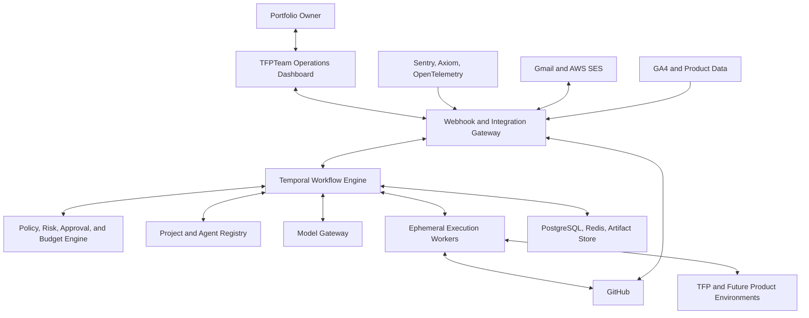

# TFPTeam Multi-Project AI Workforce Implementation Plan

> **For agentic workers:** REQUIRED SUB-SKILL: Use `superpowers:subagent-driven-development` (recommended) or `superpowers:executing-plans` to implement this plan task-by-task. Steps use checkbox (`- [ ]`) syntax for tracking.

**Goal:** Build a standalone, secure, cost-controlled, multi-project AI workforce that can monitor products, research opportunities, create and review code, run QA/UAT, coordinate deployments, support customers, and surface legal, privacy, security, and business decisions for human approval.

**Architecture:** TFPTeam is one shared control plane with logically and operationally isolated Product Workspaces. Durable workflows run through Temporal; specialist agents are created on demand; all repository and browser execution occurs in constrained ephemeral workers; every external action passes through policy, budget, approval, and audit services.

**Tech Stack:** TypeScript, Node.js 22, Fastify, Next.js, PostgreSQL, Prisma, Redis, Temporal, OpenAI Agents SDK, Codex SDK/CLI, Docker rootless, GitHub App, Playwright, OpenTelemetry, Sentry, Axiom, AWS SES, Gmail API, Cloudflare, Vitest, and pnpm.

---

## 1. Executive Decision

TFPTeam is feasible, but “autonomous” has a controlled meaning:

- Agents may continuously monitor, analyze, prioritize, prepare changes, create pull requests, run tests, deploy to non-production environments, and produce reports.
- Agents may automatically complete low-risk actions allowed by project policy.
- High-risk, destructive, financial, legal, customer-sensitive, and production actions require explicit approval.
- No general-purpose agent receives unrestricted root SSH, production database, billing, email, GitHub, or secret-manager access.
- The target is 80–90% operational automation, not removal of human accountability.

TFPTeam must support many unrelated products without mixing their data. TFP, an AutoTrading product, and future applications reuse the same workforce definitions while retaining separate:

- Product Owners
- repositories and workspaces
- knowledge bases
- credentials
- environments
- budgets
- policies
- risk registers
- analytics
- customer communications
- deployment permissions

## 2. Scope and Delivery Boundaries

### 2.1 Version 1 scope

Version 1 must deliver:

1. Multi-project registration and isolation.
2. Project-specific Product Owner and governance profiles.
3. GitHub issue-to-PR engineering workflow.
4. Sentry/Axiom incident-to-task workflow.
5. Independent review, QA, UAT, and approval gates.
6. UAT deployment automation.
7. Human-approved production deployment.
8. Security, privacy, legal/compliance, and AI-governance reviews.
9. Customer-support intake and draft responses.
10. Daily operational, engineering, business, risk, and cost reports.
11. Per-project and global budget enforcement.
12. One-VPS production deployment with external backups.

### 2.2 Explicitly excluded from Version 1

- Autonomous financial transfers.
- Autonomous live trading.
- Automatic customer refunds.
- Automatic acceptance of legal or regulatory risk.
- Automatic production database destructive operations.
- Automatic secret rotation without owner approval.
- Automatic advertising purchases.
- Self-modification of TFPTeam’s policy engine.
- Unrestricted shell or Docker socket access.
- General public multi-tenant SaaS access.

### 2.3 Future scope

- Commercial external tenancy.
- High-availability control plane.
- Multiple worker VPS nodes.
- Managed Temporal or managed PostgreSQL.
- Voice support and telephony.
- Fully automated low-risk production releases after sufficient evidence.

## 3. Core Design Principles

### 3.1 Shared workforce, isolated Product Workspaces

Agent roles are reusable templates. A task creates a project-bound agent instance with only the context and tools allowed for that project.

### 3.2 Durable workflow, ephemeral execution

Temporal owns workflow state, retries, timers, signals, and approval pauses. Coding, test, browser, and repository jobs run in disposable isolated workspaces.

### 3.3 Deterministic control around probabilistic models

LLMs may recommend, classify, summarize, and generate. Deterministic code must enforce:

- permissions
- workflow transitions
- budgets
- schema validation
- approval requirements
- retry limits
- environment restrictions
- deployment gates

### 3.4 Evidence over unsupported conclusions

Security, legal, privacy, product, and incident findings must include:

- evidence
- source or artifact references
- confidence
- severity
- recommended action
- required decision
- expiration or re-review date

### 3.5 Least privilege

Every tool is deny-by-default. Credentials are project-specific, short-lived where possible, and injected only into the activity that requires them.

## 4. System Context



## 5. Deployment Topology

### 5.1 Development

Run development on the owner’s M1 Pro Mac:

- TFPTeam API and dashboard
- PostgreSQL
- Redis
- Temporal development server
- fake model provider
- Gemini free API smoke provider using synthetic data only
- Codex Plus coding worker
- Playwright
- Docker workers

The Mac is not a permanent 24-hour production host.

### 5.2 Initial production

Use one Contabo VPS 40:

- 16 cores
- 48 GB RAM
- sufficient bundled storage
- approximately $30/month based on the owner’s current plan

Run:

- reverse proxy
- control API
- dashboard
- Temporal
- PostgreSQL
- Redis
- scheduler
- model gateway
- audit service
- one coding worker
- one browser worker
- up to three lightweight analysis jobs

Heavy jobs must queue. The initial scheduler must prohibit unlimited parallel workers.

### 5.3 Runtime resource limits

| Worker type | Concurrency | CPU | Memory | Default timeout |
|---|---:|---:|---:|---:|
| Lightweight analysis | 3 | 0.5 | 512 MB | 5 minutes |
| Coding | 1 | 4 | 8 GB | 45 minutes |
| Browser QA | 1 | 4 | 8 GB | 30 minutes |
| Build/test | 1 | 6 | 12 GB | 45 minutes |
| Report generation | 1 | 1 | 1 GB | 10 minutes |

### 5.4 Upgrade trigger

Add a separate worker VPS only when one of these remains true for seven days:

- P95 job queue delay exceeds 15 minutes.
- Worker CPU exceeds 80% for more than two hours/day.
- Memory pressure terminates jobs.
- Production incidents wait behind development tasks.
- Security policy requires physical separation.

## 6. Repository Structure

Create TFPTeam as a separate repository:

```text
TFPTeam/
├── AGENTS.md
├── README.md
├── package.json
├── pnpm-workspace.yaml
├── turbo.json
├── apps/
│   ├── control-api/
│   ├── operations-dashboard/
│   ├── temporal-worker/
│   └── scheduler/
├── packages/
│   ├── agent-runtime/
│   ├── audit/
│   ├── auth/
│   ├── config/
│   ├── database/
│   ├── integrations/
│   ├── knowledge/
│   ├── model-gateway/
│   ├── policy-engine/
│   ├── project-registry/
│   ├── schemas/
│   ├── secrets/
│   └── worker-runtime/
├── agents/
│   ├── engineering/
│   ├── governance/
│   ├── operations/
│   ├── product/
│   └── support/
├── workflows/
│   ├── daily-report/
│   ├── feature-delivery/
│   ├── incident-response/
│   ├── project-onboarding/
│   ├── release/
│   └── support-triage/
├── workers/
│   ├── browser/
│   ├── coding/
│   └── analysis/
├── infrastructure/
│   ├── compose/
│   ├── nginx/
│   ├── systemd/
│   └── backup/
├── evaluations/
│   ├── datasets/
│   ├── scorers/
│   └── scenarios/
├── docs/
│   ├── architecture/
│   ├── operations/
│   ├── policies/
│   └── projects/
└── tests/
    ├── contract/
    ├── e2e/
    ├── integration/
    └── security/
```

## 7. Product Workspace Model

Each project is represented by a versioned manifest:

```yaml
apiVersion: tfpteam.io/v1
kind: ProductWorkspace
metadata:
  id: tfp
  name: TFP Photographers
spec:
  repositories:
    - id: app
      url: git@github.com:mrgauravgupt/tfpphotographers.com.git
      defaultBranch: main
    - id: collage
      url: git@github.com:mrgauravgupt/tfp-collage-service.git
      defaultBranch: main
    - id: moderation
      url: git@github.com:mrgauravgupt/tfp-image-moderation-service.git
      defaultBranch: main
  environments:
    - local
    - test
    - uat
    - production
  budgets:
    monthlyUsd: 150
    taskUsd: 10
    incidentReserveUsd: 25
  concurrency:
    coding: 1
    browser: 1
    analysis: 2
  approvals:
    mergeToMain: owner
    deployUat: automatic_after_gates
    deployProduction: owner
    productionMigration: owner
  dataPolicy:
    freeProviderAllowed: synthetic_only
    productionDataProviders:
      - openai
```

Every future project receives a separate manifest, Product Owner, policy profile, budget, secrets namespace, knowledge index, and deployment adapter.

## 8. Agent Workforce

### 8.1 Portfolio and coordination

#### Portfolio Director

- Compares priorities across products.
- Enforces global budgets and capacity.
- Reserves worker capacity for incidents.
- Produces a portfolio-level report.
- Cannot override project policy.

#### AI Chief of Staff

- Receives normalized events.
- Detects duplicates.
- Chooses the correct workflow.
- Tracks blocked decisions.
- Escalates stale work.

#### Scrum Coordinator

- Converts approved specifications into executable tasks.
- Tracks dependencies.
- Assigns reusable specialist workers.
- Escalates blocked tasks.
- Does not autonomously change business priorities.

### 8.2 Product

#### Product Owner per project

- Maintains vision, personas, business model, KPIs, roadmap, and backlog.
- Analyzes analytics, support trends, incidents, and market evidence.
- Creates opportunity briefs and acceptance criteria.
- Requests owner approval for roadmap changes.

#### Business Analyst

- Converts approved opportunities into testable requirements.
- Defines user journeys, edge cases, and acceptance criteria.
- Identifies missing decisions.

#### Product Researcher

- Performs market and competitor research.
- Records source URLs and retrieval dates.
- Separates evidence from inference.

### 8.3 Engineering

#### Architecture Agent

- Maps affected repositories and services.
- Defines contracts, migrations, rollout, rollback, and observability.
- Rejects cross-project context contamination.

#### Frontend SDE

- Implements UI, accessibility, localization, browser behavior, and performance.
- Works only in isolated project workspaces.

#### Backend SDE

- Implements APIs, domain logic, databases, workers, and integrations.
- Requires migration-specific review for schema changes.

#### Code Review Agent

- Must not be the authoring agent.
- Reviews correctness, security, architecture, tests, and scope.
- Produces blocking and non-blocking findings.

#### Database Reliability Agent

- Reviews migrations, query plans, locks, backups, and restoration evidence.
- Blocks destructive or irreversible migrations.

### 8.4 Operations

#### SRE Agent

- Monitors logs, metrics, traces, uptime, queues, and worker health.
- Correlates regressions with releases.
- Maintains SLO and error-budget reports.

#### Production Support Agent

- Triages incidents and customer-reported defects.
- Creates linked engineering tasks.
- Maintains status updates.

#### Incident Commander

- Coordinates major incidents.
- Maintains timeline, owners, actions, and communications.
- Recommends rollback.
- Cannot perform prohibited actions.

#### Deploy Agent

- Builds release manifests.
- Validates migrations and rollback.
- Deploys UAT automatically after gates.
- Deploys production only after required approval.

### 8.5 Quality

#### QA Agent

- Selects test suites from changed paths and project registry rules.
- Runs unit, integration, contract, security, accessibility, and browser tests.
- Produces evidence, not unsupported signoff.

#### UAT Agent

- Restarts FE and BE before fresh browser validation.
- Uses approved TEST/UAT seed data.
- Executes acceptance criteria as user journeys.
- Signs off or rejects with evidence.

### 8.6 Governance

#### Governance Manager

- Selects required Security, Privacy, Legal, AI Governance, and industry specialists.
- Aggregates findings without weakening severity.
- Applies release gates.

#### Security Manager

- Performs threat modelling.
- Reviews authentication, authorization, secrets, dependencies, infrastructure, and abuse controls.
- Maintains security findings and exceptions.

#### Privacy Manager

- Maintains data inventory and data-flow maps.
- Reviews consent, minimization, retention, deletion, analytics, and vendor sharing.

#### Legal and Compliance Manager

- Identifies potentially applicable laws, regulations, contracts, and licenses.
- Uses authoritative current sources.
- Never claims final legal compliance.
- Requests professional review when uncertainty or regulated activity exists.

#### AI Governance Manager

- Reviews automated decisions, bias, explainability, disclosure, model changes, evaluations, and prompt-injection risk.

#### Industry Risk Specialist

Created dynamically for domains such as:

- financial services
- healthcare
- children
- e-commerce
- social platforms
- content marketplaces

### 8.7 Business operations

#### Customer Support Agent

- Reads Gmail messages through a restricted integration.
- Classifies, retrieves approved context, and drafts replies.
- Creates defects or feature requests.
- Sends only pre-approved low-risk templates automatically.

#### Analytics Agent

- Produces KPI summaries and anomaly reports.
- Validates instrumentation before interpreting movement.

#### Marketing Agent

- Proposes experiments within budget.
- Does not purchase ads or commit spend without approval.

#### Content and SEO Agent

- Creates evidence-backed content proposals and technical SEO tasks.

#### FinOps Agent

- Tracks model, server, storage, email, and external-tool cost.
- Stops workflows that exceed budget.

#### Knowledge Curator

- Maintains project instructions, architecture maps, runbooks, and freshness metadata.

## 9. Agent Communication Protocol

Agents must not communicate through unstructured chat alone. Every handoff uses a typed envelope:

```typescript
export interface AgentMessage<TPayload> {
  id: string;
  projectId: string;
  workflowId: string;
  taskId?: string;
  sender: AgentRole;
  recipient: AgentRole | "workflow";
  messageType:
    | "request"
    | "result"
    | "finding"
    | "approval_request"
    | "decision"
    | "status";
  correlationId: string;
  causationId?: string;
  risk: "low" | "medium" | "high" | "critical" | "prohibited";
  confidence?: number;
  payload: TPayload;
  evidence: EvidenceReference[];
  createdAt: string;
  expiresAt?: string;
}
```

Required rules:

- `projectId` is mandatory.
- Messages cannot cross projects unless the Portfolio Director creates an explicitly audited comparison workflow.
- Findings require evidence.
- Approval requests state exact proposed action and impact.
- Decisions record the human or deterministic policy that authorized them.
- Agent output must validate against JSON Schema before workflow continuation.

## 10. Model Gateway

### 10.1 Capability-based routing

Agents request a capability:

- `classify`
- `summarize`
- `research`
- `reason`
- `code`
- `review`
- `critical_review`

They do not hardcode provider names.

### 10.2 Environment policy

| Environment | Default | Allowed data |
|---|---|---|
| Unit tests | Deterministic fake provider | Fixtures only |
| Local development | Gemini free API | Synthetic/public/sanitized only |
| Development coding | Codex Plus worker | Approved repository data |
| UAT | Low-cost OpenAI API model | Sanitized UAT data |
| Production routine | Low-cost OpenAI API model | Policy-approved production data |
| Production complex | Strong OpenAI API model | Minimum necessary context |
| Critical independent review | Strongest approved model | Owner-approved context |

Google AI Pro is used interactively through supported Google surfaces. It is not treated as unlimited Gemini API credit.

Codex Plus is used as one queued coding worker through the Codex CLI/SDK. It is not treated as an unlimited general API.

### 10.3 Required gateway controls

- Per-project allowlists.
- Per-environment provider allowlists.
- Token and dollar accounting.
- Prompt and response size limits.
- PII and secret redaction.
- Retry limit of two by default.
- Circuit breaker after repeated provider failures.
- No production fallback to free providers.
- Store prompt template version and model identifier.
- Do not store chain-of-thought.
- Store sanitized inputs, outputs, usage, decision, and trace references.

## 11. Tool and Permission Architecture

### 11.1 Tool gateway

Agents call typed tools through a gateway. They do not receive direct credentials.

Tool categories:

- GitHub read
- GitHub branch/PR write
- repository sandbox
- test execution
- browser execution
- observability read
- analytics read
- Gmail read/draft
- SES send
- UAT deploy
- production deploy
- database diagnostics
- secret administration

### 11.2 Default permissions

| Role | Default permission |
|---|---|
| Product/Research | Read-only |
| SRE/Support | Observability read and task create |
| SDE | Workspace write and branch push |
| Reviewer | Diff and repository read-only |
| QA | Test and browser execution |
| UAT | UAT test execution |
| Deploy | Environment-specific deploy activity |
| Governance | Read, findings, and release block |
| FinOps | Usage read and workflow stop |

### 11.3 Prohibited credentials

Never provide agents:

- withdrawal-capable financial credentials
- root SSH private keys
- unrestricted production database owner credentials
- personal GitHub tokens
- cloud account owner credentials
- full mailbox passwords

## 12. Data Model

The database must include:

### Portfolio and projects

- `projects`
- `project_repositories`
- `project_environments`
- `project_memberships`
- `project_manifests`
- `project_budgets`
- `project_policies`
- `project_secrets_metadata`

### Work management

- `opportunities`
- `requirements`
- `tasks`
- `task_dependencies`
- `workflow_runs`
- `workflow_steps`
- `agent_runs`
- `agent_messages`

### Governance

- `risk_findings`
- `risk_acceptances`
- `approvals`
- `evidence_references`
- `vendors`
- `data_inventory`
- `compliance_sources`
- `policy_decisions`

### Operations

- `incidents`
- `incident_events`
- `deployments`
- `test_runs`
- `uat_signoffs`
- `support_conversations`

### Cost and audit

- `model_usage`
- `tool_usage`
- `budget_events`
- `audit_events`
- `artifacts`

All project-owned tables must include `project_id`. PostgreSQL Row-Level Security must prevent cross-project access.

## 13. Workflow State Model

Use these standard states:

```text
received
triaging
researching
awaiting_requirements
awaiting_approval
planned
implementing
reviewing
testing
uat
release_ready
deploying
monitoring
completed
rejected
failed
cancelled
budget_exceeded
blocked_by_policy
```

Every transition must record:

- actor
- previous state
- next state
- reason
- evidence
- timestamp
- cost
- policy decision

## 14. Core Workflows

### 14.1 Project onboarding

1. Owner submits project name and high-level idea.
2. Product Owner asks bounded requirements questions.
3. Governance Manager performs industry and data screening.
4. Architecture Agent proposes repository and environment topology.
5. Security Manager creates initial threat model.
6. Privacy Manager creates initial data inventory.
7. Legal Manager identifies professional-review triggers.
8. FinOps proposes project budget.
9. Owner approves scope, policy, and budget.
10. System creates Product Workspace manifest, secrets namespace, GitHub App installation binding, and knowledge index.

### 14.2 Feature delivery

1. Opportunity enters backlog.
2. Product Owner scores reach, impact, confidence, effort, risk, and revenue potential.
3. Owner approves the opportunity.
4. Business Analyst creates acceptance criteria.
5. Architecture and Governance reviews run.
6. Scrum Coordinator creates tasks.
7. SDE worker creates branch and tests.
8. Independent reviewer evaluates the diff.
9. Security/privacy/legal checks run based on changed paths and metadata.
10. QA executes selected suites.
11. UAT executes user journeys.
12. Deploy Agent deploys UAT.
13. Owner approves production.
14. Deploy Agent releases and monitors.
15. Analytics Agent measures outcome.

### 14.3 Incident response

1. Sentry/Axiom event is normalized.
2. Duplicate and known-deployment correlation runs.
3. SRE classifies severity and confidence.
4. Critical incidents preempt lower-priority jobs.
5. Incident Commander creates timeline and communication schedule.
6. Support Agent prepares customer-safe updates when required.
7. SDE prepares remediation branch.
8. Reviewer and QA validate.
9. Deploy Agent rolls back or deploys fix according to approval policy.
10. SRE verifies recovery.
11. Incident Commander creates RCA and preventive tasks.

### 14.4 Customer support

1. Gmail integration receives message metadata.
2. Security service scans attachments and content.
3. PII is classified and minimized.
4. Support Agent classifies category, priority, and sentiment.
5. Approved knowledge is retrieved.
6. Agent drafts reply with confidence and citations to internal policy.
7. Low-risk acknowledgement may send through SES.
8. Sensitive replies require owner approval.
9. Defects create linked tasks; incidents start incident workflow.
10. Resolution updates the customer and knowledge base.

### 14.5 Daily report

Report sections:

- platform health
- incidents and SLOs
- engineering work
- PR and test status
- deployments
- customer support
- product analytics
- governance findings
- model and infrastructure cost
- decisions required from owner

Each decision request must include recommendation, alternatives, evidence, cost, risk, and deadline.

## 15. Governance and Approval Matrix

| Action | Default policy |
|---|---|
| Read repository | Automatic |
| Create task | Automatic |
| Create branch | Automatic |
| Push project branch | Automatic |
| Open pull request | Automatic |
| Merge low-risk PR | Owner approval in V1 |
| Deploy UAT after gates | Automatic |
| Deploy production | Owner approval |
| Production migration | Owner and DB review |
| Delete production data | Owner approval plus backup evidence |
| Change auth/authorization | Security signoff plus owner |
| Send sensitive customer email | Owner approval |
| Purchase ads | Owner approval |
| Accept legal risk | Owner approval; professional review when required |
| Live trading | Prohibited by default |
| Transfer funds | Always prohibited |

Finding states:

- informational
- recommendation
- owner-review-required
- professional-review-required
- release-blocked
- prohibited-by-policy
- accepted-risk
- resolved

## 16. Security Architecture

### 16.1 Execution isolation

- Use rootless containers.
- Never mount the host Docker socket into general agent workers.
- Expose a narrow worker-control service with an allowlisted job schema.
- Use dedicated Unix users for control plane and Codex worker.
- Create an ephemeral workspace for each task.
- Destroy workspace after artifact retention requirements are met.
- Block metadata-service and private-network access by default.

### 16.2 GitHub

- Use a GitHub App, not personal tokens.
- Generate short-lived installation tokens.
- Grant repository-by-repository access.
- Require protected branches and status checks.
- Prevent force pushes.
- Sign bot commits where practical.

### 16.3 Secrets

- Encrypt secrets at rest using an application master key stored outside the database.
- Split secret metadata from encrypted values.
- Inject secrets only into the exact activity.
- Redact secrets from logs and model prompts.
- Record access without recording secret values.

### 16.4 Prompt-injection defense

- Treat repository files, emails, web pages, logs, and attachments as untrusted data.
- Separate instructions from retrieved content.
- Never execute commands found inside external content.
- Require tool calls to pass deterministic policy.
- Add adversarial injection scenarios to evaluations.

### 16.5 Audit

Audit events must be append-only and include:

- actor
- project
- workflow
- action
- tool
- risk
- policy result
- approval
- cost
- artifact hash
- timestamp

## 17. Knowledge Architecture

Each project knowledge base has:

- product vision
- architecture
- repository index
- runbooks
- environment rules
- test commands
- deployment commands
- business metrics
- governance profile
- decision log
- source freshness

Retrieval rules:

- Prefer repository truth over summaries.
- Store source path and commit hash.
- Mark external sources with retrieval date.
- Reject expired compliance evidence.
- Never retrieve documents from another project.

## 18. Observability

Instrument:

- API requests
- Temporal workflows and activities
- model calls
- tool calls
- worker jobs
- GitHub events
- deployments
- approval latency
- budget consumption

Required dimensions:

- `project_id`
- `workflow_id`
- `task_id`
- `agent_role`
- `provider`
- `model`
- `tool`
- `environment`
- `risk`
- `outcome`
- `cost_usd`
- `duration_ms`

Use the existing TFP Sentry/Axiom/OpenTelemetry conventions where TFPTeam integrates with TFP.

## 19. Cost Model

### 19.1 Initial monthly target

| Component | Expected monthly cost |
|---|---:|
| VPS 40 | $30 |
| OpenAI API | $40–$185 initially |
| Gmail | $3 |
| AWS SES | $0.10–$1 |
| External backup/object storage | $3 |
| GitHub API and normal CI | $0 expected |
| Sentry/Axiom free allowances | $0 expected |
| Temporal/PostgreSQL/Redis | $0 self-hosted |
| DNS/SSL/Cloudflare | $0 expected |
| **Expected total** | **$76–$222/month** |

Budget configuration:

- normal target: $200/month
- warning: $275/month
- hard ceiling: $350/month for model API
- total platform hard ceiling: $450/month
- incident reserve: configurable per project

### 19.2 Cost controls

- Fake provider for unit tests.
- Free Gemini API only for synthetic development data.
- Codex Plus for queued coding.
- OpenAI mini-class model for routine production.
- Strong model only for difficult or high-risk tasks.
- Batch processing for non-urgent reports.
- Maximum two retries.
- Context retrieval instead of full repositories.
- Pre-filter logs before model calls.

## 20. Testing Strategy

### 20.1 Unit tests

Use deterministic fake providers. Cover:

- routing
- schemas
- budget calculations
- policy rules
- state transitions
- redaction
- permission denial

### 20.2 Contract tests

Cover:

- OpenAI-compatible model adapter
- Codex worker adapter
- GitHub App
- Sentry webhook
- Axiom query adapter
- Gmail
- SES
- Temporal activities

### 20.3 Integration tests

Run PostgreSQL, Redis, and Temporal. Verify:

- project isolation
- workflow pause/resume
- approval expiry
- budget termination
- retry behavior
- audit completeness

### 20.4 Security tests

- cross-project access attempts
- prompt injection
- secret leakage
- command injection
- path traversal
- SSRF
- unapproved deployment
- forged webhook
- replayed approval

### 20.5 End-to-end tests

Required scenarios:

1. Register a sample project.
2. Convert a synthetic Sentry event into a task.
3. Create a sandbox branch and mock PR.
4. Reject a failing QA run.
5. Pause for approval.
6. Approve UAT.
7. block production without owner approval.
8. terminate on budget limit.
9. prevent cross-project knowledge access.
10. produce a daily report.

### 20.6 Evaluations

Maintain scored datasets for:

- incident severity
- duplicate detection
- task decomposition
- code review findings
- support classification
- legal uncertainty
- security risk
- refusal and escalation

No prompt or model change may promote to production without evaluation comparison.

## 21. Operations and Recovery

### 21.1 Backup

- Daily encrypted PostgreSQL backup.
- Seven daily, four weekly, and one monthly retention.
- Store off the VPS.
- Back up configuration and audit artifacts.
- Do not back up disposable repository clones.
- Run a monthly restore test.

### 21.2 Failure handling

- Temporal resumes durable workflows.
- Activity retries use bounded exponential backoff.
- Provider circuit breaker pauses new model calls.
- Worker timeout destroys the container.
- Repeated failure requests human intervention.
- Partial deployment triggers rollback workflow.

### 21.3 Kill switches

Provide:

- global pause
- project pause
- agent-role pause
- provider pause
- deployment pause
- email-send pause
- coding-worker pause

## 22. Dashboard Requirements

Views:

1. Portfolio overview.
2. Project overview.
3. Active workflows.
4. Approval inbox.
5. Tasks and PRs.
6. Incidents.
7. Deployments.
8. QA/UAT evidence.
9. Governance findings.
10. Support queue.
11. Model and infrastructure cost.
12. Audit explorer.
13. Project configuration.
14. Kill switches.

Approval screen must show:

- proposed action
- affected project/environment
- diff or artifact
- evidence
- tests
- governance findings
- rollback
- model/tool cost
- approval expiry
- approve/reject/request-changes controls

## 23. API Boundaries

Required API groups:

- `/api/projects`
- `/api/workflows`
- `/api/tasks`
- `/api/approvals`
- `/api/findings`
- `/api/incidents`
- `/api/deployments`
- `/api/support`
- `/api/reports`
- `/api/costs`
- `/api/audit`
- `/api/webhooks/github`
- `/api/webhooks/sentry`
- `/api/webhooks/gmail`

All mutating endpoints require:

- authenticated actor
- project scope
- idempotency key
- policy decision
- audit event

## 24. Implementation Phases

This program is intentionally decomposed. Each phase must produce deployable, testable software.

### Phase 0: Repository and decisions

- [ ] Create the standalone `TFPTeam` repository.
- [ ] Add `AGENTS.md`, README, license decision, pnpm workspace, TypeScript, linting, formatting, and test configuration.
- [ ] Record architectural decisions for Temporal, Fastify, Next.js, PostgreSQL, Redis, OpenAI Agents SDK, Codex worker, and rootless workers.
- [ ] Add CI for lint, typecheck, unit tests, dependency audit, and secret scan.
- [ ] Commit with `chore: initialize tfpteam workspace`.

**Exit criteria:** Clean install and CI pass on the M1 Pro.

### Phase 1: Data, identity, and project isolation

- [ ] Implement Prisma schema for Section 12.
- [ ] Implement owner authentication.
- [ ] Implement project context middleware.
- [ ] Enable PostgreSQL Row-Level Security.
- [ ] Add cross-project denial tests.
- [ ] Implement append-only audit events.
- [ ] Commit with `feat(core): add project isolation and audit`.

**Exit criteria:** A test actor in project A cannot read or mutate project B.

### Phase 2: Temporal workflow foundation

- [ ] Add Temporal client and worker.
- [ ] Implement standard workflow state transitions.
- [ ] Implement activity retry policies.
- [ ] Implement approval signal and expiry timer.
- [ ] Implement cancellation and kill-switch signals.
- [ ] Add workflow replay tests.
- [ ] Commit with `feat(workflows): add durable workflow foundation`.

**Exit criteria:** Workflow survives worker restart and resumes after approval.

### Phase 3: Model Gateway

- [ ] Implement deterministic fake adapter.
- [ ] Implement Gemini development adapter.
- [ ] Implement OpenAI production adapter.
- [ ] Implement Codex queued worker adapter.
- [ ] Add capability and environment routing.
- [ ] Add redaction, usage accounting, circuit breaker, and budget enforcement.
- [ ] Add structured-output validation.
- [ ] Commit with `feat(models): add governed model gateway`.

**Exit criteria:** Production data cannot route to a free provider, and budget overflow stops the workflow.

### Phase 4: Policy, approvals, and governance

- [ ] Implement action/risk policy schema.
- [ ] Implement deterministic policy evaluation.
- [ ] Implement approval records with expiry and anti-replay.
- [ ] Implement governance finding lifecycle.
- [ ] Add Security, Privacy, Legal, and AI Governance agent profiles.
- [ ] Add professional-review-required state.
- [ ] Commit with `feat(governance): add policy and review gates`.

**Exit criteria:** A prohibited action cannot be approved through an agent message.

### Phase 5: Worker runtime

- [ ] Implement rootless worker-control service.
- [ ] Implement ephemeral workspaces.
- [ ] Implement CPU, memory, network, and timeout limits.
- [ ] Build Node and Python worker images.
- [ ] Implement command allowlists.
- [ ] Implement artifact capture and cleanup.
- [ ] Add hostile repository security tests.
- [ ] Commit with `feat(workers): add isolated execution runtime`.

**Exit criteria:** Worker cannot access control-plane database, host secrets, or another project workspace.

### Phase 6: GitHub engineering workflow

- [ ] Register a GitHub App with minimum permissions.
- [ ] Implement installation-token generation.
- [ ] Implement repository clone, branch, commit, push, and PR tools.
- [ ] Implement Architecture, SDE, Reviewer, and Scrum profiles.
- [ ] Implement issue-to-PR Temporal workflow.
- [ ] Add branch protection documentation.
- [ ] Commit with `feat(engineering): add issue-to-pr workflow`.

**Exit criteria:** Synthetic issue produces a PR without merge or production permission.

### Phase 7: QA and UAT

- [ ] Implement project validation command registry.
- [ ] Implement targeted test selection.
- [ ] Implement Playwright worker.
- [ ] Implement QA evidence schema.
- [ ] Implement UAT restart, seed, journey, and signoff stages.
- [ ] Add failed-test and flaky-test handling.
- [ ] Commit with `feat(quality): add qa and uat gates`.

**Exit criteria:** Failing acceptance criteria prevents release-ready state.

### Phase 8: Observability and incident response

- [ ] Implement Sentry webhook verification.
- [ ] Implement Axiom query adapter.
- [ ] Implement normalized incident model.
- [ ] Implement SRE and Incident Commander profiles.
- [ ] Implement duplicate detection and release correlation.
- [ ] Implement incident-to-PR workflow.
- [ ] Commit with `feat(operations): add incident response`.

**Exit criteria:** Synthetic production alert creates one deduplicated incident with evidence and task links.

### Phase 9: Deployment

- [ ] Implement environment-specific deployment adapters.
- [ ] Implement UAT automatic deployment after gates.
- [ ] Implement production approval requirement.
- [ ] Implement health checks and rollback.
- [ ] Implement migration-specific gate.
- [ ] Integrate TFP `scripts/vps` deployment flow without confusing OCI.
- [ ] Commit with `feat(release): add governed deployment workflows`.

**Exit criteria:** Production deployment cannot start without valid owner approval.

### Phase 10: Support and communications

- [ ] Implement Gmail OAuth with minimum scopes.
- [ ] Implement SES sender.
- [ ] Implement support classification and draft schema.
- [ ] Implement acknowledgement allowlist.
- [ ] Implement sensitive-message approval.
- [ ] Implement incident and engineering escalation.
- [ ] Commit with `feat(support): add governed customer communications`.

**Exit criteria:** TFPTeam drafts replies but sends only approved templates automatically.

### Phase 11: Product, analytics, and reporting

- [ ] Implement Product Owner and Analytics profiles.
- [ ] Implement opportunity scoring.
- [ ] Implement KPI source adapters.
- [ ] Implement daily and weekly reports.
- [ ] Implement owner decision inbox.
- [ ] Implement Portfolio Director comparison view.
- [ ] Commit with `feat(product): add portfolio intelligence`.

**Exit criteria:** Report clearly separates facts, inferences, recommendations, and required decisions.

### Phase 12: Dashboard

- [ ] Build authenticated Next.js dashboard.
- [ ] Implement views in Section 22.
- [ ] Add real-time workflow updates.
- [ ] Add approval and kill-switch actions.
- [ ] Add accessible responsive UI.
- [ ] Add dashboard Playwright tests.
- [ ] Commit with `feat(dashboard): add operations console`.

**Exit criteria:** Owner can inspect evidence and safely approve or reject actions.

### Phase 13: TFP onboarding

- [ ] Register TFP root and nested repositories.
- [ ] Load `docs/agent-index.json`.
- [ ] Configure validation commands and runtime guides.
- [ ] Configure Sentry/Axiom integrations.
- [ ] Configure TEST/UAT/production deployment policies.
- [ ] Validate incident-to-PR and UAT workflows without production deployment.
- [ ] Commit with `feat(projects): onboard tfp`.

**Exit criteria:** TFP workflow respects nested repositories, TEST defaults, current `scripts/vps` routes, and existing observability.

### Phase 14: Production deployment

- [ ] Provision VPS 40.
- [ ] Configure non-root users, firewall, rootless containers, TLS, and backups.
- [ ] Deploy PostgreSQL, Redis, Temporal, API, dashboard, and workers.
- [ ] Configure $450 total monthly ceiling.
- [ ] Run recovery and restore exercise.
- [ ] Run security test suite.
- [ ] Enable monitoring-only mode for seven days.
- [ ] Enable task creation for seven days.
- [ ] Enable PR creation after review.
- [ ] Enable UAT deployment after evidence.
- [ ] Keep production approval manual.
- [ ] Commit operational configuration with `ops: deploy tfpteam control plane`.

**Exit criteria:** Thirty days without critical security findings, uncontrolled spend, cross-project leakage, or unaudited external actions.

## 25. Definition of Done

TFPTeam Version 1 is complete only when:

- Project isolation is demonstrated by tests.
- Every external mutation is auditable.
- Every model call is costed and project-scoped.
- Production data never routes to free providers.
- Coding and browser work runs in isolated workers.
- High-risk actions require valid approval.
- Legal agents express uncertainty and request professional review.
- Security findings can block releases.
- TFP incident-to-PR-to-UAT flow works end to end.
- Daily reports identify decisions required from the owner.
- External backups restore successfully.
- Monthly spending cannot exceed configured hard limits without owner configuration change.

## 26. Implementation Order Recommendation

Do not build all agents first. Build the enforcement platform first:

1. Project isolation and audit.
2. Temporal workflows.
3. Model Gateway and budgets.
4. Policy and approvals.
5. Worker isolation.
6. GitHub engineering workflow.
7. QA/UAT.
8. SRE and incident response.
9. Deployment.
10. Support and product/business roles.

This order ensures later agents inherit safe infrastructure instead of creating unsafe automation that must be redesigned.

## 27. Final Operating Model

The owner supplies:

- high-level product ideas
- business decisions
- budget approval
- professional signoffs where required
- high-risk production approvals

TFPTeam supplies:

- continuous monitoring
- evidence-backed analysis
- product proposals
- specifications and tasks
- code and pull requests
- independent reviews
- QA and UAT evidence
- controlled deployments
- customer-support drafts
- security, privacy, legal, and AI-governance findings
- daily reports and decision requests

The platform is autonomous in execution but accountable through deterministic policy, evidence, auditability, and human authority.
